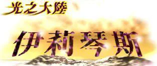
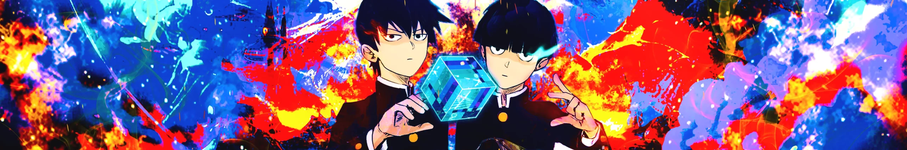
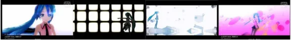
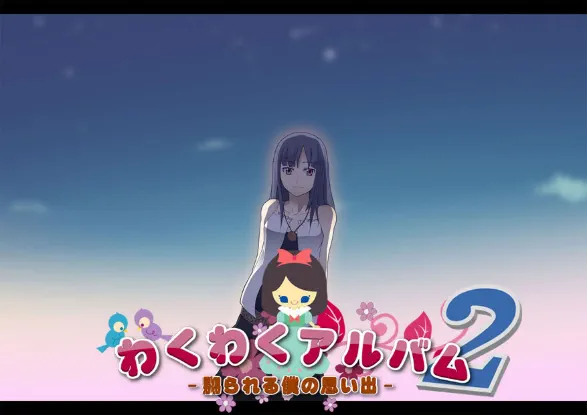
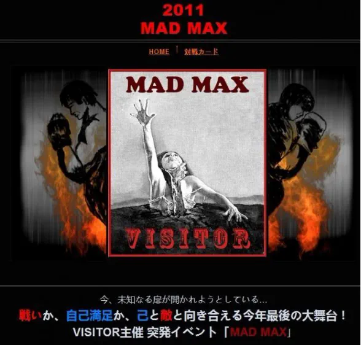
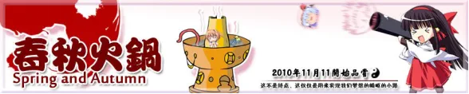
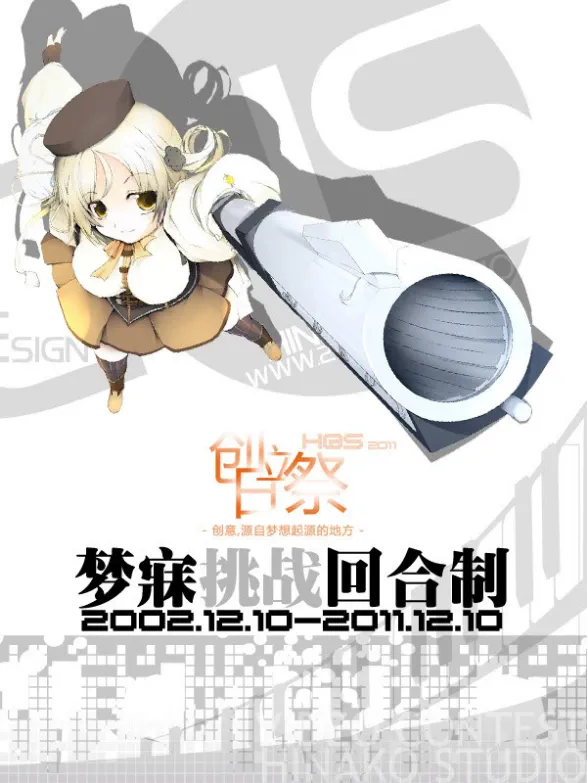
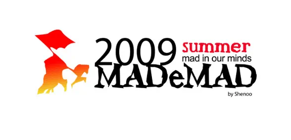
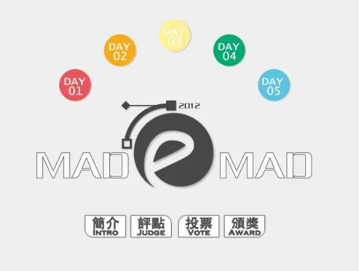

# Beyond the Mountains, Beyond the Towers (History of MAD)

::: warning Historical archive
This page preserves an early community history first published in 2010 and revised in 2013. Its definitions, dates, links, and evaluations reflect the source and may be incomplete or disputed. The English wording follows the historical English edition on [MAD Producer](https://madproducer.com/en/mad); the 15 accompanying images are stored locally in MAD DOC.
:::

## Statement 1

This section is not part of the original article; it serves as a brief explanation.

This article was first published in 2010 and revised in 2013, with the original author unknown (I have searched for a long time without success; if anyone has information, please message me to provide it). Given the almost fragmented content available on Baidu and Google, I saved this article after reading it years ago to prevent it from disappearing from the internet. Considering that the original formatting was quite chaotic, I specially modified the layout. I also added hyperlinks to some sections for easier navigation and collected all the images that accompanied the original text to ensure completeness. However, I did not make any inaccurate modifications to the original article's objective or subjective content.

The full text has 13,272 words. After reading, you might feel the historical sense of MAD, perhaps. ~ By 无疑

Updated on 2020.7.27: This article was reposted from MD's "Blue Sky," written by darklore.

## Statement

Regarding this article, the definitions discussed may not have widespread recognition or agreement, meaning there could be differing opinions. Therefore, I kindly ask readers to be tolerant of viewpoints they may disagree with before reading. Additionally, I welcome the presentation of different perspectives, and I will do my best to revise the content to improve it.

Article License: Copyright - This article is licensed under CC. You may share it for non-commercial purposes, but please be sure to indicate the source. Do not modify the article's link or author's name, especially not for political reasons.

## Chapter 1: The Origin of MAD

### **1-1-1 The Beginning**

The name "MAD" was born on (insert date) in 1978 (Showa 53). To discuss the original meaning of the term "MAD," we must start with three members of the Osaka University of Arts' Animation Research Department, CAS.

1\. MAD岛川氏 - Claims his full name is "元祖本家マッドテープ家元サウンディングマッド岛川" and is one of the founding members of CAS. He is also a member of the creative group Team S.I.N. and is still active in the ACG community as of May 2010. 2. Y氏 (矢野健太郎) - Another founding member of CAS, which he co-established with MAD岛川氏. He is also an elder of Team S.I.N. and currently works as a professional manga artist, focusing on adult comics featuring vampires. His three-volume work *Spirit Warrior* was published in Taiwan and served as the prototype for the Taiwanese adult literary work *Rebirth of the Demon King: The Silver Witch*. 3. 金井聡 - Gained fame in the 1990s for his puppet animation, later entering the animation industry due to his talents in special effects production. His representative works include *Heisei Mothra*, and he currently has an official website.[”Dance Reflection & JCC”](http://www.lares.dti.ne.jp/~maimilk/index.html)

The three of them at CAS produced many recordings that parodied animated characters' voices or music from the films, naming them "奇知害低符" (which is pronounced "きちがいテープ," meaning "crazy tape"). The reason for deliberately using these kanji characters is that "気違い" conveys the idea of "temporary madness." However, many Japanese people often misunderstand this term, associating it with a pathological description. Therefore, to align with their original intent while reducing misunderstandings from outsiders, they chose to use these particular kanji characters.

### **1-1-2 From "Kichigai Teihuku" to "MAD"**

Shortly after MAD岛川氏 completed the 10th volume of "奇知害低符," a fan of the famous singer Yamaguchi Momoe approached him with a request: "Could you transfer all of Yamaguchi Momoe's records into a cassette for me?" Using his editing skills, he completed the 11th work: "クレイジー．カセット No.11 TAPE C-60."

Side A Title - MOMOE MAD - 30 minutes and 17 seconds (Yamaguchi Momoe's romanization is Momoe Yamaguchi).

Side B Title - Prelude and Interlude Series - 30 minutes and 28 seconds.

It's worth mentioning that the title of Side A was later named by his friend. After receiving the tape, this friend not only cherished it but listened to it from morning till night. Whether moved or inspired by his friend's enthusiasm, MAD岛川氏 announced that future public works would officially change their name from "奇知害低符" to "MAD-TAPE." Thus, the name "MAD" was born and has been used ever since.

From this point on, the name "MAD" was officially established—later, some referred to it as "M@D" or "derivative-work movie" (Note 1). The term "MAD" is widely used among fans in East Asian countries such as Japan, China, and Taiwan, essentially defining derivative ACG videos as MAD. This is a relatively credible historical verification. However, since there are still various claims regarding the origins of MAD, it has become difficult to ascertain the truth today.

### 1-2-1 Regarding AMV

AMV, short for Anime Music Video, is created by mixing and editing one or more animations accompanied by music. The etymology of the term AMV is difficult to trace, but existing sources indicate that the term began to be used in the early 1980s, which is a relatively reliable claim.

Compared to the widespread use of the term "MAD" in East Asian countries, Western nations such as the UK, USA, France, and Germany refer to their derivative works as "AMV (Anime Music Video)." (Note 2)

### **1-2-2 Differences Between AMV and MAD**

Since the "A" in AMV stands for the English word "Anime," it can be seen that the definition of AMV essentially involves using animation or animated content from games to create videos. (Note 3) As for MAD, it mostly uses still materials to create videos; however, its works are clearly more diverse. In contrast, the range of creative sources for authors is more flexible, essentially allowing for any content related to ACG (Anime, Comic, Game) to be used. (Note 4) In early 2006, several entries utilizing animation as their source material participated in the SM@DXSM@D competition, which is a clear example. (Note 5) Additionally, when Japan holds MAD creation contests, if creators are required to use still image materials, "Still-image MAD" will be specifically labeled on the event logo. (Note 6) At this point, it can be summarized that for Madders, MAD can generally be categorized into: - Still Image MAD - primarily using manga as material - Game MAD - primarily using game material - Animation MAD - primarily using animation material (also known as AMV) - Mixed MAD - using a mix of various ACG materials Therefore, if deduced in this way, it can be noted that AMV should be considered a branch of the broader MAD category, meaning that animation-based MAD is essentially AMV, and MAD cannot be equated with AMV.

### 1-3 A Brief History of Early MAD Creation

\*This section primarily discusses Japanese MAD.

#### 1978-1995

As mentioned earlier, MAD can be said to have originated quite early. However, during the 70s and 80s, it was still the era of videotapes, and personal computers were not yet widespread. The creation of MAD was not only highly challenging due to insufficient equipment, but there were also no distribution channels or audiences. Although MAD had already been born, it saw little development until the early 90s...

#### June 1997

In June 1997, Taiwan's largest animation OPED download site, "光之大陸 伊莉琴斯" (Land of Light: Illychins), was established. Its Material Management Bureau provided many OPEDs that were difficult to obtain at the time. In addition, a large number of collectors offered MAD downloads on the site, making significant contributions to the early promotion of MAD in Taiwan.

#### March 1996 to March 1999

From 1996 to early 1999, with the release of several H-Games and the popularization of personal computers, there was an increasing trend in MAD creation. A notable sign of revolution in the MAD community was the "メビウスONE" (Mebius ONE) β version created by Nua in March 1999, which was also the first MAD to exceed 100MB in size.

During this period, the creations were primarily at a resolution of 160x120, with 320x240 not yet becoming mainstream. The themes of the works were almost entirely focused on H-Games, such as "One" and others.

#### September 2000

The work "彼女と彼女の猫 -Their standing points-" by Makoto Shinkai was released.

From June 1999 to January 20, 2001, the MAD community experienced its first period of prosperity.

#### June 1999

The pace of MAD creation gradually increased, and it is estimated that by June 1999, the total number had surpassed 100. Around the summer, 320x240 finally became the mainstream resolution.

#### November 1999

The Japanese National Diet passed the "Child Welfare Law" and the "Intellectual Property Protection Law." Many creators struggled with legal issues, causing some of them to go underground or retire.

#### March 2000

Nua started a job and began gradually withdrawing from the MAD community.

#### September 2000

The MAD community began organizing events such as the MAD Awards, and in September, the entries for the "Newcomer Award" were made public.

#### September 2000

The work "彼女と彼女の猫 -Their standing points-" by Makoto Shinkai was released.

#### October to December 2000

\- Led by Shingei Workshop representative "神月社," the first the Huayin Awards was launched, receiving enthusiastic responses, with a total of 52 creators participating. On December 12, the second "Newcomer Award" also began its preparatory activities. - Prominent MAD creators such as 神月社, Nua, and SATURN announced their plans to retire in 2001.

#### January 20, 2001

Key noticed that many MAD creators were using its released works as material for their creations, and publicly issued a letter warning that this was a violation of copyright law. This caused a major upheaval in the MAD community, leading many prominent MAD creators to announce their retirement.

The following day, several related events, except for the Huayin Awards and the Newcomer Award, were also suspended.

Moreover, other related creative fields were also in a state of fear. The wallpaper creation event "Lamplight Awards" was discontinued, and the wallpaper board on 2ch was also shut down as a result.

#### January 28, 2001

AK-1 released the Air MAD work "Azurewind" on January 28, 2001. This MAD, centered on the character Misuzu Kamio, used many sophisticated techniques in its production. It remains quite renowned among still-image MAD works based on Air.

("Azurewind" was the second place winner in the 2001 Still Image MAD Awards.)

It is noteworthy that this work had a resolution of 640x480 (equivalent to DVD pixel quality). After "Azurewind," high-resolution MADs at 640x480 began to appear more frequently.

#### Late January 2001

神月社 officially announced his retirement from the MAD community. He later transitioned into the field of commercial AVG OPED production and remained active in it until June 2010.

#### February 2001

A Japanese animation enthusiast named 異端氏 claimed on the Shingei Workshop bulletin board that "the visual and audio quality of MAD works is generally poor," which led to him being heavily criticized by many forum members. However, this incident became a turning point, prompting Japanese still-image MAD creators to increasingly aim for high bitrate (data rate per second) in their works.

Since many creators did not fully understand the proper methods for encoding files, unnecessary file bloat became a major issue for MADs during this period.

#### April 11, 2001

The "Chengda 411 MP3 Incident" occurred in Taiwan.

The Tainan District Prosecutor's Office in Taiwan received a report from IFPI (International Federation of the Phonographic Industry) and conducted a search at the student dormitory "Sheng Yi Dormitory" at National Cheng Kung University. They found fourteen students suspected of illegally downloading MP3s and hosting a website providing over 18,000 songs for download.

Due to the rough search process and police actions that violated the principle of university autonomy as outlined in university law, the search provoked a strong backlash and panic among students. This incident also led to serious scrutiny of the Illychins platform hosted by Sun Yat-sen University, causing a significant decline in its influence.

#### April 16, 2001

Key once again sent warning emails against infringement to various related websites (this time targeting mainly wallpaper creation sites), which became known as the Key 4.16 Incident. Its impact was not as significant as the one in January, and most sites continued to operate after removing Key-related content.

#### May 3, 2001

Mist, from the MAD group "M2 Union," completed the first-ever legal MAD titled "iniquity." During this period, Japanese game companies displayed polarized attitudes toward MAD production: some were highly opposed (like Key), while others offered full support (such as Witch, which authorized Mist's work but has since gone out of business).

Generally speaking, the larger the company, the more likely they were to prohibit MAD production.

#### August 3, 2001

Minori released the demo movie for their AVG work "BITTERSWEET FOOLS" on August 3, 2001. Created by Makoto Shinkai, this demo received high praise, and his name began to become well-known among MAD enthusiasts.

#### August 2001

The world's largest AMV original file repository <a href="http://www.animemusicvideos.org/home/home.php" target="_self">AMV Music Video.org</a> was established under the leadership of Kris, declaring the site's ultimate goal to be collecting every AMV ever created.

#### December 29, 2001

Voting began for "あなたが選ぶ静止画MAD大賞2001" (The Still Image MAD Awards 2001), organized by 美凪ちよ. For the next ten years, this event continued annually with the purpose of selecting the best MAD of the year.

#### August to December 2001

At the summer Comiket, the related work "Kagetsu Tohya" from the Tsukihime series, released by the doujin circle Type-Moon, became a hot topic. MAD works based on the Tsukihime series began to emerge.

#### September to December 2001

Due to the increasing demand for special effects, using Adobe After Effects to create MADs became mainstream in Japan. Before this, most creators used Premiere.

#### November 11, 2001

The prominent MAD group "Shingei Workshop," led by 神月社, announced its dissolution as 神月社 shifted towards commercial AVG OPED production. The group planned to shut down its website after releasing the final three works, marking the end of an era.

#### April 5, 2002

The Shingei Workshop website was shut down.

#### March 4, 2002

Minori released the demo movie for "Wind -A Breath of Heart-" created by Makoto Shinkai. By the technical standards of the time, it was an impressive work, and this subsequently made Makoto Shinkai's name well known in the ACG community.

#### June 22, 2002

Littlewitch released the opening for their first AVG work, "白詰草話" (Shiratsutsumi Souwa).

An exceptionally well-made action opening, rumored to have consumed 90% of the game's production budget.

#### July 18, 2002

Information about Type-Moon's second AVG, "Fate/Stay Night," began to be released.

#### September 22, 2002

"Tsukihime" was set to be adapted into an anime, becoming the first doujin work to be animated. During this period, Type-Moon and Key works accounted for nearly two-thirds of all MADs.

#### October 4, 2002

The "Baldr Force" demo movie, directed by 神月社, was released. Featuring 3DCG created by 感电注意 and Kotoko's theme song, this demo became an outstanding work in the industry. Numerous imitative MADs appeared over the following years.

#### December 28, 2002

At Comiket 62 in Japan, Watanabe Seisakujo released the Type-Moon doujin game "Melty Blood".

This sparked a trend of creating Melty Blood GMVs (Game Music Videos).

#### October 2, 2004

The Chinese MAD organization FLSnow established a MAD section.

#### March 2006

Due to worsening external circumstances, 光之大陸 伊莉琴斯 closed its last remaining Material Management Bureau page. The collection and distribution of MADs and OPEDs in Taiwan entered a "warring states" era with numerous competing forums emerging.

(Image: Illychins site logo)

September 2006

The Liuming Union's 本居 MAD section was established, and over the next several years, it gradually developed into a MAD sharing and creation platform.

#### December 1, 2006

The famous AVG game company KID, which had produced games such as "Memories Off" and "Ever 17," declared bankruptcy.

#### December 12, 2006

Niconico Douga, which would later shake up the entire MAD community in Japan([ニコニコ動画（仮）](http://www.nicovideo.jp/))began its operation, with its unique real-time video comment system profoundly changing the way MADs were discussed, and influencing many other websites to adopt similar features.

#### October 14, 2007

During the Central University Song Festival, the organizers led the participants in singing many ACG medleys. The event was recorded by Japanese media personnel and uploaded to Nico, accumulating 120,000 views within just three days. It was considered one of the best examples of recent Japan-Taiwan cultural exchange.

#### January 21, 2008

Taiwan held the first MADeMAD Awards (organized by 鬼娃娃伊帆).

#### March 21, 2008

The Chinese MAD organization Sakuramai (Sakuramai) was established.

#### September 9, 2008

The Taiwanese MAD group "HSM@D" was established, with the goal of revitalizing the MAD community in Taiwan. However, due to a lack of members, they were never able to achieve significant results.

#### December 9, 2008

The Taiwanese government launched a large-scale crackdown on copyright infringement within the ACG industry, dealing a heavy blow to many local ACG download-related websites. As a result, Liuming Union's 本居 also closed its MAD sharing section, never to reopen. This blow severely weakened the MAD community in Taiwan, with most sharers and creators moving to Chinese forums, where MAD development was flourishing.

#### March 3, 2009

The Chinese MAD organization "Raindrop Lazurite MAD Studio (RL MAD Team)" was established.

#### November 10, 2010

The Taiwanese MAD organization "HsMAD" resumed activities after a major reorganization and began planning a competition exclusively for Taiwanese creators.

#### December 8, 2010

The Chinese MAD organization "Towiko MAD" was established.

#### 2011-2012

In the Japanese MAD community, the release of original file MADs gradually began to be replaced by online releases on Niconico Douga.

#### March 1-2, 2011

The Taiwan region-exclusive MAD event "MAD Battle Royale" took place.

#### August 19 - early September 2011

MADeMAD 2011 event (organized by darklore).

The first China MAD Newcomer Battle (organized by 盒子).

### 1-4 Other Special Classifications

#### 1-4-1 FMV

FMV stands for Fighting Movie Video, which refers to battle record videos. As many fighting game players need to study match strategies or practice by watching other skilled players' matches, the number of such videos gradually increased, eventually becoming an established genre.

After the release of "Melty Blood ReAct" (MBR, Tsukihime fighting game), there was a growing trend of editing these types of videos with added music, creating a more rhythmic and artistic effect. This led to what we today call FMVs.

However, regardless of the development, the focus of FMVs remains on providing gameplay footage for practice and study for players. Essentially, they still lack the more complex MAD production techniques.

#### 1-4-2 Story-based AMV/MAD

This type of AMV is mostly produced by Western countries. The content generally includes a substantial storyline, which makes it quite different from pure music AMVs (which are more like MTVs). These works are not easy to create well, but those that are done well often have an astonishingly outstanding impact.

The biggest problem for the audience is the language barrier. Limited language skills can create significant obstacles to enjoying these works. Although there are a few that do not include foreign dialogue, such works are very rare.

In terms of still-image MADs, they generally use a method of pairing music with subtitles, constantly cutting in and fading out to narrate the story. The best example of this is "If," created by the now-retired Koba-U, using Tsukihime as the original material.

Therefore, purely story-based works essentially do not exist in still-image MADs. To avoid confusion, they are not categorized primarily by this classification.

#### 1-4-3 Music-based MAD/AMV

Works centered around music are referred to as such.

A significant portion of MAD/AMV works fall into this category. If the work is an AMV, it closely resembles an MTV.

In Taiwan, this type of creation is based mainly at National Central University, with representative creator 萧剑龙.

#### 1-4-4 iMADs(im@ds)

iMADs are a new type of MAD that emerged more recently (around the end of 2008), developed as a new category due to popular idol training software like "The Idol Master" and other similar programs.

The characteristic of iMADs is that MADders first choreograph the dancers' movements before performing regular MAD editing, which brings a unique vibrancy and aesthetic different from traditional MADs. It is worth noting that more and more creators are now referring to this type of work as MMD. In addition, traditional iMADs made with "The Idol Master" software have been gradually declining, even from the original game's production company.

At the end of 2011, the second-generation editing software for "The Idol Master" was released. However, with the continuous growth of the MMD community, the declining trend of iMADs did not change.

\*Work Appreciation:

The Idol Master-V-[Project VA](https://www.nicovideo.jp/watch/sm4821152)

The Idol Master—[2008 Autumn Festival](https://www.nicovideo.jp/watch/sm5537811)

#### 1-4-5 MMD

MMD is an abbreviation for the software MikuMikuDance. Generally, any video created using this software for the visual portion is referred to as MMD.

MMD was developed by Japanese programmer Yu Higuchi, originally intended as software to create 3D music videos for the Hatsune Miku series. However, it later expanded to include numerous other ACG character models, especially from the Touhou series.

As for the styles of character models, the LAT, ISAO, and TDA styles of MMD are more well-known.

To date, MMD has evolved into a diverse 3D ACG video production platform, complete with its own regular competitions (see the MMD Cup section for reference).

Due to the author's retirement, the MMD software has ceased further updates, with the final version being 7.39. (For those interested in exploring MMD-related information, please refer to the MMD forums listed in the appendix.)

\*LAT-style MMD Work Appreciation:

Hatsune Miku-[Electric Love \[Wakamura\]](https://nicovideo.jp/watch/sm12234304)

Hatsune Miku-[Sweet Devil MMDPV \[Wakamura\]](https://nicovideo.jp/watch/sm12392042)

#### 1-4-6 Sound-based MAD

Sound-based MAD refers to a type of MAD that focuses more on the music rather than the visuals. It can be roughly divided into the following two categories:

\(a\) Sound MAD: This type of MAD typically uses looping of the original work's music to achieve a comically chaotic effect and is also known as "Noisy MAD." An example is the well-known "Ran Ran Ru" from a few years ago, which is a representative of this type.

\(b\) Misheard Lyrics (Soramimi): Soramimi refers to when the original song in a work sounds like a completely different sentence, often in a different language. A famous example is the theme song of "The Elder Scrolls V," which has been interpreted as a completely Chinese song through soramimi.

## Chapter 2: Characteristics of MAD

### 2-1 Born from Passion

From the history of MAD, it can be observed that MADs originated independently of official sources. Based on this, I believe that a key requirement for a work to qualify as a MAD is that it must be created by unofficial groups or individuals.

### 2-2 Secondary and Tertiary Creations

#### 2-2-1 Derivative Work

Since MADs are created independently by unofficial individuals or groups who are fans of a particular work, they inevitably make extensive use of original footage and music, which is then modified to create the final piece (this process of reworking original materials is generally known as derivative work). For both the companies whose visuals are used and the artists whose music is used, this phenomenon can be seen as both good and bad. However, not every company is willing to tolerate MAD creators. For example, Kadokawa Bunko once carried out a significant crackdown on related MADs on Nico (Japan's largest video platform). Even though Kadokawa eventually changed its stance, this incident highlighted the inherent uncertainties and risks involved in MAD creation.

#### 2-2-2 Tertiary Creation

There is a scenario where an old MAD by another creator is used as material for a new MAD. This type of behavior is strictly prohibited within the MAD community and can result in severe consequences, up to and including the social ostracism of the plagiarist. The most well-known example is HO-kun in the "Four Four Incident" (Note 9). Additionally, the extensive use of "templates" (a kind of pre-designed semi-finished MAD project that allows for complex scenes to be created with simple settings) is also considered quite low-grade by some still-image MAD creators.

### 2-3 Definitions Provided in This Edition

"MAD is a type of video work not produced by companies or official entities. Some of the material used is created independently, while other parts are derived from the original work and modified."

The above can be considered my personal view of the definition of MAD... Since MAD lacks a rigorous definition even within the ACG community, promoting and discussing it often presents challenges. This is especially true when many works possess multiple attributes, making it nearly impossible to definitively categorize them. Even as of 2012, this lack of clarity remains a significant obstacle for beginners. P.S.: The Chinese Wikipedia does have an entry on the definition of MAD, but personally, I believe that the article has significant issues (as of September 2012). It might be better used as a supplementary reference.

### 2-4 The Legality of MAD

According to copyright laws in various countries, although the conclusions may differ slightly, generally speaking, MADs cannot claim copyright, except for MMDs, which do not have such issues. (Refer to the legal doctrine of "fruit of the poisonous tree" for more details.)

## Chapter 3: MAD Activities and Awards Since 2005

In the early days, MAD creation and distribution faced significant challenges due to hardware limitations and an unfavorable external environment, making it difficult to achieve substantial progress. Therefore, this section begins the discussion starting from 2005.

### 3-1 MAD Activities

#### 3-1-1 Japanese MAD Activities

As the first country to develop MADs, Japan undoubtedly has the highest number and quality of MAD competitions.

##### A.Red and White MAD Battle

(Basically an annual event, though it seems to have been discontinued and replaced by other activities starting in 2012). This was the highest-level MAD competition in Japan, held annually, where the best still-image creators in Japan gathered. It was primarily invitation-based, with no open registration.

With a consistently high level of quality, it is an event that MAD enthusiasts should not miss.

(Image: Logo of the 2nd Japan Red and White MAD Battle)

##### B. SM@DxSM@D (An annual event, though it appears to have been discontinued starting in 2012)

This is a competition held in Japan with the aim of discovering new talents. Generally, only newcomers (those who debuted within the past year) are eligible to participate, although the rules may change slightly each year. The competition is registration-based.

The overall quality is also considered good, though there can occasionally be significant variations among individual participants.

##### C. Black Group MAD Contest (Irregular Event)

Technically, the purpose of the Black Group MAD Competition is to provide a venue for creators who couldn't finish their Red and White works in time. It is often filled with the organizers' mischievous humor, such as requiring all creators to use pseudonyms for their entries (due to disqualification from Red and White, perhaps XD), or spoofing other Red and White works as parody MADs, and so on.

There are many excellent works, with the unique feature of guessing who the creator is (especially in the 2009 edition), and a particularly high number of parody MADs (especially in the first edition).

##### D.[Niconico Red and White MAD Battle](http://www.nicovideo.jp/tag/%E7%B4%85%E7%99%BDMAD%E5%90%88%E6%88%A6%E3%80%8C%E7%B4%85%E7%B5%84%E3%80%8D)(Basically an annual event)

From 2007 to September 2012, a total of five MAD competitions were held. It was open for registration, and the quality of the works was average. The major issue was the lack of high-quality releases, meaning no clear files were available for collection, which is a significant regret for collectors.

##### E.[MAD Showcase Party](http://www3.atword.jp/mad/)(Basically held once every three to four months)

A MAD competition held on Nico. As of September 2012, it had been held an astonishing 57 times. The production volume is high, but the quality is relatively low. Basically, it just provides a platform for Madders to showcase their MADs, without the voting/selection processes found in formal competitions. Similarly, high-quality files are not provided.

##### F. WAKUWAKU Group (Wakuwaku Album - Memories of Being Tormented) (Basically an annual event)

[2010](http://omanchin.web.fc2.com/)

[2011](http://wakuwakudan.web.fc2.com/)

First held in 2009, the third edition of the event took place on September 10, 2011. The first two editions were both released on Singles' Day (November 11). The second edition was somewhat like a MAD competition expressing the grievances of single Madders... There was no requirement for works to be released for the first time, nor was there a limit on the number of submissions per individual. The high-quality original files for the third edition are now available on the official website. Although the WAKUWAKU Group was initially established for the purpose of the event, its increasing frequency has shown a trend towards becoming an organized group, which is promising.

(Image:WAKUWAKU 2010 HP TOP)

(Image:WAKUWAKU 2011 official-site screenshot)

##### G.[MMD Cup](http://www31.atwiki.jp/mmdcup/)

The MMD Cup is a competition limited to works created using MikuMikuDance software. Since 2008, it has been held nine times. Initially focused on Hatsune Miku music videos, the competition has evolved, with the software—created by hobbyists—expanding its scope as surrounding modules have been developed. Today, the creations extend beyond the Hatsune family to include others, such as the Touhou series.

The competition operates by having participants choose one of several themes and create a short video based on that theme to enter both the preliminary round (where submitting a work-in-progress, such as a commercial, is acceptable) and the final round (where a complete work is required). In each round, participants publish their entries on Nico, and the winner is determined by the number of times their video is added to Mylist within a fixed time period. The winner is then recorded on the MMD Wiki for commemoration.

##### H.[MADMAX](http://www.bisuke.biz/~gunma/mad_max/top.html)

MADMAX is a MAD event organized by the major Japanese MAD creation group "Visitor." Since there was no Red and White MAD Battle in Japan in 2011, it is speculated that this event was held to fill the gap as a smaller-scale event.

The start date was December 24, 2011, with 8 creators participating.

(Image: MADMAX event logo)

##### I.[Author: Imagine MAD Festival (AIMF)](http://aimf2012.blog.fc2.com/)

(Video release site: Nico:[http://www.nicovideo.jp/tag/AuthorImagineMADFestival](http://www.nicovideo.jp/tag/AuthorImagineMADFestival))

AIMF and the Nameless event held a few years ago are essentially the same type of MAD activities, where the creators remain anonymous when publishing their works. Whether to release the original high-quality files is left to the creators themselves. The audience enjoys observing and guessing the MAD creators. However, this time, the event effectively replaced the traditional Red and White MAD Battle of previous years as the 2012 MAD competition. No original high-quality files were publicly released, which could be seen as an important signal of a change in the Japanese MAD community's approach to releasing works.

================

The following are events in Japan that have been discontinued for several years and may not have any future editions.

The following are events in Japan that have been discontinued for several years and may not have any future editions.

A MAD competition that only took place once in 2007. Since Red and White MAD Battle was not held that year, it can be considered an event that took its place. The works were of high quality, although fewer in number compared to Red and White MAD Battle.

B.Green and Yellow MAD Battle(a one-time MAD event)

A legendary one-time small MAD event, primarily intended as a penalty for disqualified Red and White MAD Battle Madders and a fun competition for creating MADs within a time limit.

Since it was an unofficial competition, the quality was more at an amateur level.

C.[Nameless](http://zoome.jp/sirotora/diary/47/)

A small event that began in 2009 on Nico. After authors submit their works, they do not sign their names, and whether to release the original files is up to each author. The event's operation is similar to China's "Dark Hot Pot Conference." The audience enjoys observing and guessing the creators of the MADs.

\*As of June 5, 2012, there were no confirmed plans for an annual event.

#### 3-1-2 China MAD Activities

Due to rapid economic growth and a large population base, the development of MAD activities in China has also made significant progress in recent years.

##### A.[Battles of the Spring and Autumn Period](http://seeasea.net/sprau/)(Basically an annual event)

This MAD event, independently organized by 龍嵐君, is the largest MAD festival in China. The participation system is currently gradually transitioning to an invitation-based approach. Since FLSnow is the oldest MAD organization in China, a large number of creators publish their works in this event, resulting in a significant number of still-image creators participating in Spring and Autumn Battle.

In addition to the well-established participation system and consistent quality, the number of MADs submitted to Spring and Autumn Battle each year is quite impressive, making it somewhat reminiscent of the Japanese Red and White MAD Battle, but with a distinct Chinese flavor.

In 2010, only the "Spring and Autumn Hot Pot" was held, which was closer in style to the original "Dark Hot Pot Gathering". From 2012, the event has been organized by 葉月, and it will be held around November. (This event is not hosted by FLSnow, as corrected via phone by 龍嵐君, hereby clarified.)

##### B. Light Dance DVD (an annual regular event)

"Light Dance DVD" is a unique MAD DVD from within the FLSnow group, typically sold at various doujin events each spring, and also available for mail order within China. For those unable to purchase it, a lower-quality version is available for free download online.

The content includes outstanding works from various events in the Chinese-speaking community, along with unpublished new works by creators from different regions and related MAD production tutorials. As of February 2009, "Light Dance" had released a total of four DVDs, but as of September 2012, there were no plans for further releases.

##### C. Dark Hot Pot Gathering (irregular event)

"雪舞" first held this MAD event in 2007. The unique feature of this event is that participants bring their own materials, which are then randomly drawn by MAD creators. The creator who draws a particular material package must use it for their production.

A small-scale MAD event focused purely on entertainment and parody, with an average level of work quality. As of September 2012, it has been held twice.

(Image: "Spring and Autumn Hot Pot" homepage banner)

##### D. Sakuramai (Sakuramai, SKM) annual event (an annual regular event)

Starting in 2009, SKM held its first internal MAD exhibition during the Lunar New Year, categorizing it as a showcase event. As one of the oldest MAD organizations in China, SKM also releases a considerable number of still image works each year, though the quality varies significantly, leading to some regrets. Beginning with the second edition, the "Valentine's Festival" was renamed to "White Valentine's Festival," held on March 14th.

(Image: SKM Third Annual Event Logo)

##### E. Raindrop Lazurite (Raindrop Lazurite, RL) Summer Festival (an annual regular event)

"Raindrop Lazurite" first held its internal MAD exhibition in the summer of 2009, which is also a showcase event. By the end of 2012, a total of four editions had been held.

Due to the large number of novice creators, the quality of works at the Summer Festival has been somewhat unsatisfactory. However, when considering the DVD released by the organization in 2009, it becomes evident that the growth of the MAD creators has been remarkably fast, which is quite promising.

##### F. Raindrop Lazurite MAD Studio Annual DVD Collection (one per year)

RL began releasing group showcase DVDs at the end of 2009. The 2009 edition included three parts: the Summer Festival, a collection of new group works, and TMD group works. All the content consisted of works from RL's own group. Notably, this DVD was authored in standard DVD format, meaning the individual files cannot be separately stored, which is a significant regret for collectors.

The 2012 annual DVD has already been released and distributed.

##### G. [Baidu MAD Tieba Qiankun Battle](http://tieba.baidu.com/f?kz=629548089)

The "Baidu MAD Tieba Qiankun Battle" was first held by Baidu MAD community in 2009. The participants were mainly members of the MAD community, consisting mostly of unaffiliated anime creators, with registration required for entry. Most of the works were anime-based (AMV/MTV) pure edits. Since it was the first time the event was held, there were quite a few oversights, including a severe case of vote manipulation, which resulted in the cancellation of the votes for that day, significantly damaging the event's credibility. Nevertheless, the emergence of many promising newcomers was a highlight of the competition.

The second "Qiankun Battle" was held in February 2011.

##### H.[H@S 2011 Founding Anniversary Festival](http://www.2012hs.com/read.php?tid=24672)

The Founding Anniversary Festival is an exhibition competition organized by China's professional advertising design team, Hinako Studio, to celebrate its 9th anniversary. The event is hosted by the studio's founder, 竹內條條.

All participants are internal members of Hinako Studio. As professional designers, their works are highly polished, with impressive technical execution and a very refined presentation.

(Image: 2011 Founding Anniversary Festival Poster)

##### I. BGM New Year Festival (no official website, can be viewed on SKM or FL Snow)

The BGM New Year Festival is an event primarily featuring creators from the BGM Newcomers Group, held during the New Year period. In addition to showcasing MAD works, it also includes the release of New Year greeting illustrations, with many of the works being cheerful and parody-themed.

The organizer, 盒子, mentioned that the event would likely continue in 2013 under a new name.

##### J. BGM MAD Newcomers Battle (no official website, can be viewed on SKM or FL Snow)

(Second Event Official Website:[http://bgmad.org/battle/](http://bgmad.org/battle/))

Organized by the veteran creator 盒子君, this MAD event is mainly aimed at newcomers. The first edition was held on August 19, 2011, and featured works of above-average quality. One of the key features of the Newcomers Battle is the detailed and comprehensive feedback provided by the judges, which is highly beneficial for creators who wish to understand the strengths and weaknesses of their own works.

================

The following are events in China that have been discontinued for several years and are unlikely to continue in the future.

A. Anime FANS 2010 Winter MAD Creation Contest

This MAD contest has been held several times and is the only commercially oriented MAD competition. It attracted a large number of entries.

It is suitable for complete beginners to participate, but due to its commercial operation and exclusivity (Note 8), there is a very low chance of seeing works from veteran creators within the MAD community.

#### 3-1-3 Taiwan MAD Events

Compared to other regions, MAD events in Taiwan are less developed, with the "Song Festival" being a more distinctive feature.

##### A. MADeMAD (an annual regular event)

(2012 Event Website:[http://bgmad.org/mademad/](http://bgmad.org/mademad/))

MADeMAD brings together MAD creators from China, Taiwan, the US, Japan, and other regions. Currently, the participation system is semi-invitational.

The event format resembles a newcomer selection competition, with entries of varying and average quality. A unique feature is that commemorative items such as wallpapers are provided during the event for collection. In 2011, a large number of creators from the Taiwanese group HS M@D participated, adding more diversity to the competition.

In 2012, for the first time, the event collaborated with the BGM group to establish a standalone HTML-based official website.

 

(Image: MADeMAD 2009 Logo)

(Image: MADeMAD 2012 Event Website Snapshot)

##### B. MAD Brawl (First edition held from March 1 to 2, 2011)

This is a MAD showcase event initiated by the Taiwanese group HS MAD.

Since HS aims to revitalize the Taiwanese MAD community, this event is restricted to participants from Taiwan.

##### C.[University Song Festivals](http://wineswordgod.myweb.hinet.net/)(an annual regular event)

Strictly speaking, many universities hold their own Song Festivals. However, the festivals developed by student clubs from National Central University and National Taiwan Ocean University are the most well-known. The format involves students editing videos and adding music beforehand.

Then, on the event day, the audience requests songs, and everyone sings along, creating an atmosphere similar to a concert.

(Image: Central University Song Festival Blog)

### 3-2 National Awards

#### 3-2-1 Japan MAD Awards

##### A. Your Choice Still-image M@D Awards (an annual event)

An event held annually from the beginning of the year to around February, evaluating still image works from the previous year. Non-Japanese creators are also eligible for nomination.

Each year, awards for "Newcomer Award," "Top 100 MAD Awards," and "Best Creator Award" are announced, making it the most representative ranking list for still image works.

(Image: Red and White official website)

#### 3-2-2 Western MAD Awards

##### A. A-M-V.Org Viewer's Choice Awards (VCAs) (an annual regular event)

The A-M-V.org Viewer's Choice Awards is an annual event held from the beginning of the year to early March, where the best AMVs of the previous year are selected. No new works are premiered during the event.

The selection categories are very detailed, making this event a must-watch for fans of high-quality AMVs.

(Image: VCA Results Announcement Section)

#### 3-2-3 Russian MAD Awards

##### A. AKROSS Con (an annual regular event)

In Russia, AKROSS Con is held annually from late in the previous year to around Orthodox Christmas. The evaluation method is largely similar to that of AMV.com.

The quality of AMVs is also high, making it an unmissable event for enthusiasts.

#### 3-2-4 Korean MAD Awards

##### A.RMS Blue and White MAD Battle

Currently the largest MAD competition in Korea)

The first edition was held on December 26, 2008, organized by Rhythmical Motion, with the competition format modeled after "Japan Red and White Battle".

The second edition began on August 25, 2011, but the quality of the works noticeably declined.

\*RMS stands for Risky Madmovie Syndrome. (Website: [http://cafe.naver.com/anymadmovie](http://cafe.naver.com/anymadmovie))

##### B.Madmoviecontest

The Madmovie Contest is the longest-running MAD competition, with its sixth edition held as of September 2010.

#### 3-2-4-1 Brief Introduction to Korean Creators and Groups

Lakei: A South Korean female MAD creator active from 2006 to 2008, specializing in still image MAD production. Her later works reached the quality of top-tier Japanese MADs. In 2009, after being admitted to a medical university near Seoul, she announced her retirement due to academic commitments.

Notable works:

\[MAD\] Water Moon - The Shadow of Water and the Moon \[Lakei\]

\[AMV\] Collaboration - The Stories \[Lakei\]

\[MAD\] A Song of Dandelion \[Lakei\]

\[AMV\] Ef: A Tale of Memories – We Are Here \[Lakei\]

\[MAD\] Little Busters - Are You Waiting for Miracles \[Lakei\]

Duet: A creator specializing in AMV production, currently less active.

Notable works:

\[AMV\] Ef: A Tale of Memories – You and Me Together \[duet\]

\[AMV\] The Haruhi Suzumiya Series - Dance of Haruhi \[duet\]

Lepusnette: An emerging MAD creation group, initially focused on producing commercial special effects videos, later expanded to include MAD movie creation.

Notable works:

Atonement

Reset

\[MAD\] A Song of Dandelion

Website:[http://lepusnette.aquz.biz/FrameSET.htm](http://lepusnette.aquz.biz/FrameSET.htm)

Rhythemical Motion: Currently the main MAD production group in South Korea. Their distinctive feature is the division of labor in MAD creation, which means individual contributors are not credited for specific parts of a project; all works are released under the group name. This group is also a key promoter of standardizing MAD competitions in South Korea, and it organizes nearly all major events.

Notable works:\[AMV\]合作-Last Night On Earth\[合作(Rhythmical Motion)\]

Website: [http://cafe.naver.com/anymadmovie](http://cafe.naver.com/anymadmovie)

\*The listed works above are primarily based on those archived in darklore.

## Appendix A: Detailed Classification Table of Various Short Films

#### I. MAD System

Still Image MADs Using Manga as Main Material \[MADs Using Games as Main Material (generally referred to as)\] —

Anime-based MADs \[MADs using anime as the main material (i.e., AMV)\]

Mixed-type MADs \[Combining various ACG materials without focusing heavily on any particular type\]

#### II. MTV

MTV is a type of music video originally created for official promotion purposes (usually for singers, or for cartoons, movies, etc.). With the rapid advancement of personal computers, independently produced MTVs have also become increasingly common. Consequently, the distinction between music-based AMVs and MTVs has begun to blur.

Generally speaking, in the ACG community, there are three key differences between music-based AMVs and MTVs:

1\. Whether it is officially produced or not.

If it is produced officially, it is called MTV; otherwise, it is considered an AMV (refer to the "MAD Definition" section).

2\. Presence of subtitles.

Typically, videos with subtitles are closer to MTVs, while those without subtitles are AMVs.

3\. The level of special effects.

In most cases, music-based AMVs tend to place more emphasis on the use of special effects. While MTVs may also use effects, they are generally not as crucial.

#### III. CM

CM is the abbreviation for "commercial video," and it is always produced officially.

#### IV. OP/ED

OP is short for "Opening," generally referring to opening videos or opening music.

ED is short for "Ending," generally referring to ending videos or ending music.

Sometimes you may see "NC OP" or "NC ED," where "NC" stands for "No-Credit," meaning an OP/ED without subtitles or staff credits.

#### V. PV

PV stands for "Promotion Video," which is a video used for promotional purposes, typically created by fans or officially produced to promote the original work.

#### VI. Special Features

Special features are usually videos included with DVDs after release. Categorizing them separately is not entirely accurate, as they can be any type of video... The most common examples are NC OP/EDs included as bonuses.

## Appendix B: List of Outstanding Works from Previous MAD Awards

\*Only competitions collected after 2009 are listed here. For older data, please refer to other lists on the site.

### 2012 BGM New Year Festival (2012)

(BF-2012_MAD)\[CasterNick\]PZOS

(BF-2012_MAD)\[Smile 灬 Good Girl\] New Year Festival

(BF-2012_MAD)\[Uncle_Lucifel\]Horizon50%

(BF-2012_MAD)\[v1\] βios Memories

(BF-2012_MAD)\[WEILIANG06\] The Will of Our Companions

(BF-2012_MAD)\[Z·DARK\]OVERLOCK

(BF-2012_MAD)\[っ冰葑♂呖駛\] Kizuna no Sora + \[dm\]

(BF-2012_MAD)\[Xiao Wu\] High Sync ~ Eternal Claude

\_(BF-2012_MAD)\[Xiao Neng is missing 灬\]54213GINTAMA

(BF-2012_MAD) \[Mito Seiran\] At the End of a Wish

(BF-2012_MAD) \[Mito Seiran\] At the End of a Wish (V2)

\_(BF-2012_MAD)\[The Devil in My Left Hand\]Numb

(BF-2012_MAD)\[Stone\] Magical Everyday Life

(BF-2012_MAD) \[Edogawa's Pride\] Official Version @ Professor Kiyama

(BF-2012_MAD)\[Ichishi\] A Story That Belongs Only Here

(BF-2012_MAD)\[Touhou Valley ⑨ Kaori\] ELK_TYPE

\_(BF-2012_MAD)\[Ryoichi Hoshimiya\]new_jonuery

(BF-2012_MAD) \[Requiem of Love\] Tasting the Fruit of Fate

(BF-2012_MAD)\[Love Battle ★ Little Sorrow\] Unraveling It

(BF-2012_MAD)\[Floating Clouds\] A Sorrow Both Fleeting and Eternal

(BF-2012_MAD)\[Piglet\]\_confuse_black_with_white

(BF-2012_MAD)\[Yuki Otonashi\] Fluorescent

(BF-2012_MAD)\[Shadow of the Dark Night\]And_I_m_Home

(BF-2012_MAD)\[Man Zihe\] Atomic

(BF-2012_MAD)\[Man Zihe\] Atomic v2

(BF-2012_MAD)\[Hinako\] 2012 New Year Festival ED

### 2011 Black Group (2011)

Black Team Special Opening Movie

SugarDays

If there's no rice, why not just use us as a side dish? ☆

\[Black Group\] Tokumitsu Flash Memory – One-Hour Photo (For Public Release)

SakuraMai Mad Studio \[Hoshino@yuu\]

Ratto Beta Part 3 (Sweet and Sour Pork Flavor)

The Garden of Smiles

\[MAD\] Don't Step on the Angel's Wings: "Inner Rain" \_For Distribution\_

Daily Feasting

I love you, who love me

Magic Luv

The Lucid Dream – Kurogumi Ver.

BLovers - Source Files

Raspberry Tart (POC Version)

Black Group ( ﾟдﾟ ) For Public Release

Collaboration with Wizard_Gamer

Revival Edition

It smells like rotten yokan!

The Woman Sleeping with the Blind Willow (For Public Release)

Dreaming of Summer Fatigue

### BGM MAD Rookie Battle (2011)

Pen Name Title of Work

Mito Seiran: Her Years of Burning Passion

Yi Shi The side dish for dinner yesterday was salt-grilled mackerel… right?

T.&.Omelet Puella Magi - Purification -

Empty-headed iwasawa

The Left-Handed Chess Player The View I Saw That Day—So I Won’t Forget It

youk Just One Last Dance

Silver Dash Hikari

Shining Sky Watching Over You

Flower Slays the Wind KATE's Night

X.z_CA Red

Autumn Wind Scarlett

Piglet Deep Sea Girl

KOTOBA Regeneration

Pumpkin The Heart of a Music Box on the Verge of Breaking

The Human-Shaped Rabbit in the Crevice AFTER EDEN

SY Bacteria Radiance

The Idle Fish BLACK★ROCK SHOOTER THE M@D

The Genius Master Kuang Affirmation of Aria

Can Again, Again, and Again

The Left Hand Belongs to the Devil Left for the Devil

AG Jun At the Link in the Clouds

Sui Feng Yuan Editing - One Piece

Shadow-Light Puella Magi Madoka Magica—The Witness

LEO (Li Zi) Catch Me If You Can

lucifel Salamander the Burner - Hellsing

Galadia: FATE—Destiny Awaits the Night

N.ec Fish Balls Tears of the Blue Sky

### MADeMAD 2011(2011)

\[MAD\] We Still Haven't Forgotten the Name of the Doll We Found That Year

\[MAD Completion Project\]

(Collaboration) Is that going to change?

School S.O.S.!!

\[MAD\]Madooooooooooooka

Morning Colors

Memories and Dreams

DIDUDIDA

OP Parody

Create Your Own "Grand Chase"

\[Exclusion\]

R.M.S. Dangerous Mad Movie Syndrome

MAD \[Rise Up Once Again\]

A Final Wish

Another day

### Waku Waku Album 2 - My Memories of Being Teased - (2010)

\[AMV\] Angel Beats! - Live A LIVE (Alchemy PV Style) \[Tsukasa Edagiri\]

\[AMV\] Angel Beats! - Spica \[Wakuwaku-san\]

\[AMV\] Angel Beats! - YoU and I (For Web Release) \[Tsukasa Edagiri\]

\[AMV\] TigerXDragon - Sunset Omantick (Revised Version) \[Ipponsugi\]

\[AMV\] TigerXDragon - Bergamot in the Night Sky (Revised Version) \[Ipponsugi\]

\[AMV\] The Garden of Sinners - Die for Me \[General\]

\[hatter\] “Kinpira is made with burdock root and carrots.”

\[MAD\] Judas - The Hunter of Death - The Forbidden Door - Gate of Eden - \[Kotori\]

\[MAD\] From "And the World of Tomorrow" - October Sky (Revised Version for Web Release) \[Tsukasa Edagiri\]

\[MAD\] The Master Thief—The Logic of Dreams Is Made of Metaphors and Empathy_wkwk\[hatter\]

\[MAD\] Literary Girl - Tamahiyo \[Chicken\]

\[MAD\] The Wine of Immortality - Crack Stage \[Cangfei\]

\[MAD\] Collaboration - The Land of the Rising Sun \[Instructions\]

\[MAD\] Love Story: Rain Then Sunny—Asada-san and Takagi-kun \[One-Piece Shirt\]

\[MAD\] Love-Colored Skies - Parasama! \[Frog\]

\[MAD\] "Playful Words" Series - "Playful Words" \[Mawaru\]

### Fourth Red and White MAD Battle (2010)

\[MAD\]\[Goldwing\] REQUIEM ~To My Dear Friend~

\[MAD\] Amagami: The Fool, the Gentleman, and the Masked Honor Student \[Face’s\]

\[MAD\] Ef: A Tale of Memories – Amnesiac Luv \[Mikami Tsugumi\]

\[MAD\] Fate/Stay Night: The End of Oath \[Yakumo\]

\[MAD\] Love Plus - Colorful Days \[papa\]

\[MAD\] Natural Another One 2nd - Belladonna - Perfume Side AntiLovers \[Necro Disc\]

\[MAD\] Shuiyue - Traumerei - A Dream in a Miniature Garden - \[+Holy Cross+\]

\[MAD\] Collaboration - Eternal Sacramento \[Arles\]

\[MAD\] Wonderful Days - Discontinuous Existence - Cantus FirMus \[Asana\]

\[MAD\] Wonderful Days - Discontinuous Existence - Gleaming Sky \[Kogarashi\]

\[MAD\] The Girl with the Fake Axis - Fake Doom Fakers \[Longhua\]

\[MAD\] Honey Four-Leaf Clover - The Flowers Have Not Yet Bloomed \[Shinobu Handa\]

\[MAD\] The Moon I Saw \[Spinning\]

BSK-Complete-\[Strategic Amber\]

You Can't Shoot Through a Bullet Made of Sugar Candy \[Hitomi Suiren\]

### Your Choice: Top 20 Still Image M@D Awards 2009

First Place - ゆのっちが可愛すぎて生きていくのが辛い。(Completed Version)

Second Place - ■■と、偽りの救世主 (Public Version)

Third Place - 夏の欠片、地図に無い島 \[Part 2\] net

Fourth Place - ヨワイボクラノウタ

Fifth Place - 神のみぞ知る世界

Sixth Place - 「Pai’N Au ChoCo：Lat」

Sixth Place - 快速特急 瞬間のシネマ号

Eighth Place - monochrome filtre de vierge ＋ mensongeverite

Ninth Place - 幸福な未来に再見!

Tenth Place - サクラデリセット

Eleventh Place - 『Tales of Tomorrow』

Twelfth Place - 好きだよ (Japanese Version)

Twelfth Place - 好きだよ (Mandarin Version)

Fourteenth Place - Oversold Cemetery -catacomb-

Fifteenth Place - The Magic Hour (Revised Version)

Sixteenth Place - 蒼穹の世界

Seventeenth Place - 「あなたのことが、好きになりまひた」

Eighteenth Place - 21g

Nineteenth Place - Cyanic Inscription

Twentieth Place - エトナでGOGO3

## Appendix C: Other MAD-Related Websites

[MAD Underground](http://double-eight.net/mug/links/a-z.htm)

\[Bookmark of websites for individual or collective Japanese MAD creators, very useful for keeping up with the latest updates on Japanese creators\]

[iVocaloid](http://bbs.ivocaloid.com/forum-27-1.html)

\[One of the important repositories for MMD resources, providing everything needed for learning MMD\]

VPVP

\[The most comprehensive MMD resource and tutorial hub in the world! However, it is a Japanese site, so some proficiency is required to understand it.\]

[HS MAD Team](http://pat-anime.com/forumdisplay.php?fid=113)

\[The main gathering place for creators in Taiwan, one of the major MAD forums\]

[FL Snow MAD Team](http://bbs.flsnow.net/index-htm-m-bbs-cateid-29.html)

\[The home of China's MAD organization FL Snow, currently one of the main MAD forums in China\]

Sakuramai MAD Team

\[The home of China's MAD organization Sakuramai, also one of the main MAD forums in China\]

[RL MAD Team](http://www.sosg.net/thread.php?fid=262)

\[The current home of China's MAD organization RL, which frequently relocates\]

[MAD Nico Chinese Subtitle Group](http://nico.pixnet.net/blog/category/1512522)

\[An organization that collects notable works from Nico and adds subtitles, allowing users to discover many great pieces. (Unfortunately, the subtitles are hardcoded. There are rumors about external subtitles being created, but the author has not seen them.)\]

[MADer Database](http://mader.pixnet.net/blog)

\[The personal website of the leader of the HS MAD group, which also serves as his MAD tutorial center\]

The Blue Sky on the MD

\[The personal website of Taiwanese MAD collector Darklore, currently closed but seems to be considering reopening; under observation\]

## Note

Note 1: Reproduced and rewritten from "MAD Information Repository" / Originally posted on "M@D Dark History," by author CCSX.

Note 2: Refer to the English version of Wikipedia's explanation of AMV: "Anime Music Video".

Note 3: To verify this, the author selected and watched 185 AMVs on AMV.org. Except for one work, "Recollection," which used still image materials, all others without exception used animated materials.

Note 4: Actually, the Japanese still use unrelated content to make MADs... For instance, live-action MADs, like several videos made during the 2006 "Red and White MAD Battle." If you want to experience their poor quality, you can download the "Legendary C3B Video" from 2CHA to watch.

Note 5: The two works "Eternal Blaze ～君は光の天使～" and "Cloud of Cronus." Of course, there are more, but these are enough to prove the point.

Note 6: Refer to the "Still Image MAD Awards" of 2004/2005.

Note 7: Thanks to Pirrysal for providing the 2001-2005 Still Image MAD Awards data.

Note 8: Anime FANS has repeatedly expelled SKM forum representatives, deleting their accounts, posts, and blocking IPs, while refusing to remove MADs produced by those representatives. This led to strong resistance from some SKM creators.

Note 9: The "Four-Four Incident" refers to a MAD plagiarism incident that occurred from April 3 to April 5, 2010. It started when a SKM MADder discovered that "hottt67 (HO君 who doesn't eat noodles)" from the Baidu Cat-Ear Attribute Bar was claiming ownership of a work by Japanese creator PAPA (later changing the claim to co-creation). After questioning, it was strongly denied by both a co-moderator of the forum and HO君, leading to an extremely intense conflict as both sides felt insulted. On April 4, based on clear evidence of plagiarism, SKM members spearheaded an unprecedented show of unity within the Chinese MAD community, with members from nearly all major organizations participating in the denunciation activities. Eventually, HO君 from the Cat-Ear Attribute Bar issued an apology, ending the incident. However, social exclusion within the MAD community for the individual seemed inevitable.
