# Video Fundamentals, Encoding, and Delivery

Encoding is not merely the last step in an export window. It is part of a complete technical chain that begins when source media is decoded and continues through color conversion, scaling, compositing, frame-rate processing, audio processing, compression, and final muxing. A mistaken interpretation at any stage can cause color shifts, banding, combing, audio drift, or unnecessary generation loss.

This page uses the video fundamentals, defect-identification, and encoding material in the [public VCB-Studio guides](https://guides.vcb-s.com/) as its primary technical reference, reorganized around a MAD·AMV production workflow. The VCB-Studio guides mainly address BDRip production; this page instead focuses on preserving source information after media enters an editing application and on delivering a reliable final work.

::: warning Confirm contest or platform requirements first
Contests may restrict resolution, frame rate, container, codec, bitrate, file size, and submission method. A technically "higher" specification does not necessarily satisfy the rules. Before submitting, follow the current organizer's original rules and consult the site's [Contest and Submission Guidelines](/en/mad/contest-rules).
:::

## 1. Distinguish the Basic Terms

### Files, Containers and Tracks

A common video file consists of three layers:

| Hierarchy | Meaning | Example |
| --- | --- | --- |
| File | Object stored on disk | `work.mkv`, `master.mov` |
| Container | A format for organizing multiple pieces of media data and meta-information | Matroska/MKV, MP4, MOV |
| Track or stream | Independent media data inside the container | Video, audio, subtitles, chapters, attachments |

A filename extension usually identifies the container, not the video codec. Two `.mp4` files may contain AVC, HEVC, or AV1 video and may also use different audio codecs.

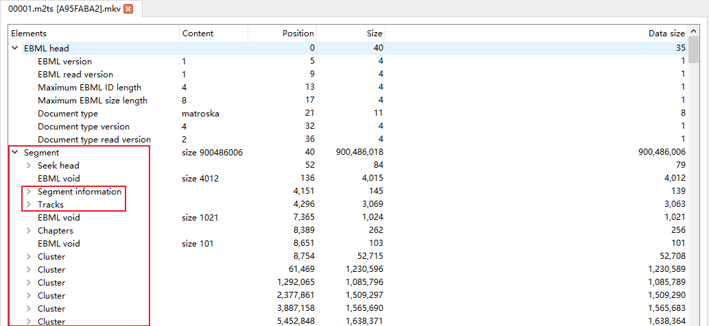

*Figure: Basic structure of Matroska file. Source: VCB-Studio "Understanding Video from Scratch". *

### Codec, Encoder, and Decoder

- A **codec specification** defines how compressed data is organized, as in AVC/H.264, HEVC/H.265, or AV1.
- An **encoder** is software or hardware that implements a codec specification. For example, x264 is an AVC encoder and x265 is a HEVC encoder.
- A **decoder** restores a compressed stream to pictures or audio that can be displayed or processed further.
- **A codec specification is not an encoder implementation.** `H.264` and `x264`, or `H.265` and `x265`, name different layers of the system.

### Demuxing, Muxing, Remuxing, and Transcoding

| Operation | Whether to recompress | Description |
| --- | --- | --- |
| Demux | No | Extract video, audio, subtitle, or other tracks from a container |
| Mux | No | Place independent tracks and metadata into a container |
| Remux | Usually no | Preserve the encoded tracks while changing the container or track organization |
| Transcode／Transcoding | Yes | Re-encode with another set of encoding settings after decoding |
| Re-encode／re-encoding | Yes | Even if the encoding standard remains unchanged, re-compression will produce a new generation of encoding results |

Remuxing cannot repair image defects already present in an encoded stream. Conversely, if only the container is unsupported by the editing application, a lossy transcode may be unnecessary.

### Lossless, Lossy, and Generation Loss

- **Lossless encoding** can recover sample-by-sample consistent data from the compression result, but it does not mean that the file is unprocessed.
- **Lossy encoding** actively discards some information in exchange for higher compression rates.
- **Visually lossless** is just "difficult to observe the difference" under certain viewing conditions, not mathematical losslessness.
- **Generation loss** is the error accumulated when lossy media is repeatedly decoded, processed, and re-encoded.

In MAD·AMV production, source media should undergo only the processing that is necessary. Generate platform-specific releases from a high-quality master instead of reusing a platform-downloaded copy as a new source.

## 2. Inspect Source Media Instead of Guessing

### Recommended checking tools

- [MediaInfo](https://mediaarea.net/MediaInfo): Quickly view container, track and encoding parameters;
- [ffprobe](https://ffmpeg.org/ffprobe.html): Read stream, timestamp, frame rate and color metadata;
- A player or preview tool that supports frame-by-frame viewing, switching field order and displaying frame numbers;
- Material properties, sequence properties and color management panels of editing software.

Basic check commands:

```bash
ffprobe -v error -show_format -show_streams -of json input.mkv
```

Check only the common fields of the first video stream:

```bash
ffprobe -v error -select_streams v:0 \
  -show_entries stream=codec_name,profile,width,height,pix_fmt,field_order,r_frame_rate,avg_frame_rate,time_base,color_range,color_space,color_transfer,color_primaries \
  -of default=noprint_wrappers=1 input.mkv
```

::: tip command can only read existing information
Metadata may be missing or mislabeled. Inspection results must be cross-validated with source specifications, actual footage, frame sequences and software interpretation methods.
:::

### Video Source Checklist

| Item | What to confirm | Consequences of incorrect interpretation |
| --- | --- | --- |
| Containers and tracks | Video, audio, subtitles, chapters, attachments | Missing tracks, wrong default tracks, missing subtitle fonts |
| Codec and profile | codec, profile, level/tier | Decode failure or hardware incompatibility |
| Screen size | Encoding size, display size, cropping, rotation | Stretching, black borders, wrong orientation |
| Pixel aspect ratio | SAR, DAR | Wrong proportions of characters and graphics |
| Pixel format | RGB/YUV, 4:4:4/4:2:2/4:2:0, bit depth, Alpha | Color fringing, gradient break, transparent edge errors |
| Frame rate | Exact fraction, CFR/VFR, time base | Repeated frames, dropped frames, audio and video drift |
| Scan mode | Progressive, interlaced, field order, telecine | Combing, judder, or repeated fields |
| Color metadata | primaries, transfer, matrix, range | color cast, gray-black, dead black, highlight cutoff |
| HDR information | PQ/HLG, static or dynamic metadata | Display too dark, too bright, wrong colors |
| Audio | Encoding, sample rate, bit depth, channel layout, delay | Pitch shifting, channel misalignment, out of sync |

## 3. Frame Dimensions, Pixels, and Sampling

### Resolution, display ratio and pixel aspect ratio

- **Resolution** is the number of samples horizontally and vertically, such as `1920 × 1080`.
- **SAR (Sample Aspect Ratio)** describes the aspect ratio of a single sample. Square pixels are typically `1:1`.
- **DAR (Display Aspect Ratio)** is the final display aspect ratio.
- The relationship is approximately: `DAR = frame aspect ratio × SAR`.

Older format, DVD, or broadcast material may use non-square pixels. Just look at `720 × 480` and other encoding sizes and scale them directly, you may get the wrong ratio.

### RGB, YUV and YCbCr

RGB records red, green, and blue components respectively, and is suitable for display, graphics, and composition. Video encoding often uses digital YCbCr: Y′ records the brightness-related components processed by the transfer function, and Cb and Cr record color difference signals. Daily software interfaces often refer to YCbCr as YUV, but the two are not exactly the same in strict definition.

The human eye is generally more sensitive to luminance detail than chroma detail, so videos can be downsampled to save data.


*Figure: Example of color assimilation illustrating the difference in perception of luminance and chrominance information. Source: VCB-Studio "Understanding Video from Scratch". *

### Chroma Subsampling

`4:4:4`, `4:2:2` and `4:2:0` describe the sampling ratio of brightness and chroma in a certain pixel area, not the "image quality percentage".

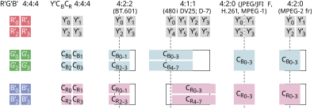

*Figure: Common chroma sampling structures. Source: VCB-Studio "Understanding Video from Scratch". *

| Format | Characteristics | Common uses in MAD·AMV |
| --- | --- | --- |
| 4:4:4 | Each luma sample has a corresponding chroma sample | Graphics, text, keying, synthesis intermediate files |
| 4:2:2 | Reduce chroma sampling in the horizontal direction | Professional collection and production of intermediate formats |
| 4:2:0 | Chroma downsampling in both landscape and portrait orientation | BD, web video and common distribution files |

"4:2:0" also refers to the chroma location/chroma sampling location. Different standards have different conventions on where the chroma samples are located on the pixel grid; incorrect interpretation can result in a chroma shift of about half a pixel.


*Figure: Illustration of chroma sampling and sampling position. Source: VCB-Studio "Understanding Video from Scratch". *

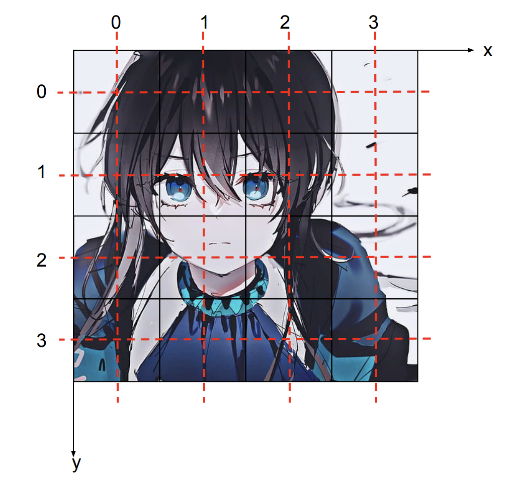

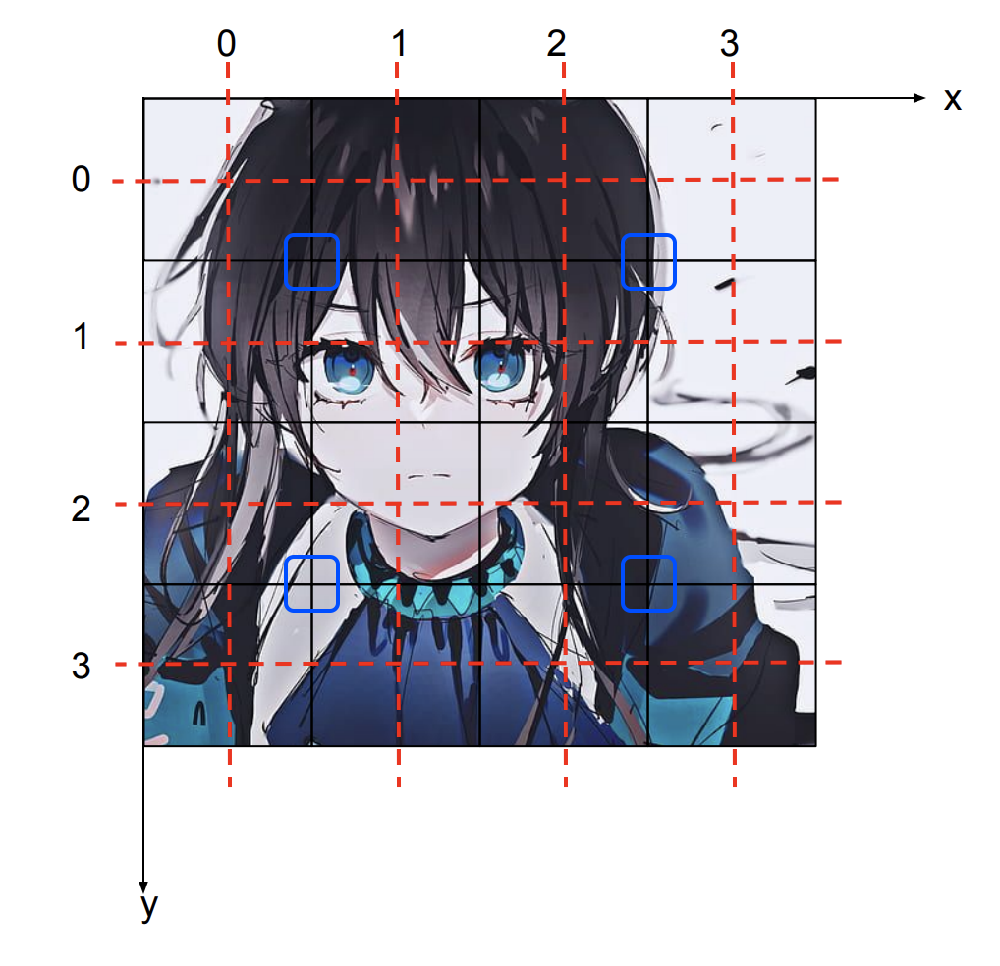

*Figure: Luminance and chroma sampling grid. Source: VCB-Studio "Understanding Video from Scratch". *

### Bit Depth, Quantization, and Dithering

The bit depth determines the number of discrete series that can be represented by a single component:

- 8-bit: Maximum `2⁸ = 256` encoding values per component;
- 10-bit: Maximum `2¹⁰ = 1024` encoding values per component;
- 12-bit: Maximum `2¹² = 4096` encoded values per component.

Increasing bit depth will not restore lost detail out of thin air, but it will reduce rounding errors in grading, gradients, blurs, glows, and multiple compositing. When converting from high bit depth to low bit depth, **dither/dither** can be used to convert regular quantization steps into less conspicuous subtle noise.

Examples of common pixel format names:

| Name | Meaning |
| --- | --- |
| `yuv420p` | 8-bit planar YUV 4:2:0 |
| `yuv420p10le` | 10-bit, little endian, planar YUV 4:2:0 |
| `yuv422p10le` | 10-bit planar YUV 4:2:2 |
| `yuv444p10le` | 10-bit planar YUV 4:4:4 |
| `gbrp`／`gbrp10le` | Planar RGB, 8-bit／10-bit |
| `rgba` | Packed RGB with Alpha |

### Alpha Channel

Alpha records transparency. It is necessary to distinguish during synthesis:

- **Straight／Unmatted Alpha**: RGB saves the color without multiplied transparency;
- **Premultiplied/Matted Alpha**: RGB multiplied by Alpha.

Incorrect interpretation can produce black edges, white edges, or color contamination on transparent edges. H.264/HEVC files for publishing generally do not assume transparency intermediate file responsibilities; transparent compositing should select an intermediate format or image sequence that explicitly supports Alpha.

## 4. Color Management

### Human Vision, CIE, and Color Gamut

Color primaries are not "numbers of colors", but three sets of primary color coordinates and white points that define a codable color gamut. The figure below shows the relative responses of the three types of cone cells in the human eye to different wavelengths.

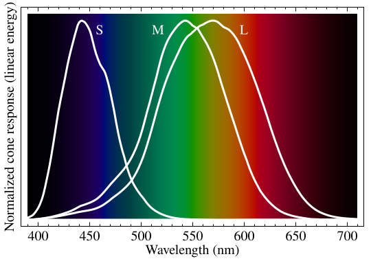

*Figure: Normalized response spectrum of human cones. Source: VCB-Studio "Understanding Video from Scratch". *

The CIE xy chromaticity diagram projects visible colors onto a two-dimensional plane. The RGB primaries in the standard form a triangle in the diagram, and inside the triangle is the range of colors that can be represented by that set of primaries.

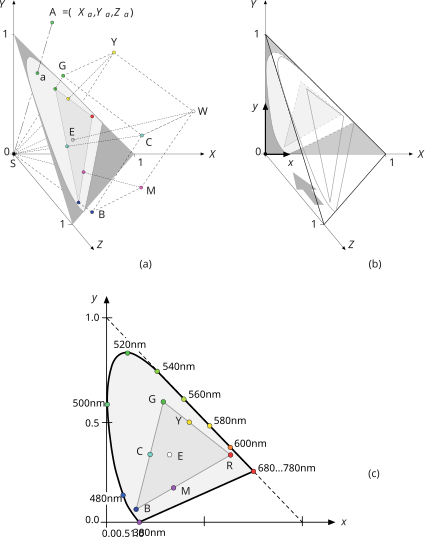

*Figure: CIE xy chromaticity diagram. Source: VCB-Studio "Understanding Video from Scratch". *

### Four Fields That Determine Video Color

| Project | What to decide | Typical signs of incorrect marking |
| --- | --- | --- |
| Color primaries／Color primary colors | RGB primary color coordinates and white point, that is, color gamut | Hue and saturation errors of saturated colors |
| Transfer characteristics | Relationship between linear light and encoded values | Midtones, shading, and HDR brightness errors |
| Matrix coefficients／Matrix coefficients | Conversion relationship between RGB and Y′CbCr | Overall color cast, skin tone and highly saturated colors are obviously abnormal |
| Color range／Color range | The valid range corresponding to the digital encoding value | Gray, dead black, overexposed or truncated details |

These four items are independent of each other. You can't just write "Rec.709" and ignore whether it is a primary color, transfer property, or matrix, and you can't force override metadata based on resolution alone.

### Rec.601, Rec.709 and Rec.2020


*Figure: Rec.601 Chromaticity Diagram. *


*Figure: Rec.709 chromaticity diagram. *

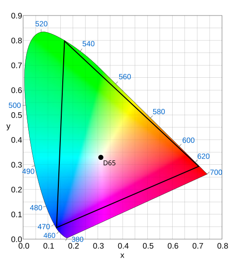

*Figure: Rec.2020 chromaticity diagram. Source of the three pictures: VCB-Studio "Understanding Video from Scratch". *

- **Rec.601** is common in SD digital video, but NTSC and PAL systems still need to be further distinguished;
- **Rec.709** is the most common standard combination used in HD SDR production and delivery;
- **Rec.2020** defines the wider color gamut primary colors used by the UHD system, and the actual content may not necessarily use the boundaries;
- **sRGB** and Rec.709 use the same primary colors and D65 white point, but the transfer function and usage scenarios cannot simply be regarded as exactly the same;
- **Display P3／DCI-P3** is not an alias for Rec.2020 either.

### Transfer, Gamma, PQ and HLG

Transfer characteristics are used to map linear optical signals into nonlinear coded values suitable for recording and transmission. Traditional SDR is often colloquially referred to as Gamma; HDR is commonly referred to as:

- **PQ／ST 2084**: based on absolute display brightness;
- **HLG**: Relative system for broadcast compatibility.

Converting HDR to SDR is not just about changing the label, it requires color gamut mapping and tone mapping. Conversely, marking an SDR file as HDR will not produce true HDR.

### Full range and Limited range

Take the common Y′CbCr as an example:

| Bit Depth | Limited Y′ | Limited Cb／Cr | Full |
| --- | --- | --- | --- |
| 8-bit | 16–235 | 16–240 | 0–255 |
| 10-bit | 64–940 | 64–960 | 0–1023 |

Headroom/footroom may still be reserved outside the Limited range. Processing should not be performed without justification at each step, nor should label changes be mistaken for numerical conversions.

A clear distinction needs to be made between:

1. **Modify tag**: only change how the player interprets existing values;
2. **Conversion range**: actual remapped pixel value;
3. **Cutting range**: Truncate out-of-bounds values to the boundary.

One wrong conversion can make the image look gray; repeated conversions or incorrect cropping can permanently lose shadows and highlights.

### Color management in projects

MAD·AMV projects should be fixed and documented:

- working color space;
- Timeline bit depth or floating point precision;
- Material input transformation;
- Monitor and preview links;
- Output color space and color metadata;
- Whether to use OCIO, ACES or the software’s own color management;
- sRGB/ICC interpretation of screenshots, graphics and PNG assets.

"Looking the same" must be based on the same display conditions and the same color management chain. System players, browsers, editing software and platform transcoding results may use different color management.

## 5. Frames, Fields, Timestamps, and Motion Cadence

### Frame Rate Is Not an Approximate Integer

Common frame rates should keep exact scores:

| Commonly used writing methods | Accurate value |
| --- | --- |
| 23.976 | `24000/1001` |
| 24 | `24/1` |
| 29.97 | `30000/1001` |
| 30 | `30/1` |
| 59.94 | `60000/1001` |
| 60 | `60/1` |

`23.976` and `24`, `29.97` and `30` will produce visible time differences after long-term accumulation. Audio sync, subtitle times and match time limits should all be checked against real timestamps.

### CFR, VFR, time base and timestamp

- **CFR (Constant Frame Rate)**: Adjacent frames use a uniform display interval;
- **VFR (Variable Frame Rate)**: The display interval of different frames can be changed;
- **time base／time base**: the smallest unit of measurement used in timestamps;
- **PTS**: The time a frame should be presented;
- **DTS**: The time a frame should enter the decoder.

Since B frames refer to future pictures, the display order and decoding order may be different, so PTS and DTS are not necessarily consistent.

Neither `r_frame_rate`, `avg_frame_rate`, or "total frames ÷ duration" alone can prove that footage is CFR. Before mobile phone screen recording, screen recording, and Internet downloaded materials enter the editing software, you should check the actual timestamp and do a synchronization test.

### Progressive and interlaced

- **Progressive／Progressive**: Each frame contains a complete picture at the same time;
- **Interlaced／interlaced**: One frame consists of two fields with different times;
- **TFF／Top Field First**：The field is displayed first;
- **BFF／Bottom Field First**: The bottom field is displayed first.

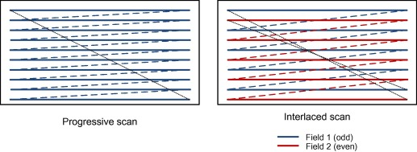

*Figure: Schematic of progressive and interlaced scanning. Source: VCB-Studio "Understanding Video from Scratch". *

Scaling, rotating, or sharpening interlaced footage as if it were progressive footage solidifies the field structure into imperfections that are harder to repair. The processing sequence should usually be to first determine the field structure, then do correct field matching, deinterlacing or degeling, and then enter the line-by-line editing process.

### Telecine, field matching and IVTC

Film and television animations are often produced at close to 24 fps, and then converted to an interlaced system of about 29.97 fps through 3:2 pulldown and other methods. **IVTC (Inverse Telecine)** attempts to restore the original progressive frame sequence; it is different from ordinary deinterlacing.


*Figure: Field assignment for 3:2 pulldown. Source: VCB-Studio "Elementary 30 fps Processing". *

Actual animation may be mixed:

- 24p: progressive approximately 24 fps content;
- 30p: progressive approximately 30 fps content;
- 30i: approximately 59.94 temporally distinct fields per second;
- 24t: obtained from 24p via the rule telecine;
- 24d: insert repeated frames in ~30 fps sequence;
- Mixed frame rates, duplicate fields, bad fields and post-superimposed subtitles.


*Figure: Field phase misalignment. Source: VCB-Studio "Elementary 30 fps Processing". *

You can't mechanically "de-duplicate" the entire footage or flatten it to 60 fps. The real movement rhythm should be confirmed segment by segment before processing. Different rhythms may also be used for camera cuts, camera pulls, subtitles and special effects layers.

### Animation Exposure and Video Frame Rate

"One shot for one, two shots for one, three shots for one" in the animation describes how many exposure frames the drawn image maintains, which is not equal to the container frame rate. A 23.976 fps file can display multiple consecutive frames of the same drawing; these repetitions may be a creative rhythm, rather than redundant frames that must be deleted.

Frame-filling creates an intermediate image that does not exist in the original work. Occlusions, fast cuts, flashes, particles, text, and anamorphic lenses are particularly prone to distortion and are not lossless frame rate conversions.

## 6. How Video Compression Works

### Intra-frame compression: transformation, quantization and entropy coding

The encoder usually divides the picture into blocks, transforms the spatial domain signal into the frequency domain, and then quantizes the coefficients. Smooth changes are concentrated in low frequencies, and fine lines, textures, and noise contain more high-frequency information.

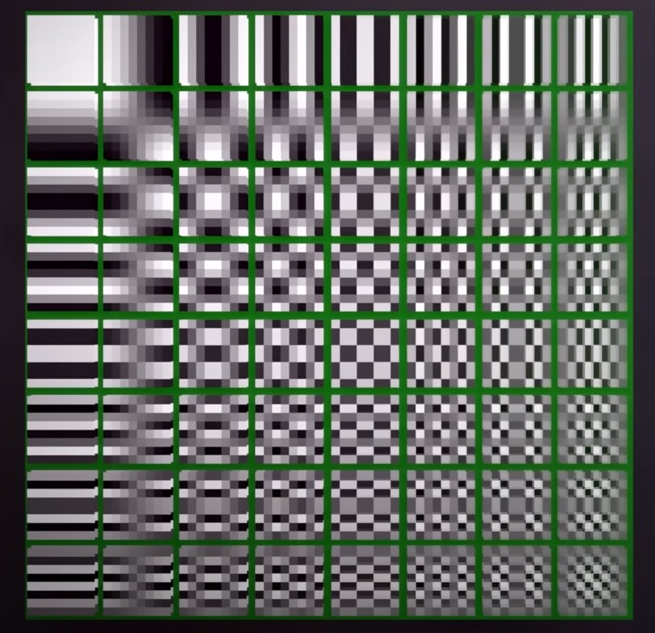

*Figure: 8 × 8 DCT basis functions. Source: VCB-Studio "Video Encoder Basics". *

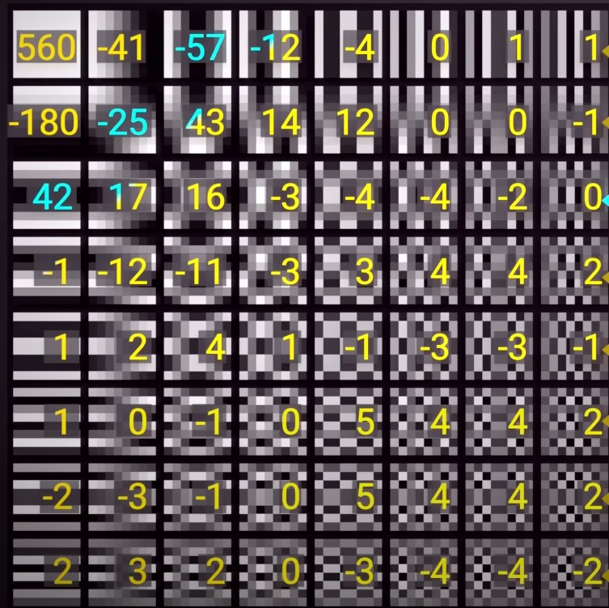

*Figure: Example of DCT coefficients after image block conversion. Source: VCB-Studio "Video Encoder Basics". *

**Quantization** will reduce the accuracy of the coefficients and is the main information loss link in common lossy coding. The stronger the quantization, the more high-frequency details are erased; entropy coding is then used to losslessly compress the remaining data.

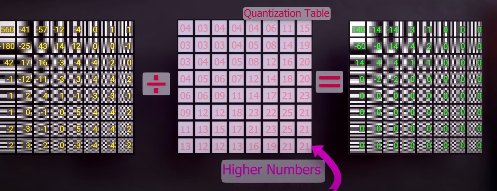

*Picture: Quantitative representation. Source: VCB-Studio "Video Encoder Basics". *

### Interframe compression: prediction and motion compensation

Consecutive frames of video are usually highly similar. Instead of saving the complete image every frame, the encoder searches for similar regions in the reference frame and records motion vectors and prediction residuals.

| Frame type | Basic function |
| --- | --- |
| I frame | Only uses the internal information encoding of the current frame and can be used as the basis for random access |
| P-frame | Prediction using previous reference frame |
| B frame | Can use front and rear reference frames for bidirectional prediction |

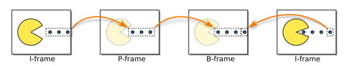

*Figure: Basic reference relationship of I/P/B frames. Source: VCB-Studio "Understanding Video from Scratch". *

### GOP, keyframes and random access

**GOP (Group of Pictures)** is a group of coded images that reference each other. Keyframe interval effects:

- Random drag and cut positioning;
- Recovery after scene switching;
- Compression efficiency;
- Streaming media fragmentation and platform transcoding;
- Error propagation scope.

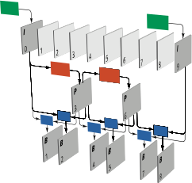

*Figure: GOP structure and inter-frame references. Source: VCB-Studio "Understanding Video from Scratch". *

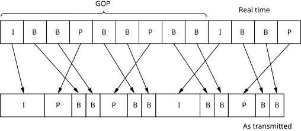

*Figure: The difference between display order and transmission/decoding order. Source: VCB-Studio "Understanding Video from Scratch". *

The keyframe interval is not bigger, the better, nor is it a fixed number. Short films, competition titles, files that require precise segmentation, and streaming platforms have different requirements for random access.

### Why block structures continue to evolve

Different codec generations permit different block and prediction structures. More flexible partitions can describe flat areas, lines, and motion boundaries more accurately, but require more encoder computation.

| MPEG-2 example | AVC/H.264 example | HEVC/H.265 example |
| --- | --- | --- |
| 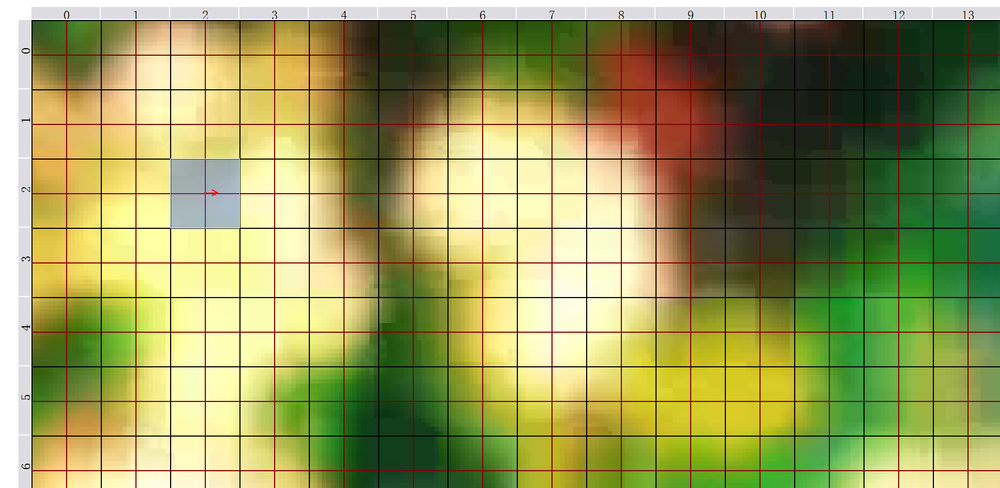 |  |  |

*Figure: Examples of chunking for different encoding structures. Source: VCB-Studio "Video Encoder Basics". *

### Profile, Level and Tier

- **Profile** specifies which coding tools and pixel formats are permitted;
- **Level** limits resolution, frame rate, bitrate, buffering, and other complexity bounds;
- **Tier** appears in some standards to distinguish additional bitrate capabilities.

These fields mainly serve decoding compatibility, not simple "image quality level". Setting the Level very high will not automatically improve the picture quality, but may cause the device to refuse playback.

## 7. Bitrate Control and Encoding Parameters

### Bitrate, File Size, and Quality

Average bitrate and file size are approximately related by:

`file size ≈ average total bitrate × duration`

Total bitrate also includes audio, subtitles, and container overhead. At the same bitrate, codec, encoder implementation, preset, resolution, frame rate, and content complexity can all change the resulting quality.

### Common Rate-Control Modes

| Mode | Control Objectives | Applicability |
| --- | --- | --- |
| CBR | Try to maintain a fixed bitrate | Real-time transmission with strictly limited bandwidth; there are usually still buffering fluctuations in file encoding |
| ABR/Average bitrate | Achieve target average bitrate | Known file size or total bitrate budget |
| 2-pass VBR | The first pass is analysis, the second pass is allocated according to the total budget | Need to more accurately control the size of the finished product |
| CRF/Constant Quality | Allocate bitrate based on perceived quality targets | Publish or archive without hard file size limits |
| CQP/QP | Direct control of quantization parameters | Testing or specific workflows, not equivalent to constant visual quality |
| CQ/ICQ, etc. | Quality target modes for hardware encoders | Names and scales vary by implementation |


*Figure: Example of x264 rate control options, used to illustrate different control targets; the interface version is not recommended as the current parameter. Source: VCB-Studio "Video Encoder Basics". *

### CRF is not a "fixed quality percentage"

CRF numbers can only be compared relatively within the same encoder, similar versions and similar setups:

- CRF numbers of different encoders cannot be horizontally equivalent;
- The same CRF will generate different bit rates and volumes when faced with different materials;
- After changing the preset, tune, resolution, bit depth or noise reduction level, the results will also change;
- The CQ/ICQ scale in the hardware encoder cannot be directly applied to the CRF experience of x264/x265.

A reliable approach is to select representative clips for testing: dark gradients, fast motion, thin lines, particles, glow, lens shake, noise, complex transitions, and large amounts of text.

### Preset, Tune and Psychological Visual Optimization

- **Preset** mainly determines how much search and decision-making calculations the encoder is willing to invest. Generally, the slower the compression, the higher the efficiency, but the marginal benefit will decrease;
- **Tune** changes the encoder's weight for certain types of content;
- The preset named `animation` is not necessarily suitable for all Japanese animations, nor is it necessarily suitable for MAD that contains a large number of synthetic, particle and live-action materials;
- Parameters should be tested based on the work. The parameter table of a certain subtitle group, a certain era or a certain software version should not be regarded as a universal standard.

### VBV and Peak Limit

The VBV model uses the maximum bit rate and buffer size to constrain the peak code stream to serve the network or hardware decoding capabilities. Setting it too tight will force complex shots to significantly reduce quality; setting no limit at all may exceed the target device or platform's instantaneous throughput capabilities.

### Software encoding and hardware encoding

- Software encoding usually provides more complete search and parameter control, making it suitable for high-quality final output;
- GPU/media engine hardware encoding is faster, suitable for preview, proxy, recording and time-sensitive tasks;
- New hardware generations can substantially change encoding quality; quality cannot be inferred from "CPU" or "GPU" alone;
- Actual graphics, speed and compatibility should ultimately be compared under the same delivery constraints.

## 8. Intermediate Files, Proxies, and Masters

### Intermediate format

Editing and compositing intermediate files should give priority to:

- Frame accurate access;
- Low decoding burden;
- Sufficient bit depth and chroma accuracy;
- Alpha support;
- Stability after multiple generations of processing;
- Editing software compatibility.

Common directions include ProRes, DNxHR, CineForm, FFV1, uncompressed video, and PNG/TIFF/EXR image sequences. The choice depends on software, operating system, alpha, HDR and storage budget.

### Proxy Files

Proxies reduce decoding and storage pressure during editing; they are not final masters. A proxy workflow must ensure:

1. Each proxy corresponds uniquely to its source file;
2. The duration, time code, frame rate and audio are synchronized and consistent;
3. Randomly check key shots after reconnecting;
4. The final export references the source media rather than the proxy;
5. Variable speed, nested sequences and VFR footage are independently verified.

### Master and Release Versions

It is recommended to distinguish at least:

| Type | Purpose | Focus |
| --- | --- | --- |
| Project master | Later revisions, subtitled editions, and platform transcodes | High bit depth, low generation loss, complete audio |
| Contest submission version | Comply with current rules | Strictly adhere to container, encoding, duration and volume |
| Platform release version | Upload to Bilibili and other platforms | Compatible with the platform and reserve margin for secondary transcoding |
| Review version | Team proofreading, fast transmission | Small size, with version number or watermark |

Masters, releases, and projects should use clear version numbers and should not be distinguished by "final2_reallyfinal".

## 9. Containers and Tracks

### Common containers

| Container | Main features | Usage precautions |
| --- | --- | --- |
| MP4 | Wide platform and device compatibility | Limited support for subtitles, attachments and some audio formats |
| MKV | Rich capabilities of tracks, subtitles, chapters and attachments | Some editing software or platforms do not accept it directly |
| MOV | Common production process, works with multiple intermediate encodings | Compatibility depends on internal encoding |
| WebM | Often used with VP9/AV1, Opus | May not be accepted in competitions or traditional editing environments |

When encapsulating, you need to check the default track, forced track, language, name, chapter, subtitle font, delay, color label and rotation information.

### Limits of Cutting Without Re-encoding

Most long GOP videos can only be cut losslessly starting near randomly accessible keyframes. Even if the tool displays "success", the cut point may be moved forward, the first paragraph may be blurred, or the timestamp may be rewritten. When precise point-cutting is required frame-by-frame, this should usually be handled in the editing timeline or in an intermediate format.

### A Safe Remuxing Example

```bash
ffmpeg -i input.mkv -map 0 -c copy output.mkv
```

This command only demonstrates the concept of "copy all tracks and repackage". Real projects still need to check attachments, chapters, track labels, timestamps, and target container compatibility.

## 10. Audio Fundamentals

### Sampling rate, bit depth and channels

- **Sampling rate** indicates how many audio samples are collected per second, 48 kHz is common in video production;
- **Bit depth** affects the quantization accuracy of PCM samples;
- **Number of channels** is not equal to the channel layout, and the six channels may be arranged differently;
- **PCM** is uncompressed sampling, FLAC is lossless compression, AAC/Opus, etc. are usually lossy compression.

The sampling rate should be fixed as much as possible within the project to avoid multiple resampling. Importing 44.1 kHz music doesn't mean you have to convert it individually to lossy 48 kHz files first; editing software can output them uniformly after high-precision internal processing.

### Loudness, Peak and True Peak

- Digital peak only checks whether discrete samples reach the upper limit;
- **True Peak／True Peak** estimates the possible peak value of the reconstructed waveform between samples;
- **LUFS** is used to describe the perceived loudness on a certain time scale;
- Limiters are not a substitute for mixing, and they cannot be used to determine whether a work sounds reasonable based on a single loudness number.

The platform may normalize playback for loudness, but the rules will change. Keep the unclipped master version and review the actual upload results.

### Synchronization and delay

Audio and video synchronization problems may come from:

- VFR timestamp;
- 23.976/24 or 29.97/30 mixed;
- Encoder delay and container compensation;
- Track start times are different;
- Resampling or variable speed;
- No re-encoding cuts falling on audio frame boundaries.

Just checking the beginning is not enough to detect drift, you should check the middle and the end at the same time.

## 11. Identifying Image Defects

The goal of defect identification is not to "fit all problems with filters", but to distinguish the production characteristics of the material itself, distribution media problems, error handling and encoding losses. The restoration must be clearly defined and compared frame by frame to the unprocessed version.

### Banding

Smooth gradients are divided into visible color levels. Could be from low bit depth, strong quantization, wrong range conversion, or excessive noise reduction. Debanding usually requires dithering or protective noise; too much processing can erase existing shadow lines and texture.

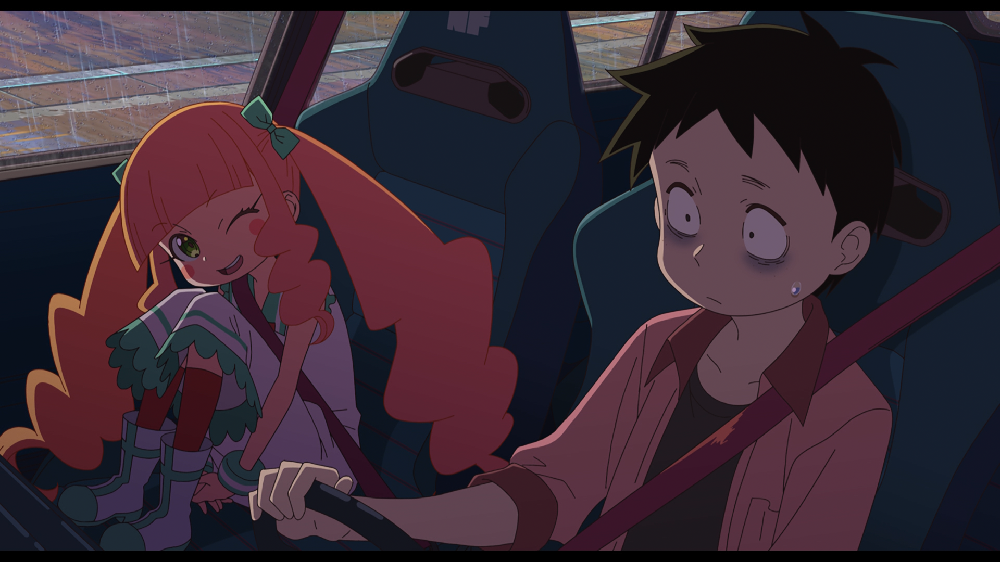

*Picture: Banding. Source: VCB-Studio "Understanding Defects". *

### Aliasing

Steps and erratic flickering in diagonal lines, curves, or scaled details. The source may be raw rendering, low-resolution upscaling, error field processing, or scaling algorithms. Anti-aliasing does not equal overall blur.


*Picture: Aliasing. Source: VCB-Studio "Understanding Defects". *

### Ringing/Haloing

Ripples, bright edges, or dark edges around high-contrast edges are often associated with over-sharpening, scaling, or compression. When processing, distinguish the strokes, luminous effects and abnormal edges of the original work.

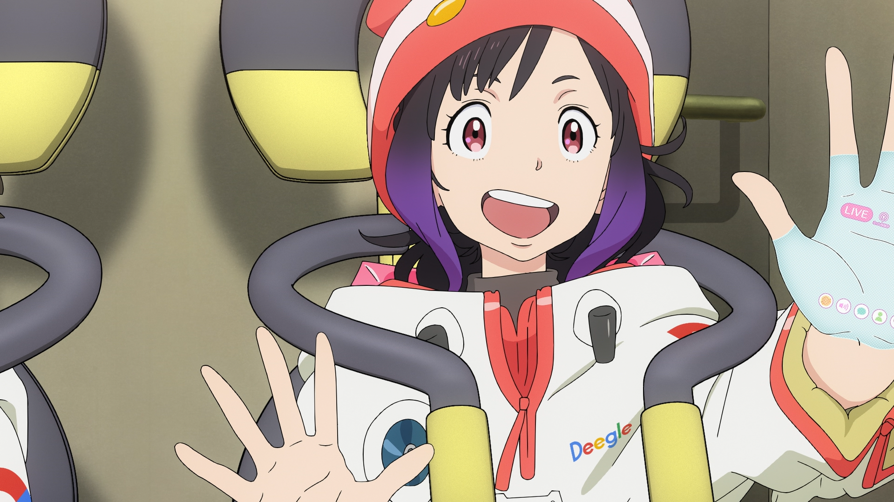

*Picture: Ringing. Source: VCB-Studio "Understanding Defects". *

### Noise/Grain

Noise may come from the sensor, film, scanning, compression, or production process; grain may also be texture that the creator intentionally preserved. Noise reduction changes encoding difficulty, but excessive noise reduction can lead to melted lines, lost textures, and "mush" in motion.

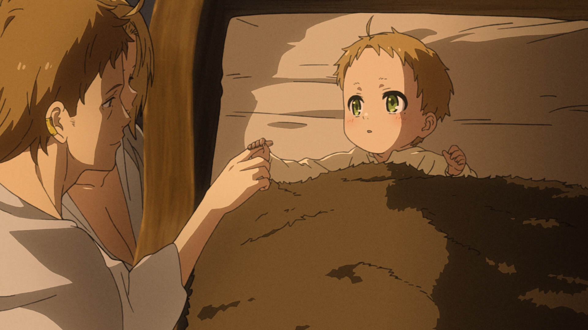

*Picture: Noise. Source: VCB-Studio "Understanding Defects". *

### Blocking effect and mosquito noise (Blocking/DCT Ringing)

When the bit rate is insufficient or the quantization is too strong, block boundaries become visible; wandering noise, bad edges, and DCT ringing may also appear around text and lines. Post-processing can only alleviate, but not restore, the true details that have been lost.


*Picture: Blocking and DCT ringing. Source: VCB-Studio "Understanding Defects". *

### Luma Overflow and Clipping

Range interpretation errors may cause effective highlights or shadows to be treated as pure white or pure black. The figure below compares the results after brightness overflow and restoration to the correct range.

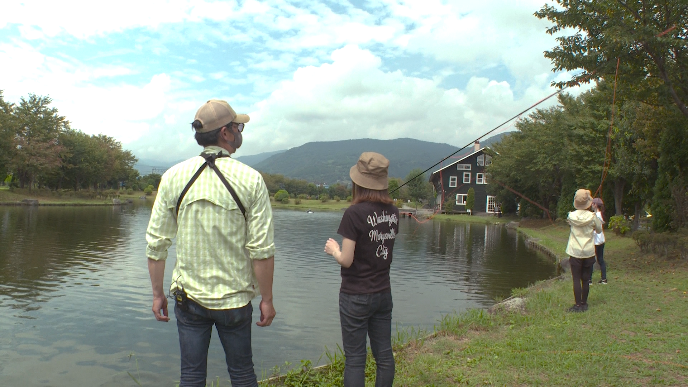


*Picture: Luma overflow and correction example. Source: VCB-Studio "Understanding Defects". *

If the data has been truncated, simply changing the label later will not restore the details. Before repairing, you need to determine whether the display is interpreted incorrectly or the pixel values ​​have been clipped.

### Combing, Interlace Scaling Artifacts, and Duplicate Fields

- **Combing／Brushing**: Two fields at different times are displayed as one frame at the same time;
- **Offset caused by interlaced scaling**: scaling according to the progressive algorithm without first processing the field structure;
- **Duplicate field／Duplicate field**: The two fields of a frame are actually repeated, which is easily confused with ordinary aliasing.

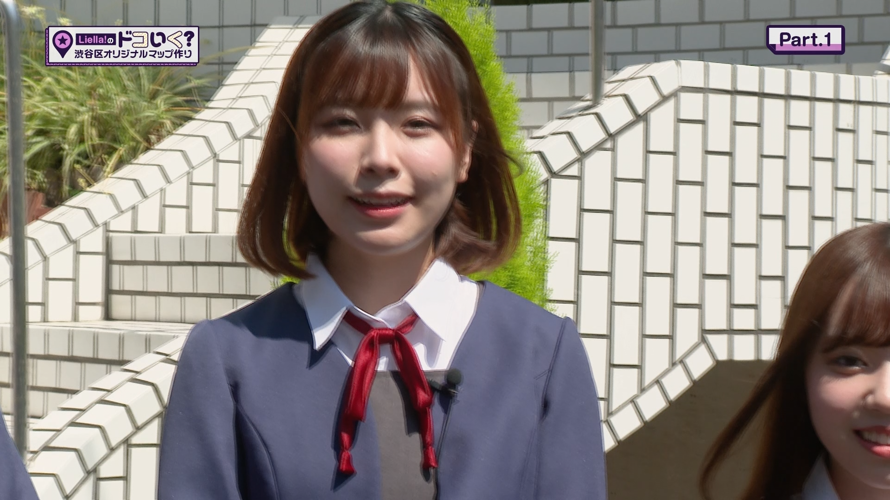


*Image: Interlacing related imperfections. Source: VCB-Studio "Understanding Defects". *

### Blending and Ghosting

Abnormal blending of adjacent frames can leave translucent afterimages on moving edges. It could come from incorrect format conversion, deinterlacing, or time-domain processing. Some regular problems can be partially restored, but irregular mixing is often difficult to fully restore.


*Picture: Blending. Source: VCB-Studio "Understanding Defects". *

### Chroma Banding, Chroma Aliasing, and Chroma Shift

Errors in the accuracy, downsampling algorithm, and sampling position of the chroma plane will produce artifacts that are different from those of the luma plane:


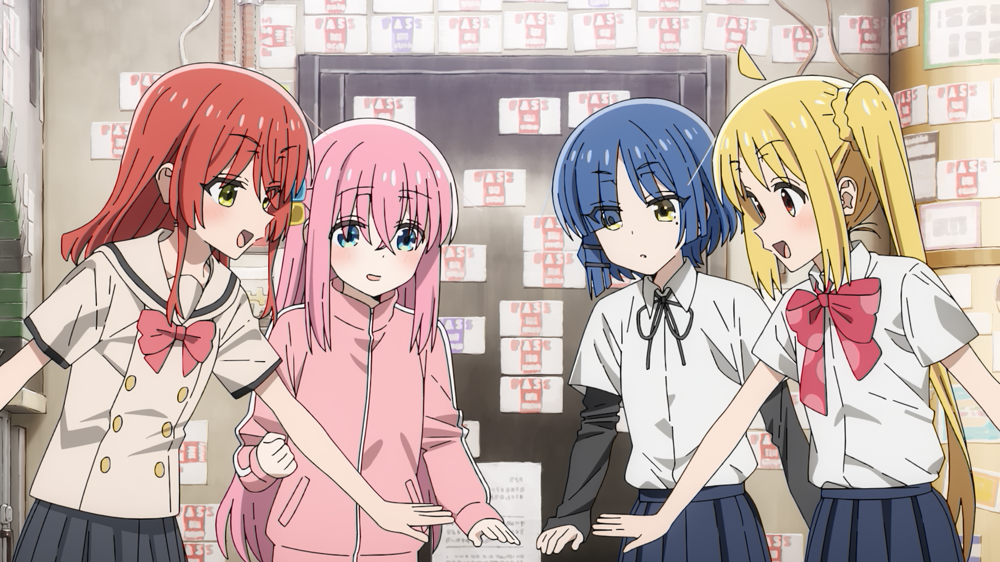

*Picture: Chroma banding, chroma aliasing and chroma shift. Source: VCB-Studio "Understanding Defects". *

Chroma shift is usually a unidirectional misalignment of the chroma plane relative to the luma plane. It is different from visual effects that deliberately stagger the RGB channels:


*Picture: RGB shift special effect, used to distinguish it from abnormal chroma shift. Source: VCB-Studio "Understanding Defects". *

### Chroma Bleeding

Highly saturated colors expand to the surroundings, and the chroma boundary clearly exceeds the brightness boundary. It is different from directional chromaticity shift.

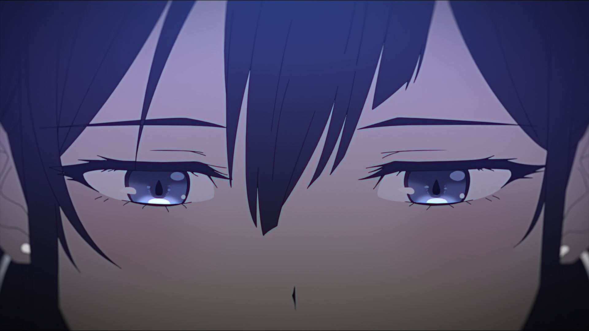

*Picture: Chroma bleeding. Source: VCB-Studio "Understanding Defects". *

### Rainbow Artifacts and Dot Crawl

Early analog composite video or poor dubbing can cause high-frequency crosstalk from luminance to chroma, creating red and blue rainbow streaks or moving dot patterns.


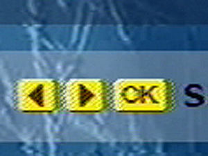

*Picture: Rainbow and dot crawl. Source: VCB-Studio "Understanding Defects". *

## 12. Suggested MAD·AMV Production Workflow

### 1. Source Registration

Record source, version, episode number, time period, container, encoding, resolution, frame rate, color information and audio track. BD, streaming media, WEBRip, PV, game screen recording and homemade graphics cannot be classified into the same category just by extension.

### 2. Technical Diagnosis

Use MediaInfo/ffprobe to establish parameter records, and then judge frame by frame:

- Whether true interlaced, pseudo-interlaced or telecine;
- Whether it is CFR/VFR;
- Whether there are range, matrix or chroma position errors;
- Does the defect come from the original production, a particular release, or a platform transcode?
- Is there a higher quality source.

### 3. Preprocessing

Only handle confirmed issues. Recommended to keep:

- original document;
- Process scripts and versions;
- Key parameters;
- Compare frames before and after processing;
- Records of cropping, speed shifting, deinterlacing and color conversion done on the footage.

### 4. Proxy Editing

Use consistent proxy naming, timecode, and audio synchronization. Choose the timeline frame rate from the work's primary cadence and delivery rules; do not let the first imported clip determine it without review.

### 5. Compositing and Intermediate Output

High-intensity color grading, glow, particles, motion blur, text and keying should be completed in a high bit depth environment as much as possible. When cross-software is required, give priority to using low-loss intermediate formats or image sequences, and confirm the Alpha type and color space.

### 6. Master output

The master should retain sufficient bit depth and chroma accuracy to avoid using a long GOP release encoding that is too low a bitrate as the only archive. The audio is retained as a lossless version, recording the project sample rate, channel layout and loudness processing.

### 7. Release Encoding and Muxing

Generate competition version, Bilibili release version or other platform versions from the master version respectively. Do not treat downloaded files after transcoding for one platform as master files for other platforms.

### 8. Review after uploading

The platform will transcode again. Spot check after uploading:

- Beginning, end and random position;
- Dark gradient, strong flash, fast motion, thin lines, subtitles and particles;
- Audio and video synchronization and sound channels;
- The resolution level actually provided by the platform;
- Cover, title, introduction, subtitles and statement of work.

## 13. Delivery Checklist

### File and Picture

- [ ] The file can be read completely, and the total duration is consistent with the competition limit;
- [ ] There are no errors in the first frame, last frame, black field and ending;
- [ ] Resolution, SAR, DAR and rotation information are correct;
- [ ] Accurate frame rate, CFR/VFR, time base and timestamps are as expected;
- [ ] Progressive/interlaced, field sequential, telecine and repeating frame structures confirmed;
- [ ] Pixel format, bit depth, chroma sampling and alpha correct;
- [ ] primaries, transfer, matrix, range labels are consistent with actual pixels;
- [ ] HDR/SDR output meets target, no pseudo-conversion that only changes labels;
- [ ] Shadows, highlights, gradients, thin lines, fast motion and complex special effects are checked;
- [ ] No new color banding, aliasing, ringing, blocking, ghosting or frame-filling distortions.

### Audio

- [ ] The sampling rate, encoding, number of channels and channel layout are correct;
- [ ] No popping, clipping, channel reversal or accidental muting;
- [ ] Check the audio and video synchronization at the beginning, middle and end;
- [ ] The loudness and true peak value meet the requirements of the team or event;
- [ ] Music, dialogue and sound effects licensing information has been recorded.

### Container and Version

- [ ] The container and encoding combination is accepted by the target platform or host;
- [ ] Default tracks, languages, titles, chapters, subtitles and font attachments are correct;
- [ ] The file name, version number and submitter information comply with the rules;
- [ ] The master version, submission version, and release version can clearly correspond;
- [ ] Generate SHA-256 and other check values and save them;
- [ ] Complete the final review on another device or target player;
- [ ] Check the online version again after the platform transcoding is completed.

## 14. Common Misconceptions

| Argument | More accurate understanding |
| --- | --- |
| "MP4 has better image quality than MKV" | The two are containers; the image quality mainly depends on the internal video and processing |
| "10-bit will make 8-bit clearer" | It will not restore source details, but it can reduce quantization errors in subsequent calculations and re-encoding |
| "The higher the code rate, the better" | Continuing to increase the gain after achieving transparency is limited; source quality and encoding efficiency are equally important |
| "CRF 18 is the same in all encoders" | The CRF scale is only suitable for relative comparisons within the same implementation and approximate setup |
| "All animations use animation tune" | Tune is a specific trade-off and must be subject to actual measurement of the work |
| "Duplicate frames should be deleted" | Animation exposure pacing, telecine, VFR and falsely repeated frames are different issues |
| "Fixing to 60 fps will make it smoother" | Filling frames will generate new pictures, and may also destroy the original rhythm and create artifacts |
| "Changing the label to Rec.709 will fix it" | Labels, pixel conversion and range cropping must be distinguished |
| "After noise reduction, the bit rate is lower, so the picture quality is better" | Noise reduction may also delete the original texture, grains and fine lines |
| "If the file can be played, the delivery is qualified" | Synchronization, color, frame structure, complex lenses and platform secondary pressure still need to be checked |

## References and Image Licensing

### Main reference

- [VCB-Studio public tutorial](https://guides.vcb-s.com/)
- [Chapter 1: Getting to Know Videos from Scratch](https://guides.vcb-s.com/basic-guide-01/)
- [Chapter 3: Tools and Suppression Process](https://guides.vcb-s.com/basic-guide-03/)
- [Chapter 4: Understanding flaws](https://guides.vcb-s.com/basic-guide-04/)
- [Chapter 7: Video Encoder Basics](https://guides.vcb-s.com/basic-guide-07/)
- [Chapter 10: Elementary 30 fps processing](https://guides.vcb-s.com/basic-guide-10/)
- [VCB-Studio Guides source code repository](https://github.com/vcb-s/guides)
- [FFmpeg Formats Documentation](https://ffmpeg.org/ffmpeg-formats.html)
- [ffprobe Documentation](https://ffmpeg.org/ffprobe.html)
- [MediaInfo](https://mediaarea.net/MediaInfo)

### Localization and Licensing

The VCB-Studio tutorial images on this page have been copied to the warehouse of this site to avoid external link failure, and the source is indicated under each image. VCB-Studio public tutorials are licensed under the [Creative Commons Attribution-ShareAlike 4.0 International (CC BY-SA 4.0)](https://creativecommons.org/licenses/by-sa/4.0/) license; related images and the adapted parts of this page based on their content are signed and shared in accordance with this license.

This page is not a mirror of the original VCB-Studio tutorial, nor does it replace the original tutorial. If you need to systematically learn BDRip, VapourSynth, x264/x265 parameters and targeted repairs, you should read the original chapter and refer to the latest version.
