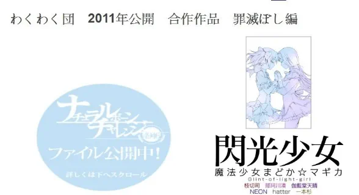
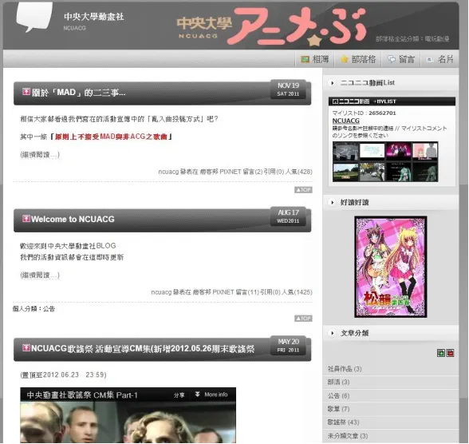
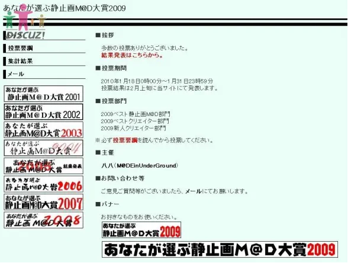
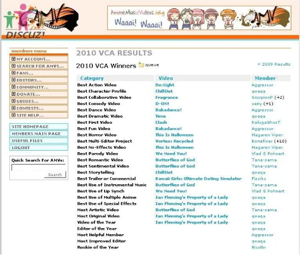

# 山外青山楼外楼（MAD史）

## 声明1

此部分并非文章原有内容,做一个简短说明.

此文章首发于2010年,修订于2013年,原作者未知(找了很久也没找到,如果有知情者可以私信我补上),鉴于百度和谷歌上的内容几乎残缺不堪,多年前看过这篇文章的本人将此保存下来以免日后真的消失于互联网上,考虑到原版排版较为混乱,所以特地修改了一下排版方式,部分含有连接的地方添加了超链接跳转,原文配的图也收集齐全并补充完备,但未对原文章有任何客观叙述和主观叙述上的不实修改.

全文共13272字,看后也许能感受到MAD的历史感也说不一定~ By 无疑

2020.7.27更新：本文转自MD上的蓝色天空，作者darklore

## 聲明

有關於本篇文章,由於討論的定義有許多並無廣泛的認知與認同.亦即可能會有不同看法,是故閱讀之前尚祈讀者能對不認同的觀點有所容忍.另亦歡迎提出不同觀點,個人將盡力修訂,使本文臻於完善.

文章授權 Copyright-採用CC授權,可在不作商業用途下自行轉載,但請務必註明文章出處.文章連結與作者名稱同時請勿修改文章內容(尤其是基於政治因素去做修改)

## 第一章 MAD的起源

### **1-1-1 開端**

1978年(昭和 53年) ？月？日 『MAD』之名誕生 (註1)，談到MAD這個詞的原貌,得從大阪藝術大學動漫畫研究部CAS的三個成員身上說起

1.MAD島川氏 -自稱本名為”元祖本家マッドテープ家元サウンディングマッド島川”(CAS的創社元老之一)亦為創作團體Team S.I.N.的成員,至今(2010年5月)仍於ACG界活動中. 2.Y氏(矢野健太郎)CAS的創社元老之一,CAS就是他與MAD島川氏共同創立的。本人也是Team S.I.N.的長老。現為一位職業漫畫家,偏好創作吸血鬼類的成人漫畫.(台灣有發售其創作”異靈戰士”,共3冊。此書並為著名台灣成人文學創作”魔王重生-銀色魔女”的原型) 3.金井聰90年代中以人偶動畫名揚全日本,之後因特攝製作的長才進入動畫業界.代表作如”平成魔斯拉”等.當前設有官方網站[”舞映＆JCC”](http://www.lares.dti.ne.jp/~maimilk/index.html)

這三人在CAS中陸續製作出許多以動畫人物的聲音或是片中音樂來剪接惡搞的錄音帶作品，並命名為”奇知害低符”(其發音正是”きちがいテープ”\[氣違いテープ,意即”瘋狂錄音帶”\]。 為什麼要刻意用這幾個漢字來表示?這是因為”氣違い”有著”一時的瘋狂”之意,但是現實上大部分的日本人常會對這個字有著誤解,認為這是一種描述病態的名稱.於是為了符合初衷而且又能降低局外人的誤解，他們才會使用這幾個漢字.

### **1-1-2 從”奇知害低符”到”MAD”**

在MAD島川氏製作完第10捲”奇知害低符”作品之後不久.有一個非常迷歌手”山口百惠”的朋友前來拜託他:”你可不可以把你所擁有的山口百惠的唱片全都轉錄成錄音帶給我?”於是在他的巧手剪輯之下，完成了第11部作品:“クレイジー． カセット No.11 TAPE C-60”

A面標題-MOMOE MAD-30分17秒(山口百惠的羅馬拼音為 Momoe Yamaguchi)

B面標題-前奏.間奏系列-30分28秒

值得一提的是,A面標題是之後才由他朋友自己命名,而且這位朋友拿到帶子之後不僅愛不釋手,甚至天天從早聽到晚,MAD島川氏不知是受到感動或者是受到朋友神來一筆的刺激.宣佈今後的公開作品名稱將正式從”奇知害低符”改為”MAD-TAPE”！“MAD”之名就此誕生.並沿用至今.

從此正式建立『MAD』的名稱－之後也有人稱呼『MAD』為『M@D』或是『二次創作ムービー』(註1)MAD一詞的使用在日本,中國,台灣等東亞各國中的Fans中非常普遍,基本上認定二次創作ACG影片=MAD.這是比較可信的歷史考證結果. 然而因為有關於MAD的起源說法尚有數種,時至今日已經難以考察真偽.

### 1-2-1 有關於AMV

AMV即Anime Music Video的縮寫,乃是由一個或多個動畫混合編輯並配上音樂製作而成.AMV一詞的語源已不可考,現有可查閱到的資料顯示,在1980年代初期AMV一詞已經開始使用,是比較可靠的說法.

相對於MAD一詞普遍在東亞各國使用,西方國家如英國,美國,法國,德國等則以”AMV(Anime Music Video)”稱呼其製作的二次創作影片.(註2)

### **1-2-2AMV和MAD的不同**

由於AMV的”A”代表了英文單字”Anime”,因此可以看出AMV的定義基本上就是使用動畫或遊戲的動畫來製作影片.(註3) 至於MAD則大多數以靜止的素材製作影片,然而其作品很明顯的較為多樣化,相形之下作者的創作素材範圍亦較有彈性,基本上只要和ACG(Anime,Comic,Game)有關的皆可使用.(註4).2006年初舉辦SM@DXSM@D競賽中,有數部以動畫為素材的作品參加了比賽即是明顯的範例.(註5) 另外,日本舉辦MAD創作比賽時,若要求要創作者以靜畫素材製作,會特別打上”靜止系MAD”的字樣在大會Logo上(註6). 走筆至此,或可做一定程度的歸納,對於Madders來說,MAD大致可分為: 靜畫系MAD -以漫畫為主要素材 -以遊戲為主要素材 動畫系MAD -以動畫為主要素材(又稱AMV) 混合系MAD -混合了各種ACG素材同時使用 是故若以此推演,或可注意到AMV應該算是廣義MAD的其中一個分支而已,亦即基本上動畫系MAD即AMV,而MAD則不能和AMV一概而論.

### 1-3 MAD創作早期簡史

\*在這部分主要提及的是日系MAD

#### 1978-1995

如前所述,MAD可說誕生得很早.然由於70.80年代仍是錄影帶時代,且個人電腦尚不普及,MAD的創作不但難度超高,設備不足,且既缺乏流通管道亦缺乏閱聽者…….MAD雖然已經誕生,但無甚發展,以至於90年代初………..

#### 1997年6月

台灣最大的動畫OPED下載網站”光之大陸 伊莉琴斯”成立,其中的物資管理局提供許多在當時難以入手的OPED,除此之外,也有大量收集職人在其上提供MAD的下載,對台灣早期的MAD推廣奉獻甚大.

#### 1996-1999年3月

從96年到99年初,隨著多部H-Game的發售以及個人電腦的普及化,MAD創作開始有增加的趨勢.被視為MAD界革命預兆的便是99年3月乃怒亞女氏所創作的”｢メビウスONE｣β版”,這同時也是第一部大小超過100MB的MAD.

本時期的創作仍以160X120為主,320X240未成為主流,創作的主題幾乎全部是H-game,例如”One”等……

#### 2000年9月

新海誠作品”彼女と彼女の猫 -Their standing points-“公開.

1999年6月-2001年1月20日,MAD界迎來第一次興盛時期

#### 1999年6月

MAD創作的速度逐漸增加,推定在99年6月時總數已突破100部.夏季左右時,320X240終於成為主流.

#### 1999年11月

日本國會通過”兒童福利法”,”智慧財產權保護法”，大多數創作者苦於應對法律問題,造成部分作家轉入地下及引退.

#### 2000年3月

乃怒亞女就職,開始逐漸淡出MAD界

#### 2000年9月

MAD界開始有組織的舉辦MAD大賞等活動,9月時公開了”新人賞’的參加作品.

#### 2000年9月

新海誠作品”彼女と彼女の猫 -Their standing points-“公開.

#### 2000年10月-12月

\-由”神藝工房”代表”神月社”領頭,開摧了第一屆”華音賞”,得到熱烈的迴響,最後共有52名作家參與.12/12日,第二屆”新人賞”亦開始籌備活動.-神月社.乃怒亞女.SATURN等中堅MAD作家先後聲稱即將在2001年引退

#### 2001年1月20日

Key社注意到MAD大量使用其發售作品作為素材創作MAD的情形,並公開去信警告其已觸犯著作權法,造成MAD界大地震, 多位實力派MAD作家相繼發表引退宣言

次日,除華音賞及新人賞外,數個相關活動亦相繼遭到中止.

不止於此,其他相關的創作領域亦人人自危,壁紙創作大會”灯火賞”因此中止,2ch壁紙版亦因此關閉.

#### 2001年1月28日

AK-1公開Air MAD作品”Azurewind”這部MAD以觀玲為主體進行創作的,在製作上使用了許多華麗的技巧,至今在Air的靜止系MAD創作中依然頗有名聲.

(Azurewind為2001年靜止畫MAD大賞的第二名)

值得注意的是本作的解析度已經是640X480(即DVD格式的畫素量),由Azurewind之後640X480的高解析度MAD開始逐漸多了起來.

#### 2001年1月底

神月社正式宣布自MAD界引退,之後轉入AVG OPED商業製作的範疇,並活耀至今(2010.6)

#### 2001年2月

日本動畫職人異端氏在神藝工房公布欄上聲稱”MAD界作品的畫質音質普遍低落”,遭到許多版友圍剿.然而以此事為契機,日本靜止畫作者在製作MAD時逐漸以高Bitrate(每秒資料流量)為目標進行作業.

由於許多作家並未完整的了解壓製檔案的方法,檔案不必要的過度肥大成為此時期MAD的一大問題.

#### 2001年4月11日

台灣發生”成大411MP3事件”.

台灣台南地檢署因接獲IFPI（國際唱片業交流協會）檢舉,前往國立成功大學學生宿舍”勝一舍”搜索,查獲十四名學生涉嫌非法下載MP3,及架設網站提供一萬八千多首歌的MP3供人下載.

由於搜索過程粗暴且警方行動有違反大學法中規定之大學自治原則,該搜索行動引起學生強烈反彈與恐慌.此事件連帶導致中山大學架設的伊莉琴斯被嚴重關切,聲勢大為衰頹.

#### 2001年4月16日

Key社再度發送警告勿侵權Mail給各相關站點(這次的目標主要是壁紙製作的網站),通稱為Key4.16事件.在影響上不如一月份來得大,大多數的網站均在削除Key社相關資料後繼續經營.

#### 2001年5月3日

MAD團體”M2 Union”的Mist氏完成史上第一部合法MAD”iniquity”在這個時期,日本各個遊戲製作公司對於MAD的製作態度趨向於兩極分化,有極度排斥的(如Key社),亦有表示充分支持的(如授權Mist氏創作的Witch社,已結束營業)

大體而言,公司規模越大,越傾向於禁止MAD的製作

#### 2001年8月3日

Minori發布AVG作品”BITTERSWEET FOOLS”的Demo Movie.由新海誠製作的此部Demo獲得極高的評價,其名由此逐漸廣為MAD愛好者所知

#### 2001年8月

全世界最大的AMV原檔保管庫[AMV Music Video.org](http://www.animemusicvideos.org/home/home.php)由Kris領導成立,宣言該站的最終極目標為收集一切曾被創作出來的AMV.

#### 2001年12月29日

由美凪ちよ主辦的”あなたが選ぶ静止画MAD大賞2001″開始投票,在接下來的10年間這個活動以票選出當年最佳的MAD為目的持續舉辦.

#### 2001年8月~12月

在夏季Comicket上由同人社團Type-Moon所發布的月姬系列關聯作品”歌月十夜”成為熱門話題,月姬系列的MAD作品開始出現

#### 2001年9月~12月

由於對特效的需求,使用Adobe Aftereffects製作MAD在日本成為主流,在這之前使用Premiere的作家比較多

#### 2001年11月11日

神月社領導之主要MAD團體”神藝工房”由於神月社本人轉向商業AVG OPED製作而宣布解散,預計在發布完最後三部作品後關閉網站,宣告了一個時代的終結.

#### 2002年4月5日

神藝工房網站消滅.

#### 2002年3月4日

Minori公開由新海誠製作的Wind-A Breath of Heart- Demo Movie,以當時的技術水準來說是極為驚人,這之後新海誠在ACG圈聲名大噪.

#### 2002年6月22日

Littlewitch公開首部AVG作品”白詰草話”的OP.

非常優秀的一只動作OP,謠傳此支OP用掉了遊戲製作預算的90%.

#### 2002年7月18日

Type-Moon第二部AVG”Fate/Stay Night”情報開始公開

#### 2002年9月22日

“月姬”決定進行動畫化,成為首部動畫化的同人作品,Type-Moon與Key社幾乎占據此時期2/3MAD的原作

#### 2002年10月4日

由神月社操刀的”Baldr Force” Demo Movie公開.配合感電注意製作的3DCG以及Kotoko的主題曲,此Demo成為業界極為優秀的作品.大量仿製的MAD在之後幾年間不斷的出現.

#### 2002年12月28日

渡邊製作所在日本Comicket 62上公開Type-Moon系列同人遊戲”Melty Blood”

開啟了製作Melty Blood GMV的一股風潮

#### 2004年10月2日

中國MAD組織”雪舞清盈(FLSnow)”成立MAD版.

#### 2006年3月

光之大陸 伊莉琴斯由於外在環境的惡化,關閉了最後一個留存的物資管理局版面,台灣MAD與OPED的收集與傳播開始進入論壇林立的戰國時代.

(圖:伊莉琴斯站點Logo)

2006年9月

流鳴聯合本居MAD版成立,在接下來的數年間逐漸發展MAD分享與創作事業

#### 2006年12月1日

曾製作包含 `<Memories Off>`.<Ever 17>等遊戲在內的著名AVG遊戲會社KID宣告破產

#### 2006年12月12日

日本方面日後撼動全MAD界生態的Niconico動畫([ニコニコ動画（仮）](http://www.nicovideo.jp/))開始營運，其獨創的即時影片留言制度深刻的改變了MAD的評論方法,並為許多網站所效法.

#### 2007年10月14日

中央大學歌謠祭期間以主辦單位領頭,參與者合唱許多ACG組曲,事後由日本方面媒體工作者錄影後上傳至Nico,短短三天便累積了12萬人次觀賞,被稱為是近期日台交流的最佳範例之一

#### 2008年1月21日

台灣舉辦第一屆MADeMAD大賞(主辦:鬼娃娃伊帆)

#### 2008年3月21日

中國MAD組織Sakuramai(櫻舞)成立.

#### 2008年9月9日

台灣MAD組”HSM@D”成立,以振興台灣MAD事業為目標營運.但人數不足,始終未拿出顯著成績.

#### 2008年12月9日

台湾政府針對ACG產業侵權進行大規模掃蕩,許多台灣本土的ACG下載相關網站遭到重擊.流鳴聯合本居亦因此關閉了MAD分享版,從此沒有恢復.受此打擊,台灣的MAD交流一蹶不振,分享者與作者大多轉入MAD發展正方興未艾的中國論壇.

#### 2009年3月3日

中國MAD組織”瀧沉琉璃MAD工坊(RL MAD Team)”成立

#### 2010年11月10日

台灣MAD組織”HsMAD”大規模改組後重新開展活動,並開始籌辦台灣作家限定的賽事

#### 2010年12月8日

中國MAD組織”Towiko MAD”成立.

#### 2011-2012年

在日本MAD界,”原檔”MAD的發布開始逐漸被NICONICO動畫的線上發布所取代

#### 2011年3月1日~2日

地域限定專屬MAD Event “MAD大亂鬥”活動

#### 2011年8月19日~9月初

MADeMAD 2011 活動(主辦:darklore)

第一屆中國MAD新人戰(主辦:盒子)

### 1-4 其它特殊分類

#### 1-4-1 FMV

FMV的F代表Fighting(戰鬥),FMV就是戰鬥紀錄影片(Fighting Movie Video)的縮寫.由於許多格鬥遊戲的玩家為了研究對戰方法或練功,常需要觀摩其他強者的對戰影片,這類影片因此數量逐漸增多,卓然成家.

直到Melty Blood ReAct(MBR,月姬格鬥)這塊遊戲以後,將這類影片加上音樂加以剪接成更有節奏及藝術感的風氣更盛,這就形成了今日所稱的FMV.

然而無論如何,FMV的重心仍然在供遊戲玩家練功觀摩之用,基本上仍然欠缺較複雜的MAD製作技巧

#### 1-4-2 劇情系AMV/MAD

這類型的AMV基本上都是歐美國家所製作.內容上都屬於包含有大量劇情的成分,和純音樂系AMV(較接近MTV)差異相當大,這類作品不容易做得好 但是做得好的作品往往有驚人的出色效果.

對於閱聽者而言最大的問題在於語言….能力不足對於欣賞這類作品有相當的障礙,雖然有少數作品並不包含外語對話,但這類作品極少.

在靜畫系的MAD方面,大致上是採用音樂配上字幕不斷切進又淡出的方法敘述劇情,最佳的代表作就是已引退的Koba-U氏所製作的”If”(原素材為月姬).

因此,基本上在靜畫MAD作品中不存在純粹的劇情系作品,為免混淆起見,不以此為主進行分類.

#### 1-4-3 音樂系MAD/AMV

以音樂為主題的作品稱之.

相當一大部分的MAD/AMV作品均屬於此類,做成的作品如果是AMV,就跟MTV相當接近了.

台灣這方面的創作以國立中央大學為大本營,並有代表作者蕭劍龍氏.

#### 1-4-4 iMADs(im@ds)

iMADs是晚近(2008年底左右)才興起的新型MAD種類,乃是由於著名偶像培養軟體”The idol Master”以及其它類似的軟體而發展出來的新分類.

特色是由Madder們先編寫舞者舞步,再進行一般的MAD編輯作業,充滿正統MAD以外的另類活力與美感.值得注意的是,目前越來越多作者將本類型作品易稱為MMD.除此之外,以idol master軟體製作的正統iMADs亦已逐漸沒落中,即便是原遊戲製作公司

在2011年底,推出了第二代idol Master的編輯軟體,然而隨著MMD陣營的不斷壯大,其頹勢並未有所轉變.

\*作品賞析:

The Idol Master-V-[Project VA](https://www.nicovideo.jp/watch/sm4821152)

The Idol Master-[2008 秋の祭典](https://www.nicovideo.jp/watch/sm5537811)

#### 1-4-5 MMD

MMD是其製作軟體MikuMikuDance的縮寫,一般界定的標準是以此軟體製作片子的影像部分即稱為MMD.

MMD為日本人樋口優所開發,原先是用以製作初音系列3D MV的軟體,不過其後開發了大量的其他ACG人物模組(尤其是東方系列),

而在人物模型的風格方面,則以LAT式, ISAO式與TDA式MMD較為有名.

時至今日,MMD已發展為多元化的3D ACG影片製作平台,並有專屬的定期比賽(請參照MMD杯一節).

由於作者本人引退,MMD軟體目前已經停止更新,最終版本號為7.39(有興趣專門探索MMD相關資料者,請參考附錄所列MMD論壇)

\*LAT式MMD 作品賞析:

Hatsune Miku-[Electric Love\[Wakamura\]](https://nicovideo.jp/watch/sm12234304)

Hatsune Miku-[Sweet Devil MMDPV\[Wakamura\]](https://nicovideo.jp/watch/sm12392042)

#### 1-4-6 音系MAD

音系MAD是指重心多在作品音樂上而非畫面上的一種MAD.粗略的分可以分成以下兩種:

(a)音MAD:這種MAD一般藉由合成原本作品的曲子不停的loop而達到爆笑崩壞的效果,又被稱為”吵雜MAD”,如前幾年有名的”藍蘭路”就是這種作品的代表

(b)空耳:空耳是指作品的原曲聽起來很像別的意思完全不同的句子,如著名的上古捲軸5主題曲就曾被空耳為全中文歌曲.

## 第二章 MAD的特色

### 2-1 因熱情而產生

由MAD產生的歷史可以發現,MAD的源起與官方並無關聯.基於這一點,筆者認為MAD必需具備的一大條件便是是必需由非官方團體或個人來製作.

### 2-2 二次創作與三次創作

#### 2-2-1 二次創作

由於MAD是由喜好作品的非官方個人或團體自行製作而成,因此不可避免的會大量使用到原作的畫面以及音樂等加以修改後成為作品(這種拿原創物再次進行加工的創作過程一般稱為二次創作).無論是對畫面被使用的企業或是音樂被使用的歌手來說,這都是令人喜憂參半的現象,然而並非每間公司企業都能有雅量來包容MAD創作的團體,如角川文庫就曾經在nico(日本最大的視訊網站)上大力掃蕩其相關MAD,即使是最終角川改變了立場,但此事仍然突顯出MAD製作的不確定風險.

#### 2-2-2 三次創作

有一種情形是使用其他作家的舊MAD做為新MAD的素材,一般在MAD圈裡嚴格禁止此類行為,嚴重程度可以達到抄襲者被社會性抹殺的程度,最著名的例子如”四四 事件”中的HO君.”(註9) ,另外大量使用”模版”(一種預先設計好可供簡單設定後做出複雜場景的半成品MAD專案)去進行製作也被部分靜畫系作家認為是相當低級的行為.

### 2-3 本版提供的定義

“MAD是一種非由企業或官方製作的影片作品,其使用的素材部分為自行創作,部分則是創作者由原作中取得,並加工而成.”

以上或可作為筆者本身對MAD的定義看法…由於MAD在即使是在ACG界亦無嚴謹定義其內涵,是故推廣與討論時常因此會遇到困難,尤其是許多作品同時具有多項屬性,導致界定其名稱幾乎變成不可能達成的任務,直到2012年的現在,界定上的混亂仍然是初入門者一個巨大的麻煩P.S.:實務上中文維基有介紹MAD的定義欄,然而個人認為它的文章大有問題(2012/9)由於迄未解決,作為補充參考用似較佳.

### 2-4 MAD的適法性

依照各國的著作權法規定雖然結論上略有差別,但大體上除了MMD無此類問題以外,MAD尚無法主張著作權利.(請參照法學上的毒樹果實理論)

## 第三章 2005年以降的MAD活動與大賞

在早期,MAD無論是在創作以及傳布方面,由於電腦本身硬體的限制以及外在環境不利於發展,難以取得較大的成就,因此本節謹以2005年作為起點開始說明.

### 3-1 MAD活動

#### 3-1-1 日本MAD活動

作為最早開始發展MAD的國家,MAD賽事的數量與品質都無庸置疑是最多最高的.

##### A.紅白MAD合戰

(基本上每年一次的定期EVENT,但2012年起似已停辦並為其他活動取代)，當前日本水準最高的MAD大會,基本上每年均會進行一次賽事,可說日本最優秀的靜畫系作家均集結於此大會中.主要採邀請制,無法任意報名.

水準極高且整齊劃一,MAD愛好者不應錯過的盛會.

(圖:日本第2次紅白MAD合戰logo)

##### B.SM@DxSM@D(基本上每年一次的定期EVENT,但2012年起似已停辦)

日本賽事中以發掘新人為目的所舉辦的賽事,一般而言必需是新人(出道在一年以內)才能參賽,不過每年的規則會有細微變動.採報名制.

水準亦稱良好,然個別參賽者有時會有差異極大的現象.

##### C.黑組MAD賽(不定期活動)

技術上來說黑組MAD賽存在的用意是讓來不及做完紅白作品的作家們放流MAD的賽事,常常充滿了主辦們的惡趣味…例如全作者假名發表作品(因為紅白失格嗎XD),或者是模彷其他紅白作品的惡搞MAD等等

有很多良作,特點是需要猜作者是誰(尤其是09年這屆),以及惡搞MAD特別多(尤其是第一屆)

##### D.[ニコニコ紅白MAD合戰](http://www.nicovideo.jp/tag/%E7%B4%85%E7%99%BDMAD%E5%90%88%E6%88%A6%E3%80%8C%E7%B4%85%E7%B5%84%E3%80%8D)(基本上每年一次的定期EVENT)

2007年至2012年9月共計已舉辦過5次的MAD賽事,為開放報名制,作品水準中平.唯一的大問題是由於不放流高畫質檔,並無清晰檔案可供收集用,是Collectors的一大憾事.

##### E.[MAD晒しの宴](http://www3.atword.jp/mad/)(基本上三到四個月會有一次的賽事)

在Nico上舉辦的MAD賽事.到2012年9月為止已經舉辦了驚人的57次.產量大,質量較低,基本上只是提供Madders晒MAD的場合,並無其他正規賽事的投計票/選拔等流程,同樣地也不提供高畫質檔案.

##### F.WAKUWAKU團(わくわくアルバム－嬲られる僕の思い出－)(基本上每年一次的定期EVENT)

[2010](http://omanchin.web.fc2.com/)

[2011](http://wakuwakudan.web.fc2.com/)

2009年首度辦理,至2011年9月10日舉辦第三屆,前兩屆均在單身漢節(11/11公開)第二屆有點類似沒女友Madder們的怨念MAD大會….作品不限定為首度公開,亦未限制個人投稿數.第三屆作品的高畫質原檔官網目前已經公開.WAKUWAKU團的創立雖然原來是因活動而產生,但隨著其活動的頻繁性,有組織定型化的傾向,值得期待.

(圖:WAKUWAKU 2010 HP TOP)

(圖:WAKUWAKU 2011官網剪影)

##### G.[MMD杯](http://www31.atwiki.jp/mmdcup/)

MMD杯是限定使用軟體為MikuMikuDance才能參賽的作品,2008年以降已經舉辦9次,初期以初音MV為主,由於是民間愛好者開發的軟體,隨著周邊模組的不斷開發,至今創作範圍已逐漸擴張到初音家族以外(如東方系列等)

該賽事的運作模式是參賽者從幾個題目中選出一個,並以該題目為基準做出短片參加予選(此階段提供半成品即可,如CM)與本選(必需是完成品)兩個階段,在每一個階段,參賽者都會同時在Nico上公開作品,並計算一段固定時間內被加入Mylist的數量,最多者為優勝,並將記錄於MMD Wiki上作為紀念.

##### H.[MADMAX](http://www.bisuke.biz/~gunma/mad_max/top.html)

MADMAX是由日本主要MAD創作團體”Visitor”所主辦的MAD活動,由於2011年日本並無紅白MAD合戰,因此估計本活動是為了填補其缺位而舉辦的小型EVENT.

開始時間是2011年12月24日,有8名作者參賽.

(圖:MADMAX活動Logo)

##### I.[Author Imagine MAD Festival(AIMF)](http://aimf2012.blog.fc2.com/)

(影片發布站為Nico:[http://www.nicovideo.jp/tag/AuthorImagineMADFestival](http://www.nicovideo.jp/tag/AuthorImagineMADFestival))

AIMF和數年前舉辦的Nameless基本上屬於同類型的MAD活動,都是發布者在發布時匿名 原檔則是各作者自行決定之後要不要公開,觀眾以觀察並猜測mad作者得到樂趣. 但是本次大會作為2012年實際上取代了歷年來傳統MAD賽事紅白合戰的活動,完全沒有公開發布原高畫質檔案,或可視為日本MAD界作品發布傾向改變的重要信號.

\================

以下是日本已停辦數年,可能不會再有後續的活動

A.山椒は小粒でピリリと辛い!?(只出現過一次的MAD賽事)

只在2007年出現過一次的MAD比賽,由於該年並未舉辦紅白MAD合戰,因此可說是代替其地位的賽事.作品水準高,數量較紅白略少.

B.綠組與黃組MAD戰(只出現過一次的MAD賽事)

傳說中只出現過一次的MAD小型賽事,主要是處罰紅白失格Madders與限時製作MAD的趣味競賽

由於是非正規的比賽,水準上屬於玩票程度

C.[Nameless](http://zoome.jp/sirotora/diary/47/)

2009年開始在Nico上舉行的小型Event,主人為作者提交作品後不署名,原檔則是各作者自行決定之後要不要公開,運作模式類似於中國的黑暗火鍋大會,觀眾以觀察並猜測mad作者得到樂趣.

\*2012年6月5日確認尚無年度活動計畫

#### 3-1-2 中國MAD活動

由於經濟快速興起,加以龐大的人口基數,中國近年來MAD活動的發展也越來越進步.

##### A.[春秋合戰](http://seeasea.net/sprau/)(基本上每年一次的定期EVENT)

由龍嵐君所獨立主辦的MAD活動,為中國最大型的MAD祭典.當前的參賽制度逐漸向邀請制過渡當中其中FLSnow作為中國成立最早的MAD組織,有一大部分作家會在此活動中發表作品,是故春秋合戰參賽的靜畫系作家相當的多.

另除了參賽制度完善,水準整齊之外,每年春秋合戰的參加MAD數亦相當驚人,隱然是中國風味的”日本紅白MAD合戰”.

2010年僅舉辦春秋火鍋,整體而言較接近原黑暗火鍋大會的風格,2012年起由葉月接手主催,並將於11月左右開始舉辦.(該活動並非由FLSnow主辦,經龍嵐君通電指正,特此聲明.)

##### B.光舞DVD(基本上每年一次的定期EVENT)

光舞DVD是FLSnow組內特有的MAD DVD,大約在每年春天時在各地同人會上販售,另也接受中國國內郵購.對於無法購入者,亦提供畫質較低的版本在網路上可供免費下載.

內容上包含了華語圈各個活動的優秀作品,同時也適度的加入華語圈各地作家的未公開新作/相關的MAD製作教程內容等.截至2009年2月為止,光舞共計已發行了四次DVD,然2012年9月為止尚無再度發行計畫.

##### C.黑暗火鍋大會(不定期EVENT)

雪舞在2007年首次舉辦此MAD活動.特點是參加作者的素材是由其各自帶來後,隨機讓Madders進行抽選,抽到該素材包的作者必需以其進行製作.

純粹娛樂與惡搞取向的小型MAD活動,作品水準中平,至2012年9月共舉辦了2屆.

(圖:春秋火鍋首頁Banner)

##### D.櫻舞(Sakuramai,SKM)年度活動(基本上每年一次的定期EVENT)

2009年開始SKM內部在農曆新年時首次進行組內MAD展示大會,屬於成果展覽類活動.做為歷史較長的中國MAD組織,每年推出的靜畫系作品亦有相當數量,然水準上彼此差異較大為遺珠之憾自第二届開始，情人祭就改為白色情人祭，於3.14活動.

(圖:SKM第三次年度活動LOGO)

##### E.琉璃工房(Raindrop Lazurite,RL)夏日祭(每年一次的定期EVENT)

琉璃工房於2009年夏天首度舉辦的組內MAD展示大會,亦為成果展覽類活動. 至2012年底為止共舉辦4屆.

夏日祭活動本身由於新手作家數量較多,作品程度尚不盡人意.但若合併其組織在09年發布的DVD一併觀察,可以注意到其Madders成長的速度非常的快, 令人相當期待.

##### F.瀧沉琉璃MAD工坊年度DVD COLLECTION(每年一片)

RL在2009年底開始發布組成果展覽用DVD,2009年版的內容上包含了夏日祭/組內新作品合集/TMD組作品等三部分.內容上全為RL本組的作品品項,然而值得注意的是,這部DVD的MAD已經壓製成一般的DVD格式,故無法分開檔案收藏,實為Collectors的一大憾事.

2012年的年度DVD已經發布並放流.

##### G.[百度MAD吧乾坤鬥](http://tieba.baidu.com/f?kz=629548089)

百度MAD吧於2009年首度舉辦的MAD賽事.參賽作家主要為MAD吧的成員,多為無組織的動畫系作家,採報名制.作品上多為動畫系(AMV/MTV)純剪活動過程上由於是首次舉辦,疏漏之處尚多,尤其是還發生了嚴重的灌票事件,致使該日票數最終作廢處理,造成了相當的公信力傷害.不過這次賽事湧現了許多素質尚佳的新人,為其亮點.

第2次乾坤鬥已於2011年2月舉辦.

##### H.[H@S 2011創立日祭活動](http://www.2012hs.com/read.php?tid=24672)

創立日祭是中國的專業廣告設計團隊Hinako Studio為了慶祝工作室成立9週年而舉辦的展示賽,主辦者即為該工作室老闆竹內條條.

參加成員均為Hinako Studio的內部人員,由於是專職設計人員,作品完成度高,技術層面演出亦相當華麗.

(圖:2011創立日祭海報)

##### I.BGM新年祭(無官網,可至SKM或FL Snow觀看)

BGM新年祭是以BGM新人團的作者為主體在新年期間舉辦的活動,除了發表MAD作品以外也會發布新年賀圖,作品也多有歡樂惡搞的類型.

主辦人盒子表示2013年應該會將活動更名後繼續舉辦.

##### J.BGM MAD新人戰(無官網,可至SKM或FL Snow觀看)

(第二屆活動官網:[http://bgmad.org/battle/](http://bgmad.org/battle/))

由資深作家盒子君主辦,面向新人為主的MAD Event.在2011年8月19日首次舉辦作品水準中上.新人戰的一大特色是評委評點非常豐富詳盡,對於需要了解自己本身作品優缺點的作者而言相信頗有助益.

\================

以下是中國已停辦數年,可能不會再有後續的活動

A.動漫FANS2010冬季MAD創作大賽

舉辦過數次的MAD賽事,同時也是唯一商業化取向的MAD比賽.參賽作品數量極大,

適合完全的新手參賽,但由於商業化經營以及排外(註8)的因素,觀賞到MAD圈內老作家的作品之機率極低.

#### 3-1-3 台灣MAD活動

台灣的MAD活動相形之下較不發達,以歌謠祭較有特色.

##### A.MADeMAD(每年一次的定期EVENT)

(2012年活動網址:[http://bgmad.org/mademad/](http://bgmad.org/mademad/))

MADeMAD整合了來自中台美日等地的Madder們.當前的參賽制度為半邀請制.

活動方式類似於新人選拔的對抗賽,作品之間水準中平,且差異頗大.特色是在賽程中會提供紀念桌布等特殊物品供保存用. 2011年該屆台灣組織HS M@D組的作家大量參賽,使賽事更加具有多元風味.

2012年該屆首度與BGM團合作設立了獨立的HTML形式官網.

(圖:MADeMAD 2009 LOGO)

(圖:MADeMAD 2012活動官網剪影)

##### B.MAD大亂鬥(2011年3月1日~2日舉辦第一屆完畢)

此為台灣HS MAD組發起的MAD展示活動.

由於HS以振興台灣MAD界為取向,因此本活動限定為台灣人參加.

##### C.[各大專院校歌謠祭](http://wineswordgod.myweb.hinet.net/)(每年一次的定期EVENT)

嚴格說來歌謠祭很多大學均有舉辦,然而由國立中央大學和海洋大學的社團所發展起來的祭典是最有名的,進行模式為事前由社團同學剪接好影片並配樂,

然後在當天由入場觀眾點播並同時一起熱唱,有如演唱會的氣氛一般

(圖:央大歌謠祭Blog)

### 3-2 各國大賞

#### 3-2-1 日本MAD大賞

##### A.あなたが選ぶ静止画M@D大賞(每年一次的定期EVENT)

每年年初到二月左右對前一年的靜畫系作品進行評選的活動,非日本本土的作家亦可列名.

每年均會公布新人賞/最佳百大MAD賞/最佳創作者賞,是為靜畫系作品最具代表性的排名榜.

(圖:紅白公式網站)

#### 3-2-2 歐美MAD大賞

##### A.A-M-V.Org Viewer’s Choice Awards(VCAs)(每年一次的定期EVENT)

AMV.com每年在年初到三月初舉辦的前一年間最佳AMV評選活動,並不會同步發表新作.

評選內容上分類相當細緻,如果喜愛高水準的AMV不可不看.

(圖:VCA賽事結果發表欄)

#### 3-2-3 俄國MAD大賞

##### A.AKROSS CON(每年一次的定期EVENT)

俄國每年從前一年年底一直到東正教聖誕節前後進行的活動,評選方式與AMV.com大致相同.

AMV水準亦高,喜愛者不可錯過的大賞.

#### 3-2-4 韓國MAD大賞

##### A.RMS青白MAD合戰

韓國目前規模最大的MAD合戰)

第一屆於2008.12.26由Rhythemical Motion舉辦,賽程規劃仿日本紅白戰模式.

第二屆於2011.8.25開始,但作品水準明顯下滑.

\*RMS的全稱是Risky Madmovie Syndrome.(網址: [http://cafe.naver.com/anymadmovie](http://cafe.naver.com/anymadmovie))

##### B.Madmoviecontest

Madmovie contest是歷史最長之MAD賽事,至2010年9月已舉辦至第六屆.

#### 3-2-4-1 韓國作者與團體淺介

Lakei: 活耀於2006-2008年的南韓女性mad作者,長於靜止畫mad製作 晚期作品已具有日系一流mad水準.09年考上首爾附近的醫事大學以後 因為學業繁忙宣布引退.

著名作品:

\[MAD\]水月-물과달의 그림자\[Lakei\]

\[AMV\]合作-The Stories\[Lakei\]

\[MAD\]沙耶之歌- A Song of Dandelion\[Lakei\]

\[AMV\]Ef-A Tale of Memories-We AreHere\[Lakei\]

\[MAD\]Little Busters-Are You Waiting ForMiracles\[Lakei\]

Duet:專長於AMV製作的作者,至今已較少活動.

著名作品:

\[AMV\]Ef-A Tale of Memories-You And MeTogether\[duet\]

\[AMV\]涼宮春日系列-Dance of Haruhi\[duet\]

Lepusnette:新興的mad創作團體,原先只製作商業用的特效影片,後轉兼創作madmovie.

著名作品:

Atonement

Reset

\[MAD\]沙耶之歌- A Song of Dandelion

網站:[http://lepusnette.aquz.biz/FrameSET.htm](http://lepusnette.aquz.biz/FrameSET.htm)

Rhythemical Motion:南韓當前主要的MAD製作團體,特色是MAD製作分工化,因此作品中並不會標明個人負責處理的項目,一律是以團體名出品.該團體目前也是南韓MAD界賽事正規化的主要推手,大型賽事幾乎均由其主辦

著名作品:\[AMV\]合作-Last Night On Earth\[合作(Rhythmical Motion)\]

網站: [http://cafe.naver.com/anymadmovie](http://cafe.naver.com/anymadmovie)

\*以上列舉作品基本上以darklore有入庫的檔案為準.

## 附錄A 各式短片細部分類表

#### 一.MAD系統

以漫畫為主要素材靜畫系MAD\[以遊戲為主要素材(總稱為)MAD—–\[

動畫系MAD\[ 以動畫為主要素材(即AMV)

混合系MAD\[混合了各種ACG素材同時使用,沒有特別多用哪類

#### 二.MTV

MTV是一種音樂影片,最初是用做官方宣傳(通常是為歌手或為卡通.電影等)用而製作的影片.隨著晚近個人電腦的飛速進步,個人獨立作業製作MTV也逐漸常見.也因為如此,音樂系AMV與MTV的分界線開始變得不明顯.

大致上來說在ACG界,音樂系AMV跟MTV有三個重要的不同點:

1.官方製作與否

官方製作者稱為MTV,反之則為AMV.(參照MAD的定義一節)

2.字幕的有否

通常有字幕的都較接近MTV,沒有字幕的就是AMV.

3.特效技術的高低

大多數情況下來說,音樂系AMV仍然較注重特效的使用,MTV雖然也會使用,但大多數時候來說,這並不是那麼重要的事.

#### 三.CM

CM就是廣告短片的縮寫,一定是官方製作的.

#### 四.OP/ED

OP是Opening的簡寫,泛指開頭影片或開頭音樂.

ED是Ending的簡寫,泛指結尾影片或結尾音樂.

有時會看到”NC”OP/”NC”ED等字樣,前方的”NC”是No-Credit的縮寫,指沒有字幕及工作人員列表的OP/ED

#### 五.PV

PV意指Promotion Video,即推廣用影片,一般是有愛人士或官方製作用來宣傳該原作.

#### 六.特典

特典通常都是發行DVD後才會附在DVD內流出的影片,將它單獨分成一類其實是不正確的,因為特典可以是任何類型的影片……最常見的就是附送NCOP/NCED.

## 附錄B 歷屆MAD大賞傑出作品列表

\*謹列出2009年以後有收集之賽事,舊資料請參閱站內其他列表帖

### 2012 BGM 新年祭(2012)

(BF-2012\_MAD)\[CasterNick\]PZOS

(BF-2012\_MAD)\[Smile灬乖乖\]新年祭

(BF-2012\_MAD)\[Uncle\_Lucifel\]Horizon50%

(BF-2012\_MAD)\[v1\]βios折（忆）

(BF-2012\_MAD)\[WEILIANG06\]伙伴们的意志

(BF-2012\_MAD)\[Z·DARK\]OVERLOCK

(BF-2012\_MAD)\[っ冰葑♂呖駛\]缘之空+\[dm\]

(BF-2012\_MAD)\[小无\]高同步~永远的克劳德

\_(BF-2012\_MAD)\[小能缺了灬\]54213GINTAMA

(BF-2012\_MAD)\[水户星岚\]愿望の果てにあります

(BF-2012\_MAD)\[水户星岚\]愿望の果てにあります(V2)

\_(BF-2012\_MAD)\[左手为恶魔\]Numb

(BF-2012\_MAD)\[石头\]神奇的日常

(BF-2012\_MAD)\[江户川傲气\]御版@木山老湿篇

(BF-2012\_MAD)\[壱识\]只属于这里的故事

(BF-2012\_MAD)\[東風谷⑨香\]ELK\_TYPE

\_(BF-2012\_MAD)\[星宫凉一介\]new\_jonuery

(BF-2012\_MAD)\[恋の镇魂曲\]品尝命运的果实

(BF-2012\_MAD)\[恋战★小殇\]それを解く

(BF-2012\_MAD)\[浮雲\]儚くも永久のカナシ

(BF-2012\_MAD)\[猪宝宝\]\_confuse\_black\_with\_white

(BF-2012\_MAD)\[結城音無\]荧光

(BF-2012\_MAD)\[黯夜影殇\]And\_I\_m\_Home

(BF-2012\_MAD)\[满梓禾\]Atomic

(BF-2012\_MAD)\[满梓禾\]Atomic v2

(BF-2012\_MAD)\[Hinako\]2012新年祭 ED

### 2011黑組(2011)

黒組スペシャルＯＰムービー

SugarDays

ご飯が無いなら、私たちをオカズにすればいいじゃない☆

\[黒組\]フラッシュメモリ徳光 – one hour photo(公開用)

SakuraMai Mad Studio\[Hoshino@yuu\]

らっとβその3（酢豚味）

笑顔の庭

\[MAD\]天使の羽根を踏まないでっ『内なる雨』\_配布用

日常モリモリ

I love you who love me

Magic Luv

the lucid dream – kurogumi ver.

BLovers-元ファイル

Raspberrytart poc.ver

黒組( ﾟдﾟ )ファイル公開用

合作 Wizard\_Gamer

Revival Edition

腐った羊羹の匂いがする！

めくらやなぎと眠る女(公開用)

夏バテに夢寐

### BGM MAD新人戰(2011)

作者笔名  作品名称

水戸星岚  激情燃烧的彼女岁月

壱识  昨天晚餐的配菜是盐烧鲭鱼……吧？

T.&.Omelet  Puella Magi-浄化-

脑壳空空  iwasawa

左撇子棋手  あの日見た景色, 忘れないように

youk  Just one last dance

秘银疾走  ヒカリ

幻耀天空  守护你

花杀风  KATEの夜

X.z\_CA  レッド(红)

秋风  Scarlett

猪宝宝  深海少女

KOTOBA  Regeneration

南瓜  快要坏掉的八音盒的心

隙间之人形兔  AFTER EDEN

SY菌  Radiance

好闲的鱼  BLACK★ROCK SHOOTER THE M@D

天才匡爷  Affirmation of Aria

罐子  Again Again and Again

左手为恶魔  Left for the devil

AG君  云的链接处

随风缘  剪辑-海贼王

Shadow-Light  魔法少女まどか☆マギカ—目击者

LEO(梨子)  Catch me if you can

lucifel  Salamander焚烧者-Hellsing

嘉拉迪雅  FATE-命运待夜临

N.ec鱼丸  青空之泪

### MADeMAD 2011(2011)

\[MAD\]我们仍未忘记那年所捡人偶的名字

\[MAD补完计划\]

(合作)変わるのですか

學園 S.O.S!!

\[MAD\]Madooooooooooooka

朝色

記憶と夢

DIDUDIDA

op模仿

創造自己的《Grand Chase》

【Exclusion】

R.M.S. 위험한 매드무비 증후군

MAD\[もう一度　立ち上がる\]

最後的願望

Another day

### わくわくアルバム2-嬲られる僕の思い出-(2010)

\[AMV\]Angel Beats!-Live A LIVE (Alchemy PV風)\[枝切司\]

\[AMV\]Angel Beats!-Spica\[わくわくさん\]

\[AMV\]Angel Beats!-YoU and I(WEB公開用)\[枝切司\]

\[AMV\]TigerXDragon-夕焼けおまんちっく(修正版)\[一本杉\]

\[AMV\]TigerXDragon-夜空のベルガモット(修正版)\[一本杉\]

\[AMV\]空之境界-わたしのためにしんで\[将\]

\[hatter\] 「きんぴらは、ごぼうとにんじんで出来ている。」

\[MAD\]Judas-死神狩獵者-禁断の扉-Gate of Eden-\[幸鳥\]

\[MAD\]そして明日の世界より-October Sky(修正版WEB公開用)\[枝切司\]

\[MAD\]どろぼうの名人-夢の論理は 隠喩と共感でできている\_wkwk\[hatter\]

\[MAD\]文學少女-たまひよ\[にわとり\]

\[MAD\]永生之酒-Crack Stage\[蒼緋\]

\[MAD\]合作-日出づる國\[指令\]

\[MAD\]恋もよう雨のち晴れ-あさださんとたかぎくん\[一本衫\]

\[MAD\]恋色空模様-パラサマ!\[かえる\]

\[MAD\]戲言系列-戯言論\[まわる\]

### 第四次紅白MAD合戰(2010)

MAD\]\[Goldwing\]REQUIEM～親愛なる友へ～

\[MAD\]Amagami-バカと紳士と仮面優等生\[Face’s\]

\[MAD\]Ef-A Tale of Memories-Amnesiac Luv\[御剣誄\]

\[MAD\]Fate-Stay night-The End of Oath\[Yakumo\]

\[MAD\]Love Plus-Colorful Days\[papa\]

\[MAD\]Natural Another One 2nd-Belladonna-Perfume Side AntiLovers \[ネクロでぃすく\]

\[MAD\]水月-Traumerei -箱庭の夢想曲-\[＋Holy Cross＋\]

\[MAD\]合作-悠久サクラメント\[アルル\]

\[MAD\]素晴らしき日々-不連続存在-Cantus FirMus\[朝奈\]

\[MAD\]素晴らしき日々-不連続存在-Gleaming Sky\[こがらし\]

\[MAD\]虛軸少女-Fake Doom Fakers\[龍花\]

\[MAD\]蜂蜜四葉草-まだ花は\[藩田志信\]

\[MAD\]僕がみた月\[まわる\]

BSK-Complete-\[策謀琥珀\]

砂糖菓子の弾丸は撃ちぬけない\[ひとみすいれん\]

### あなたが選ぶ静止画M@D大賞2009前20

第一位-ゆのっちが可愛すぎて生きていくのが辛い。(完成版)

第二位-■■と、偽りの救世主(公開版)

第三位-夏の欠片、地図に無い島\[後編\]net

第四位-ヨワイボクラノウタ

第五位-神のみぞ知る世界

第六位-「Pai’N Au ChoCo：Lat」

第六位-快速特急　瞬間のシネマ号

第八位-monochrome filtre de vierge ＋ mensongeverite

第九位-幸福な未来に再見!

第九位-サクラデリセット

第十一位-『Tales of Tomorrow』

第十二位- 好きだよ（日语版）

第十二位- 好きだよ(国语版)

第十四位-Oversold Cemetery -catacomb-

第十四位-The Magic Hour(修正版)

第十六位-蒼穹の世界

第十七位-「あなたのことが、好きになりまひた」

第十八位-21g

第十九位-Cyanic Inscription

第十九位-エトナでGOGO3

## 附錄C 其他MAD相關站點

[MAD Underground](http://double-eight.net/mug/links/a-z.htm)

\[日本MAD作家個人或集體的網站Bookmark,想了解日本作者近況很好用\]

[iVocaloid](http://bbs.ivocaloid.com/forum-27-1.html)

\[MMD資料的重要匯集地之一,想學MMD的資源應有盡有\]

VPVP

\[全世界最詳細的MMD資源與教學總站! 不過是日文站點…需要一點程度才能看\]

[HS MAD Team](http://pat-anime.com/forumdisplay.php?fid=113)

\[台灣最主要的作家聚集地,主要MAD版之一\]

[FL Snow MAD Team](http://bbs.flsnow.net/index-htm-m-bbs-cateid-29.html)

\[中國MAD組織FL Snow的本家,目前是中國主要MAD版\]

Sakuramai MAD Team

\[中國MAD組織Sakuramai的本家,亦是中國主要MAD版\]

[RL MAD Team](http://www.sosg.net/thread.php?fid=262)

\[中國MAD組織RL目前的本家,常常遷移\]

[MAD Nico 中文字幕組](http://nico.pixnet.net/blog/category/1512522)

\[收集Nico上出現的佳作並加上字幕的組織,可以發現不少好作品.(可惜字幕是內嵌的,謠傳有製作外掛字幕,但是筆者本人沒有看到過)\]

[MADer資料庫](http://mader.pixnet.net/blog)

\[HS MAD組組長的個人網站,同時也是他的MAD教學資料中心\]

MD上的籃色天空

\[台灣MAD Collector Darklore的個人站,已封閉,似乎有重開的打算,觀察中\]

## 注

註1:轉載並重行編寫自MAD情報格納庫/原載網站為M@D黑歷史,作者CCSX

註2:參考Wiki英文版對AMV的解釋文: “Anime music video”

註3:為了證實這一點,筆者在AMV.com挑選了185個AMV進行觀賞,除了一個作品”Recollection”使用靜畫素材以外,其它無一例外通通都是使用動畫素材.

註4:其實沾不上邊的東西日本人照樣用來做MAD……真人MAD,比方說2006年裏紅白MAD戰製作的數部影片,如果想體驗其糟糕程度,不妨到2CHA下載”傳說中的C3B影片”觀看……

註5: “Eternal Blaze ～君は光の天使～”以及”Cloud of Cronus”這兩部作品.當然事實上不止,不過這已經足夠證明了.

註6:參照2004/2005年的”靜止系MAD大賞”

註7: 感謝Pirrysal提供2001-2005靜止畫MAD大賞資料

註8:動漫FANS曾經數次驅逐SKM的論壇交流人員,並給予其砍帳號.刪文.封IP的待遇,然而在此同時卻拒絕撤下由該交流人員製作的MAD,因此遭到SKM部分作家對其進行強硬的抵制.

註9:四 四 事件是指2010年四月三日至五日間發生的MAD抄襲事件,起因是SKM的Madder發現到百度貓耳屬性吧的”hottt67(不吃麵條的HO君)”宣稱日本作家PAPA的作品為其所製作(後改宣稱為協力製作)詰問後遭到該吧小吧(副版主)及HO君的強力否認,由於雙方皆認為遭到羞辱,因此爆發極為激烈的衝突.四月四日,基於抄襲證據明確,以SKM人員為主,華語MAD界空前的團結起來,幾乎所有大型組織均有人員參與聲討活動,之後貓耳屬性吧HO君最終道歉結束了此次風波,然而該員在MAD界遭到社會性抹殺顯然已經無法避免.
