# 视频基础、编码与交付

编码不是导出窗口中的最后一步，而是从读取素材开始，贯穿解码、色彩转换、缩放、合成、帧率处理、音频处理和最终封装的完整技术链。任何一个环节解释错误，都可能造成偏色、色带、梳齿、音画漂移或二次压缩损失。

本页以 [VCB-Studio 公开教程](https://guides.vcb-s.com/) 的视频基础、瑕疵识别和编码知识为主要技术参考，按 MAD·AMV 制作流程重新组织。VCB-Studio 教程主要面向 BDRip；本页关注的是素材进入剪辑软件后，如何保留原始信息并可靠交付作品。

::: warning 先确认比赛或平台要求
比赛可能限定分辨率、帧率、容器、编码、码率、文件大小和提交方式。技术上“更高”的规格不一定符合规则。投稿前应以当届主办方原文为准，并参阅本站的[比赛通用规范](/mad/contest-rules)。
:::

## 一、先把几个词分清楚

### 文件、容器与轨道

一个常见的视频文件由三层结构组成：

| 层级 | 含义 | 示例 |
| --- | --- | --- |
| 文件 | 存储在磁盘上的对象 | `work.mkv`、`master.mov` |
| 容器 | 组织多条媒体数据及元信息的格式 | Matroska／MKV、MP4、MOV |
| 轨道或流 | 容器内部独立的媒体数据 | 视频、音频、字幕、章节、附件 |

扩展名通常只反映容器，不代表视频编码。同为 `.mp4`，内部视频可能是 AVC、HEVC 或 AV1，音频也可能采用不同编码。


*图：Matroska 文件的基本结构。来源：VCB-Studio《从零开始认识视频》。*

### 编码、编码器与解码器

- **编码（codec／编码标准）**规定压缩数据应如何组织，例如 AVC／H.264、HEVC／H.265、AV1。
- **编码器（encoder）**是实现某种编码标准的软件或硬件，例如 x264 是 AVC 编码器，x265 是 HEVC 编码器。
- **解码器（decoder）**把压缩码流还原为可显示或可继续处理的图像、声音。
- **编码标准不等于编码器实现。** `H.264` 与 `x264`、`H.265` 与 `x265` 不是同一层级的名称。

### 抽流、封装、重封装与转码

| 操作 | 是否重新压缩 | 说明 |
| --- | --- | --- |
| Demux／抽流 | 否 | 从容器中取出视频、音频、字幕等轨道 |
| Mux／封装 | 否 | 将独立轨道和元数据装入容器 |
| Remux／重封装 | 通常否 | 保留轨道内容，只更换容器或轨道组织方式 |
| Transcode／转码 | 是 | 解码后用另一组编码设置重新编码 |
| Re-encode／重编码 | 是 | 即使编码标准不变，只要重新压缩也会产生新一代编码结果 |

重封装不能修复码流中已经存在的画质问题。反过来，如果只是容器不被剪辑软件支持，也没有必要先做一次有损转码。

### 无损、有损与代际损失

- **无损编码**可以从压缩结果恢复出逐样本一致的数据，但不代表文件未经处理。
- **有损编码**主动丢弃部分信息，以换取更高压缩率。
- **视觉无损**只是特定观看条件下“难以观察出差异”，不是数学无损。
- **代际损失**是有损素材反复解码、处理、再编码后逐代累积的误差。

MAD·AMV 制作中，应尽量让原始素材只经历必要的处理，并从高质量母版生成各平台发布版，避免用平台下载稿再次制作。

## 二、检查素材，而不是猜素材

### 推荐检查工具

- [MediaInfo](https://mediaarea.net/MediaInfo)：快速查看容器、轨道和编码参数；
- [ffprobe](https://ffmpeg.org/ffprobe.html)：读取流、时间戳、帧率和色彩元数据；
- 支持逐帧查看、切换场序和显示帧号的播放器或预览工具；
- 剪辑软件的素材属性、序列属性与色彩管理面板。

基础检查命令：

```bash
ffprobe -v error -show_format -show_streams -of json input.mkv
```

只检查第一条视频流的常用字段：

```bash
ffprobe -v error -select_streams v:0 \
  -show_entries stream=codec_name,profile,width,height,pix_fmt,field_order,r_frame_rate,avg_frame_rate,time_base,color_range,color_space,color_transfer,color_primaries \
  -of default=noprint_wrappers=1 input.mkv
```

::: tip 命令只能读取已有信息
元数据可能缺失或标错。检查结果必须与来源规格、实际画面、帧序列和软件解释方式互相验证。
:::

### 视频素材检查表

| 项目 | 需要确认的内容 | 错误解释的后果 |
| --- | --- | --- |
| 容器与轨道 | 视频、音频、字幕、章节、附件 | 漏轨、默认轨错误、字幕字体缺失 |
| 编码与档次 | codec、profile、level／tier | 无法解码、硬件兼容异常 |
| 画面尺寸 | 编码尺寸、显示尺寸、裁切、旋转 | 拉伸、黑边、方向错误 |
| 像素宽高比 | SAR、DAR | 人物和图形比例错误 |
| 像素格式 | RGB／YUV、4:4:4／4:2:2／4:2:0、位深、Alpha | 色边、渐变断层、透明边缘错误 |
| 帧率 | 精确分数、CFR／VFR、时间基 | 重复帧、丢帧、音画漂移 |
| 扫描方式 | 逐行、隔行、场序、胶片转制 | 梳齿、颤动、重复场 |
| 色彩元数据 | primaries、transfer、matrix、range | 偏色、灰黑、死黑、高光截断 |
| HDR 信息 | PQ／HLG、静态或动态元数据 | 显示过暗、过亮、色彩错误 |
| 音频 | 编码、采样率、位深、声道布局、延迟 | 变调、声道错位、不同步 |

## 三、画面尺寸、像素与采样

### 分辨率、显示比例与像素宽高比

- **分辨率**是画面横向和纵向的采样数量，例如 `1920 × 1080`。
- **SAR（Sample Aspect Ratio）**描述单个样本的宽高比。方形像素通常是 `1:1`。
- **DAR（Display Aspect Ratio）**是最终显示宽高比。
- 三者大致满足：`DAR = 画面宽高比 × SAR`。

旧制式、DVD 或广播素材可能使用非方形像素。只看 `720 × 480` 等编码尺寸直接缩放，可能得到错误比例。

### RGB、YUV 与 YCbCr

RGB 分别记录红、绿、蓝分量，适合显示、图形与合成。视频编码常使用数字 YCbCr：Y′ 记录经过传递函数处理的亮度相关分量，Cb、Cr 记录色差信号。日常软件界面常把 YCbCr 统称为 YUV，但二者在严格定义上并不完全相同。

人眼通常对亮度细节比色度细节敏感，因此视频可以减少色度采样以节省数据量。

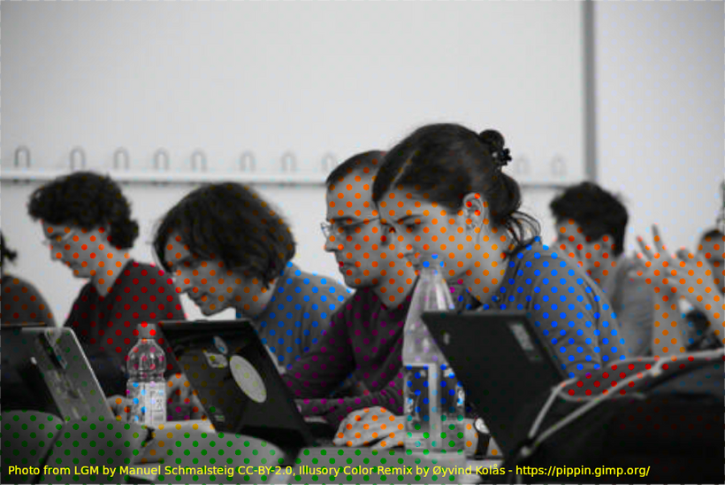

*图：色彩同化示例，用于说明亮度与色度信息的感知差异。来源：VCB-Studio《从零开始认识视频》。*

### 色度抽样

`4:4:4`、`4:2:2` 和 `4:2:0` 描述亮度与色度在一定像素区域内的采样比例，并不是“画质百分比”。


*图：常见色度抽样结构。来源：VCB-Studio《从零开始认识视频》。*

| 格式 | 特征 | MAD·AMV 中的常见用途 |
| --- | --- | --- |
| 4:4:4 | 每个亮度样本都有对应色度样本 | 图形、文字、抠像、合成中间文件 |
| 4:2:2 | 水平方向减少色度采样 | 专业采集、制作中间格式 |
| 4:2:0 | 横向和纵向都减少色度采样 | BD、网络视频和常见发布文件 |

“4:2:0”还涉及 **chroma location／色度采样位置**。不同标准对色度样本位于像素格的何处有不同约定；错误解释可能造成约半个像素的色度偏移。

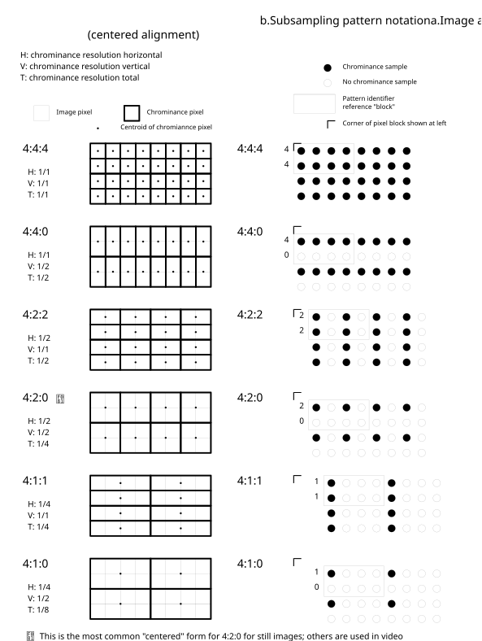

*图：色度抽样与采样位置示意。来源：VCB-Studio《从零开始认识视频》。*


*图：亮度与色度采样网格。来源：VCB-Studio《从零开始认识视频》。*

### 位深、量化与抖动

位深决定单个分量可表示的离散级数：

- 8-bit：每个分量最多 `2⁸ = 256` 个编码值；
- 10-bit：每个分量最多 `2¹⁰ = 1024` 个编码值；
- 12-bit：每个分量最多 `2¹² = 4096` 个编码值。

提高位深不会凭空恢复已经丢失的细节，但在调色、渐变、模糊、发光和多次合成中可以减少舍入误差。高位深转低位深时，可用 **dither／抖动**把有规律的量化阶梯转化为较不显眼的细微噪声。

常见像素格式名称示例：

| 名称 | 含义 |
| --- | --- |
| `yuv420p` | 8-bit 平面 YUV 4:2:0 |
| `yuv420p10le` | 10-bit、小端序、平面 YUV 4:2:0 |
| `yuv422p10le` | 10-bit 平面 YUV 4:2:2 |
| `yuv444p10le` | 10-bit 平面 YUV 4:4:4 |
| `gbrp`／`gbrp10le` | 平面 RGB，8-bit／10-bit |
| `rgba` | 带 Alpha 的打包 RGB |

### Alpha 通道

Alpha 记录透明度。合成中必须区分：

- **Straight／Unmatted Alpha**：RGB 保存未乘透明度的颜色；
- **Premultiplied／Matted Alpha**：RGB 已乘以 Alpha。

解释方式错误会在透明边缘产生黑边、白边或颜色污染。发布用 H.264／HEVC 文件通常不承担透明中间文件职责；透明合成应选明确支持 Alpha 的中间格式或图像序列。

## 四、色彩管理

### 人眼、CIE 与色域

色彩原色不是“颜色数量”，而是用三组原色坐标和白点界定可编码色域。下图展示人眼三类视锥细胞对不同波长的相对响应。


*图：人类视锥细胞归一化响应光谱。来源：VCB-Studio《从零开始认识视频》。*

CIE xy 色度图把可见颜色投影到二维平面。标准中的 RGB 原色在图中形成三角形，三角形内部为该组原色可表示的颜色范围。


*图：CIE xy 色度图。来源：VCB-Studio《从零开始认识视频》。*

### 决定视频颜色的四项信息

| 项目 | 决定什么 | 标错时的典型现象 |
| --- | --- | --- |
| Color primaries／色彩原色 | RGB 原色坐标与白点，即色域 | 饱和色的色相与饱和度错误 |
| Transfer characteristics／传递特性 | 线性光与编码值之间的关系 | 中间调、明暗和 HDR 亮度错误 |
| Matrix coefficients／矩阵系数 | RGB 与 Y′CbCr 的转换关系 | 整体偏色，肤色和高饱和色明显异常 |
| Color range／色彩范围 | 数字编码值对应的有效范围 | 发灰、死黑、过曝或细节截断 |

这四项是相互独立的。不能只写“Rec.709”而忽略具体是原色、传递特性还是矩阵，也不能仅凭分辨率强行覆盖元数据。

### Rec.601、Rec.709 与 Rec.2020


*图：Rec.601 色度图。*

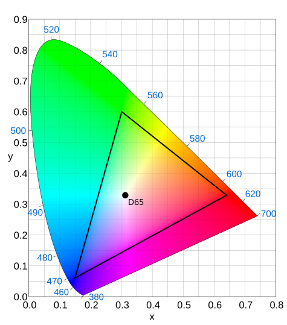

*图：Rec.709 色度图。*


*图：Rec.2020 色度图。三图来源：VCB-Studio《从零开始认识视频》。*

- **Rec.601**常见于 SD 数字视频，但 NTSC 与 PAL 系统仍需进一步区分；
- **Rec.709**是 HD SDR 制作和交付中最常见的标准组合；
- **Rec.2020**定义 UHD 体系所用的更宽色域原色，实际内容不一定使用到边界；
- **sRGB**与 Rec.709 使用相同原色和 D65 白点，但传递函数及使用场景不能简单视为完全相同；
- **Display P3／DCI-P3**也不是 Rec.2020 的别名。

### Transfer、Gamma、PQ 与 HLG

传递特性用于把线性光信号映射成适合记录和传输的非线性编码值。传统 SDR 常口头称为 Gamma；HDR 常见：

- **PQ／ST 2084**：以绝对显示亮度为基础；
- **HLG**：面向广播兼容的相对系统。

HDR 转 SDR 不是只改标签，需要经过色域映射和色调映射。反过来，把 SDR 文件标成 HDR 也不会生成真实 HDR。

### Full range 与 Limited range

以常见 Y′CbCr 为例：

| 位深 | Limited Y′ | Limited Cb／Cr | Full |
| --- | --- | --- | --- |
| 8-bit | 16–235 | 16–240 | 0–255 |
| 10-bit | 64–940 | 64–960 | 0–1023 |

Limited 范围外仍可能保留 headroom／footroom。处理中不应在每一步无依据地裁切，也不应把标签变更误当作数值转换。

需要明确区分：

1. **修改标签**：只改变播放器如何解释已有数值；
2. **转换范围**：实际重映射像素数值；
3. **裁切范围**：把越界数值截断到边界。

一次错误转换可能使画面发灰；重复转换或错误裁切可能永久丢失暗部和高光。

### 项目中的色彩管理

MAD·AMV 工程应固定并记录：

- 工作色彩空间；
- 时间线位深或浮点精度；
- 素材输入变换；
- 显示器与预览链路；
- 输出色彩空间和色彩元数据；
- 是否使用 OCIO、ACES 或软件自带色彩管理；
- 截图、图形和 PNG 素材的 sRGB／ICC 解释方式。

“看起来一样”必须建立在同一显示条件和同一色彩管理链上。系统播放器、浏览器、剪辑软件和平台转码结果可能采用不同色彩管理。

## 五、帧、场、时间戳与运动节奏

### 帧率不是一个近似整数

常见帧率应保留精确分数：

| 常用写法 | 精确值 |
| --- | --- |
| 23.976 | `24000/1001` |
| 24 | `24/1` |
| 29.97 | `30000/1001` |
| 30 | `30/1` |
| 59.94 | `60000/1001` |
| 60 | `60/1` |

`23.976` 与 `24`、`29.97` 与 `30` 长时间累计后会产生可见的时长差异。音频同步、字幕时间和比赛限时都应按真实时间戳检查。

### CFR、VFR、时间基与时间戳

- **CFR（Constant Frame Rate）**：相邻帧使用统一显示间隔；
- **VFR（Variable Frame Rate）**：不同帧的显示间隔可以变化；
- **time base／时间基**：时间戳采用的最小计量单位；
- **PTS**：一帧应当呈现的时间；
- **DTS**：一帧应当进入解码器的时间。

由于 B 帧会引用未来画面，显示顺序与解码顺序可能不同，因此 PTS 与 DTS 不一定一致。

`r_frame_rate`、`avg_frame_rate` 或“总帧数 ÷ 时长”都不能单独证明素材是 CFR。手机录屏、屏幕录制和网络下载素材进入剪辑软件前，应检查实际时间戳并做同步测试。

### 逐行与隔行

- **Progressive／逐行**：每帧包含同一时刻的完整画面；
- **Interlaced／隔行**：一帧由时间不同的两个场组成；
- **TFF／Top Field First**：上场先显示；
- **BFF／Bottom Field First**：下场先显示。


*图：逐行与隔行扫描示意。来源：VCB-Studio《从零开始认识视频》。*

把隔行素材当逐行素材缩放、旋转或锐化，会把场结构固化为更难修复的瑕疵。处理顺序通常应是先判断场结构，再做正确的场匹配、反交错或反胶转，然后进入逐行编辑流程。

### Telecine、场匹配与 IVTC

影视动画常以接近 24 fps 制作，再通过 3:2 pulldown 等方式转换到约 29.97 fps 的隔行系统。**IVTC（Inverse Telecine）**尝试恢复原始逐行帧序列；它不同于普通反交错。

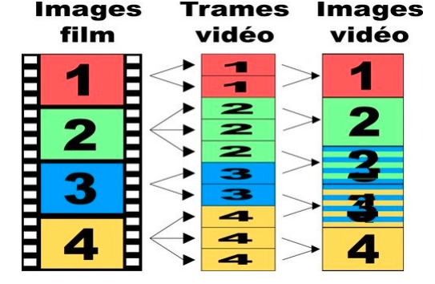

*图：3:2 pulldown 的场分配。来源：VCB-Studio《初等 30 fps 处理》。*

实际动画可能混合：

- 24p：逐行的约 24 fps 内容；
- 30p：逐行的约 30 fps 内容；
- 30i：每秒约 59.94 个时间不同的场；
- 24t：由 24p 通过规则 telecine 得到；
- 24d：在约 30 fps 序列中插入重复帧；
- 混合帧率、重复场、坏场和后期叠加字幕。

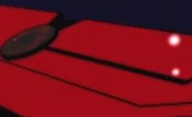

*图：场相位错位。来源：VCB-Studio《初等 30 fps 处理》。*

不能把整段素材机械地“去重复帧”或统一补到 60 fps。处理前应逐段确认真实运动节奏，切镜、拉镜、字幕和特效层也可能采用不同节奏。

### 动画张数与视频帧率

动画中的“一拍一、二拍一、三拍一”描述绘制图像保持多少曝光帧，不等于容器帧率。一个 23.976 fps 文件中可以连续多帧显示同一绘制画面；这些重复画面可能是创作节奏，而不是必须删除的冗余帧。

补帧会生成原作中不存在的中间图像。遮挡、快速切镜、闪光、粒子、文字和形变镜头尤其容易产生扭曲，不属于无损帧率转换。

## 六、视频压缩如何工作

### 帧内压缩：变换、量化与熵编码

编码器通常把画面分块，将空间域信号变换到频率域，再对系数量化。平滑变化集中在低频，细线、纹理和噪声包含更多高频信息。


*图：8 × 8 DCT 基函数。来源：VCB-Studio《视频编码器基础》。*


*图：图像块转换后的 DCT 系数示例。来源：VCB-Studio《视频编码器基础》。*

**量化**会降低系数精度，是常见有损编码中主要的信息损失环节。量化越强，越多高频细节被抹去；随后再使用熵编码无损压缩剩余数据。


*图：量化表示意。来源：VCB-Studio《视频编码器基础》。*

### 帧间压缩：预测与运动补偿

视频连续帧通常高度相似。编码器会搜索参考帧中的相似区域，记录运动向量和预测残差，而不是每帧都保存完整图像。

| 帧类型 | 基本作用 |
| --- | --- |
| I 帧 | 只使用当前帧内部信息编码，可作为随机访问基础 |
| P 帧 | 使用先前参考帧进行预测 |
| B 帧 | 可以使用前后参考帧进行双向预测 |


*图：I／P／B 帧的基本引用关系。来源：VCB-Studio《从零开始认识视频》。*

### GOP、关键帧与随机访问

**GOP（Group of Pictures）**是一组相互引用的编码图像。关键帧间隔影响：

- 随机拖动与剪切定位；
- 场景切换后的恢复；
- 压缩效率；
- 流媒体分片和平台转码；
- 错误传播范围。


*图：GOP 结构及帧间引用。来源：VCB-Studio《从零开始认识视频》。*


*图：显示顺序与传输／解码顺序的差异。来源：VCB-Studio《从零开始认识视频》。*

关键帧间隔不是越大越好，也不是固定套用某个数字。短片、比赛片头、需要精确切段的文件和流媒体平台，对随机访问有不同要求。

### 块结构为何不断演进

不同编码标准允许的分块与预测结构不同。更灵活的分块可更准确描述平面、线条与运动边界，但也需要更高编码计算量。

| MPEG-2 示例 | AVC／H.264 示例 | HEVC／H.265 示例 |
| --- | --- | --- |
|  | 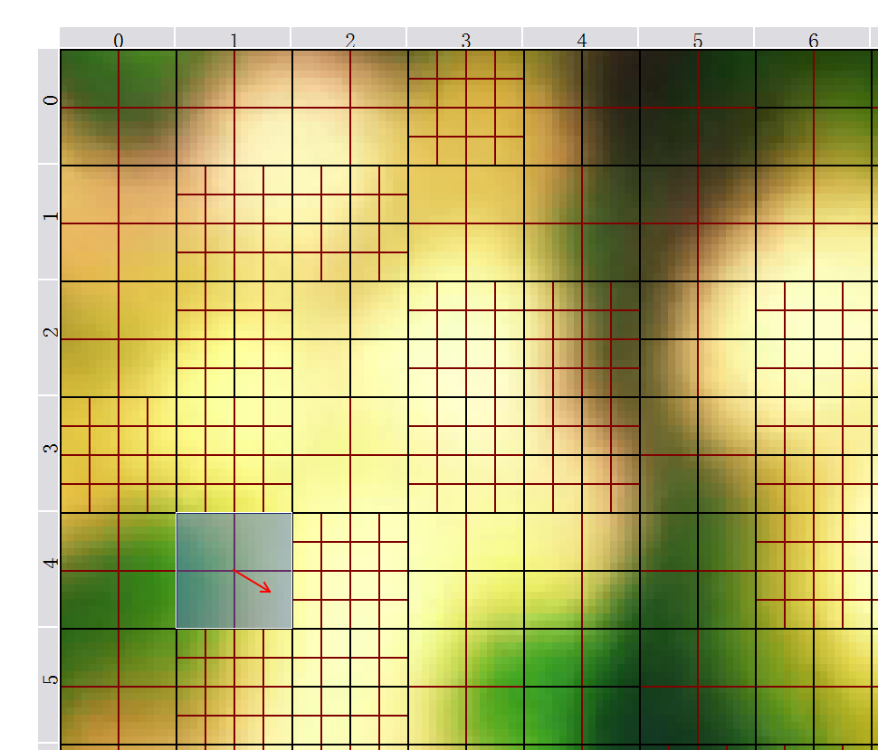 | 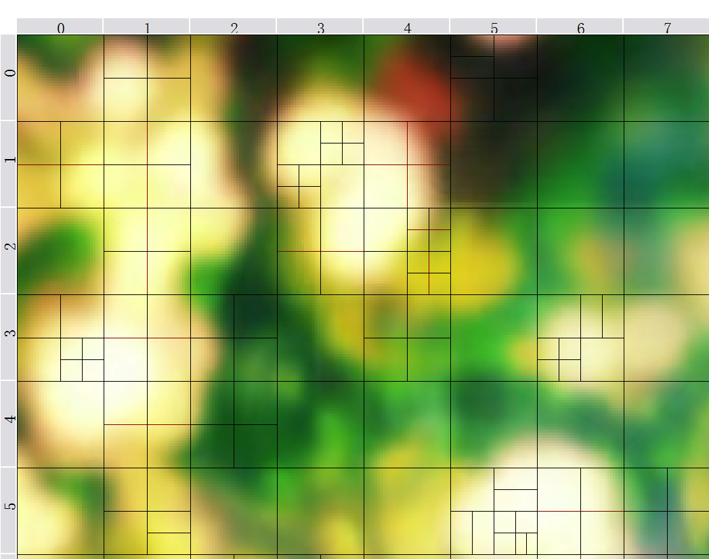 |

*图：不同编码结构的分块示例。来源：VCB-Studio《视频编码器基础》。*

### Profile、Level 与 Tier

- **Profile／档次**规定允许使用哪些编码工具和像素格式；
- **Level／级别**限制分辨率、帧率、码率、缓冲等复杂度上限；
- **Tier／层级**出现在部分标准中，用于进一步区分码率能力。

这些字段主要服务解码兼容性，不是简单的“画质等级”。把 Level 设得很高不会自动提升画质，反而可能使设备拒绝播放。

## 七、码率控制与编码参数

### 码率、文件大小与质量

平均码率与文件大小近似满足：

`文件大小 ≈ 平均总码率 × 时长`

总码率还包括音频、字幕、封装开销等。相同码率下，编码标准、编码器实现、预设、分辨率、帧率和内容复杂度都会改变最终质量。

### 常见码率控制模式

| 模式 | 控制目标 | 适用情况 |
| --- | --- | --- |
| CBR | 尽量维持固定码率 | 带宽严格受限的实时传输；文件编码中通常仍有缓冲波动 |
| ABR／平均码率 | 达到目标平均码率 | 已知文件大小或总码率预算 |
| 2-pass VBR | 第一遍分析，第二遍按总预算分配 | 需要较准确控制成品大小 |
| CRF／恒定质量 | 以感知质量目标分配码率 | 无硬性文件大小限制的发布或存档 |
| CQP／QP | 直接控制量化参数 | 测试或特定工作流，不等同恒定视觉质量 |
| CQ／ICQ 等 | 硬件编码器的质量目标模式 | 名称和量尺依实现而异 |

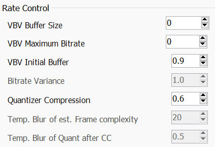

*图：x264 码率控制选项示例，用于说明不同控制目标；界面版本不作为当前参数推荐。来源：VCB-Studio《视频编码器基础》。*

### CRF 不是“固定画质百分比”

CRF 数字只能在同一编码器、相近版本和相近设置中相对比较：

- 不同编码器的 CRF 数字不能横向等同；
- 同一 CRF 面对不同素材会生成不同码率和体积；
- 改变 preset、tune、分辨率、位深或降噪程度后，结果也会变化；
- 硬件编码器中的 CQ／ICQ 量尺不能直接套用 x264／x265 的 CRF 经验。

可靠做法是选取代表性片段测试：暗部渐变、快速运动、细线、粒子、发光、镜头震动、噪声、复杂转场和大量文字。

### Preset、Tune 与心理视觉优化

- **Preset**主要决定编码器愿意投入多少搜索与决策计算，通常越慢压缩效率越高，但边际收益会下降；
- **Tune**改变编码器对某类内容的权衡；
- 名为 `animation` 的预设并不必然适合所有日本动画，更不必然适合含大量合成、粒子和实拍素材的 MAD；
- 参数应依据作品测试，不应把某一字幕组、某一年代或某一软件版本的参数表当作通用标准。

### VBV 与峰值限制

VBV 模型用最大码率和缓冲大小约束码流峰值，服务于网络或硬件解码能力。设得过紧会迫使复杂镜头显著降低质量；完全不设限制又可能超过目标设备或平台的瞬时吞吐能力。

### 软件编码与硬件编码

- 软件编码通常提供更完整的搜索和参数控制，适合高质量最终输出；
- GPU／媒体引擎硬件编码速度更快，适合预览、代理、录制和时效性强的任务；
- 代际更新会明显改变硬件编码质量，不能仅凭“CPU／GPU”判断；
- 最终应在相同交付限制下比较实际画面、速度和兼容性。

## 八、中间文件、代理与母版

### 中间格式

编辑和合成中间文件应优先考虑：

- 帧精确访问；
- 低解码负担；
- 足够位深和色度精度；
- Alpha 支持；
- 多代处理后的稳定性；
- 剪辑软件兼容性。

常见方向包括 ProRes、DNxHR、CineForm、FFV1、无压缩视频和 PNG／TIFF／EXR 图像序列。具体选择取决于软件、操作系统、Alpha、HDR 与存储预算。

### 代理文件

代理用于降低剪辑时的解码和存储压力，不是最终母版。代理工作流必须保证：

1. 每个代理与原素材唯一对应；
2. 时长、时间码、帧率和音频同步一致；
3. 重新连接后抽查关键镜头；
4. 最终导出确实引用原始素材而不是代理；
5. 变速、嵌套序列和 VFR 素材经过单独验证。

### 母版与发布版

建议至少区分：

| 类型 | 用途 | 重点 |
| --- | --- | --- |
| 工程母版 | 后续重制、字幕版、平台转码 | 高位深、低代际损失、完整音频 |
| 比赛提交版 | 符合当届规则 | 严格遵守容器、编码、时长和体积 |
| 平台发布版 | 上传 Bilibili 等平台 | 兼容平台并为二次转码保留余量 |
| 审看版 | 团队校对、快速传输 | 体积较小，带版本号或水印 |

母版、发布版和工程项目应使用明确版本号，不应通过“最终版2_真的最终”区分。

## 九、封装与轨道

### 常见容器

| 容器 | 主要特点 | 使用注意 |
| --- | --- | --- |
| MP4 | 平台与设备兼容广 | 字幕、附件和部分音频格式支持受限 |
| MKV | 轨道、字幕、章节和附件能力丰富 | 部分剪辑软件或平台不直接接受 |
| MOV | 制作流程常见，与多种中间编码配合 | 兼容性取决于内部编码 |
| WebM | 常与 VP9／AV1、Opus 配合 | 比赛或传统剪辑环境未必接受 |

封装时需检查默认轨、强制轨、语言、名称、章节、字幕字体、延迟、色彩标签和旋转信息。

### 无重编码切割的限制

多数长 GOP 视频只能从可随机访问的关键帧附近开始无损切割。工具即使显示“成功”，切点也可能前移、首段花屏或时间戳重写。需要逐帧精确切点时，通常应在剪辑时间线或中间格式中处理。

### 一条安全的重封装示例

```bash
ffmpeg -i input.mkv -map 0 -c copy output.mkv
```

该命令只演示“复制全部轨道并重新封装”的概念。实际项目仍需检查附件、章节、轨道标签、时间戳和目标容器兼容性。

## 十、音频基础

### 采样率、位深与声道

- **采样率**表示每秒采集多少个音频样本，视频制作常见 48 kHz；
- **位深**影响 PCM 样本的量化精度；
- **声道数**不等于声道布局，六声道可能采用不同排列；
- **PCM**是未压缩采样，FLAC 是无损压缩，AAC／Opus 等通常为有损压缩。

项目内应尽量固定采样率，避免多次重采样。导入 44.1 kHz 音乐并不意味着必须先单独转成有损 48 kHz 文件；剪辑软件可以在高精度内部处理后统一输出。

### 响度、峰值与 True Peak

- 数字峰值只检查离散样本是否到达上限；
- **True Peak／真峰值**估计重建波形在样本间可能出现的峰值；
- **LUFS**用于描述一定时间尺度上的感知响度；
- 限制器不能替代混音，也不能通过单一响度数字判断作品声音是否合理。

平台可能对响度做播放归一化，但规则会变化。保留未削波母版，再对实际上传结果复核。

### 同步与延迟

音画同步问题可能来自：

- VFR 时间戳；
- 23.976／24 或 29.97／30 混用；
- 编码器延迟与容器补偿；
- 轨道起始时间不同；
- 重采样或变速；
- 无重编码切割落在音频帧边界。

只检查开头不足以发现漂移，应同时检查中段和结尾。

## 十一、画质瑕疵识别

瑕疵识别的目标不是“所有问题都套滤镜”，而是区分素材本身的制作特征、发行介质问题、错误处理和编码损失。修复必须有明确对象，并与未处理版本逐帧对比。

### 色带（Banding）

平滑渐变被分成可见色阶。可能来自低位深、强量化、错误范围转换或过度降噪。去色带通常需要配合抖动或保护性噪声；处理过强会抹去本来存在的阴影线条和纹理。


*图：Banding。来源：VCB-Studio《认识瑕疵》。*

### 锯齿（Aliasing）

斜线、曲线或缩放后的细节出现台阶和不稳定闪烁。来源可能是原始绘制、低分辨率放大、错误场处理或缩放算法。抗锯齿并不等于整体模糊。


*图：Aliasing。来源：VCB-Studio《认识瑕疵》。*

### 振铃与光晕（Ringing／Haloing）

高反差边缘周围出现波纹、亮边或暗边，常与过度锐化、缩放或压缩有关。处理时要区分原作的描边、发光特效和异常边缘。


*图：Ringing。来源：VCB-Studio《认识瑕疵》。*

### 噪声与颗粒（Noise／Grain）

噪声可能来自传感器、胶片、扫描、压缩或制作流程；颗粒也可能是创作者有意保留的质感。降噪会改变编码难度，但过度降噪会导致线条融化、纹理消失和动态“糊块”。


*图：Noise。来源：VCB-Studio《认识瑕疵》。*

### 块效应与蚊噪（Blocking／DCT Ringing）

码率不足或量化过强时，块边界变得可见；文字和线条周围还可能出现游动的噪点、烂边和 DCT 振铃。后处理只能缓解，不能恢复已经丢失的真实细节。

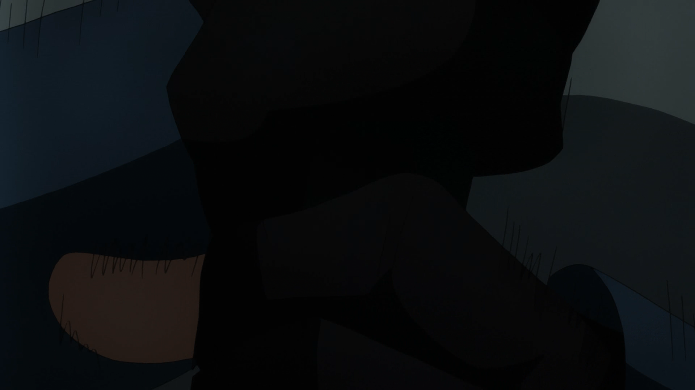


*图：Blocking 与 DCT ringing。来源：VCB-Studio《认识瑕疵》。*

### 亮度越界与截断

范围解释错误可能使有效高光或暗部被当成纯白、纯黑。下图对比了亮度溢出及按正确范围恢复后的结果。


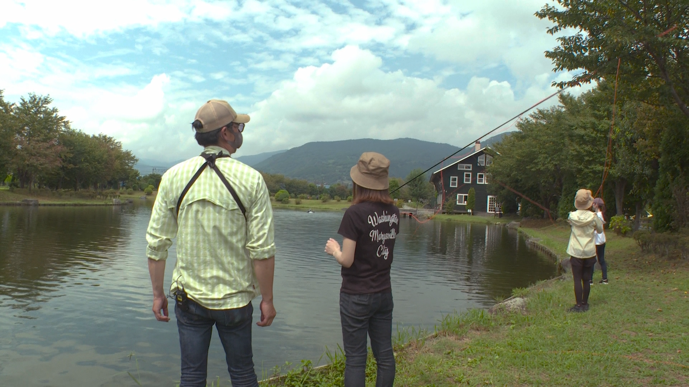

*图：Luma overflow 及修正示例。来源：VCB-Studio《认识瑕疵》。*

如果数据已经被截断，之后仅改标签无法恢复细节。修复前要判断是显示解释错误，还是像素值已遭裁切。

### 拉丝、缟缟与重复场

- **Combing／拉丝**：两个不同时刻的场被同时当作一帧显示；
- **隔行缩放造成的缟缟**：未先处理场结构便按逐行算法缩放；
- **Duplicate field／重复场**：一帧的两个场实际重复，容易与普通锯齿混淆。


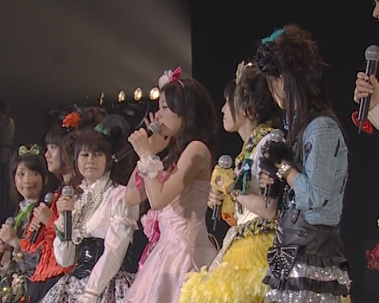

*图：交错相关瑕疵。来源：VCB-Studio《认识瑕疵》。*

### 鬼影与帧融合（Blending／Ghosting）

非正常的相邻帧融合会在运动边缘留下半透明残影。它可能来自不正确的制式转换、反交错或时域处理。某些规律性问题可以部分恢复，无规律混合通常难以完全还原。


*图：Blending。来源：VCB-Studio《认识瑕疵》。*

### 色度色带、色度锯齿与色度偏移

色度平面的精度、下采样算法和采样位置错误，会产生与亮度平面不同的瑕疵：


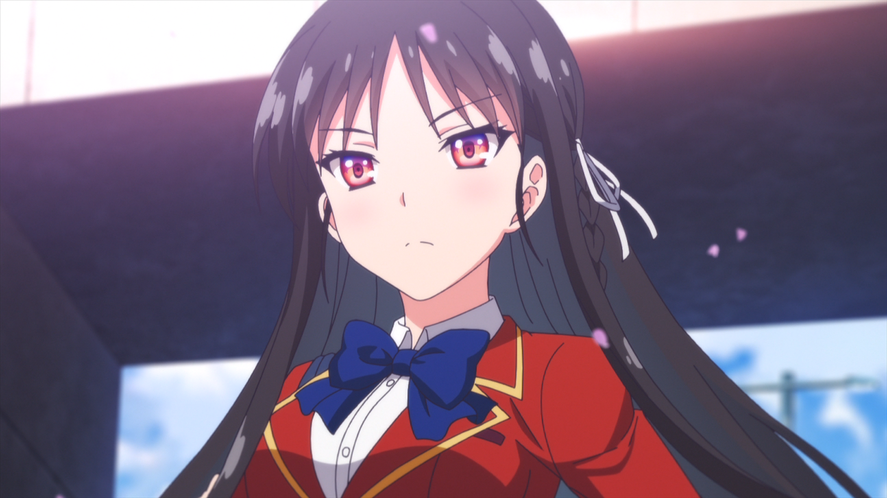


*图：Chroma banding、chroma aliasing 与 chroma shift。来源：VCB-Studio《认识瑕疵》。*

色度偏移通常是色度平面相对亮度平面的单向错位。它与刻意把 RGB 通道错开的视觉特效不同：

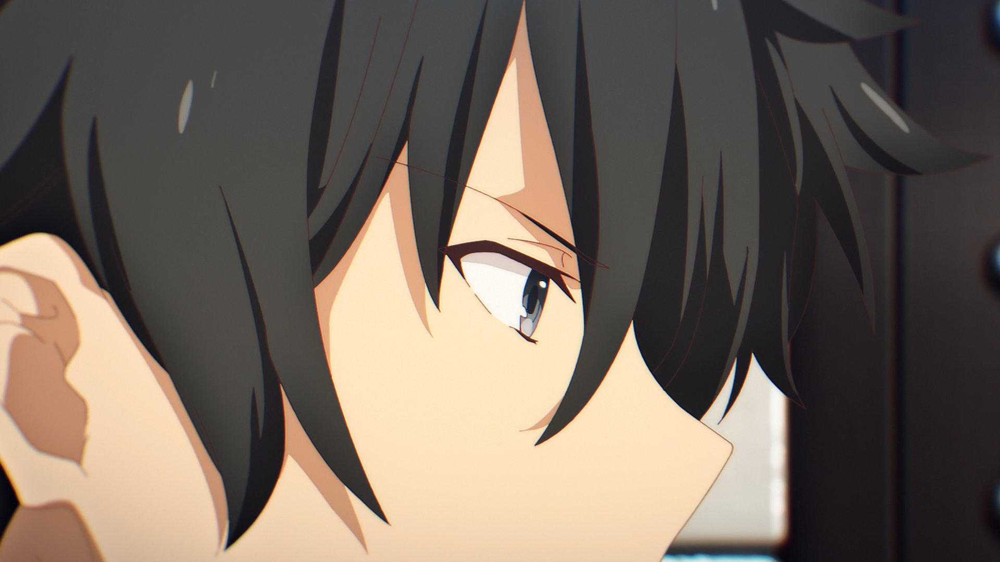

*图：RGB shift 特效，用于与异常的 chroma shift 区分。来源：VCB-Studio《认识瑕疵》。*

### 色度溢出（Chroma Bleeding）

高饱和颜色向周围扩张，色度边界明显超出亮度边界。它与有方向的色度偏移不同。


*图：Chroma bleeding。来源：VCB-Studio《认识瑕疵》。*

### 彩虹与点状斑纹

早期模拟复合视频或不良转录可能使亮度高频串扰到色度，形成红蓝彩虹纹或移动点状斑纹。

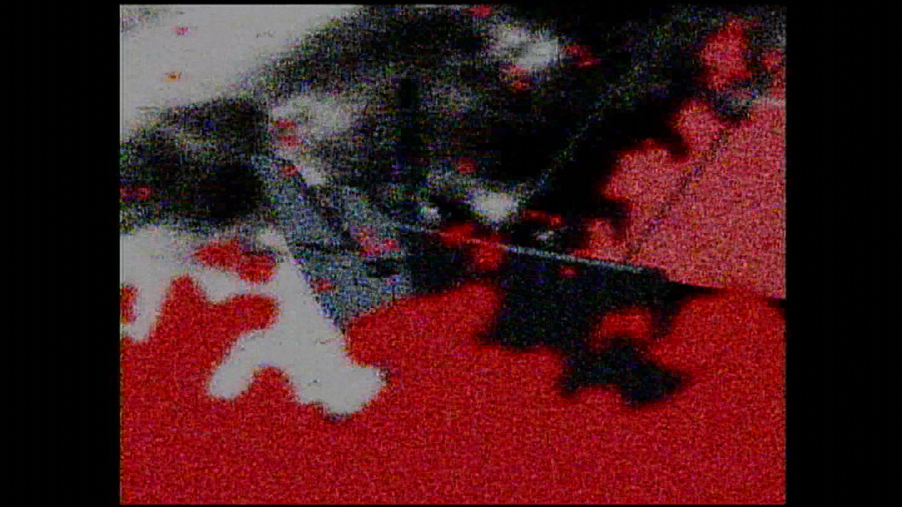


*图：Rainbow 与 dot crawl。来源：VCB-Studio《认识瑕疵》。*

## 十二、MAD·AMV 制作中的建议流程

### 1. 素材登记

记录来源、版本、集数、时间段、容器、编码、分辨率、帧率、色彩信息和音轨。BD、流媒体、WEBRip、PV、游戏录屏和自制图形不能只按扩展名归为同一类。

### 2. 技术诊断

使用 MediaInfo／ffprobe 建立参数记录，再逐帧判断：

- 是否真隔行、伪隔行或 telecine；
- 是否为 CFR／VFR；
- 是否存在范围、矩阵或色度位置错误；
- 瑕疵属于素材制作、发行版本还是平台二压；
- 是否存在更高质量来源。

### 3. 预处理

只处理已确认的问题。建议保留：

- 原始文件；
- 处理脚本及版本；
- 关键参数；
- 处理前后对比帧；
- 对素材做过的裁切、变速、反交错和色彩转换记录。

### 4. 代理与剪辑

统一代理命名、时间码和音频同步。时间线帧率应根据作品主节奏和交付规则确定，不应由首个导入素材自动决定后便不再核对。

### 5. 合成与中间输出

高强度调色、发光、粒子、运动模糊、文字和抠像尽量在高位深环境中完成。需要跨软件时，优先使用低损失中间格式或图像序列，并确认 Alpha 类型和色彩空间。

### 6. 母版输出

母版应保留足够位深和色度精度，避免使用过低码率的长 GOP 发布编码作为唯一存档。音频保留无损版本，记录项目采样率、声道布局和响度处理。

### 7. 发布编码与封装

从母版分别生成比赛版、Bilibili 发布版或其他平台版本。不要把某个平台转码后的下载文件当作其他平台母版。

### 8. 上传后复核

平台会再次转码。上传完成后抽查：

- 开头、结尾和随机位置；
- 暗部渐变、强闪、快速运动、细线、字幕和粒子；
- 音画同步与声道；
- 平台实际提供的清晰度档位；
- 封面、标题、简介、字幕和作品声明。

## 十三、交付检查清单

### 文件与画面

- [ ] 文件可完整读取，总时长与比赛限制一致；
- [ ] 首帧、尾帧、黑场和片尾没有误裁；
- [ ] 分辨率、SAR、DAR 和旋转信息正确；
- [ ] 精确帧率、CFR／VFR、时间基和时间戳符合预期；
- [ ] 已确认逐行／隔行、场序、telecine 和重复帧结构；
- [ ] 像素格式、位深、色度抽样和 Alpha 正确；
- [ ] primaries、transfer、matrix、range 标签与实际像素一致；
- [ ] HDR／SDR 输出符合目标，没有只改标签的伪转换；
- [ ] 暗部、高光、渐变、细线、快速运动和复杂特效经过检查；
- [ ] 没有新增色带、锯齿、振铃、块效应、鬼影或补帧扭曲。

### 音频

- [ ] 采样率、编码、声道数和声道布局正确；
- [ ] 无爆音、削波、声道反转或意外静音；
- [ ] 开头、中段、结尾均检查音画同步；
- [ ] 响度与真峰值符合团队或赛事要求；
- [ ] 音乐、对白和效果声授权信息已记录。

### 封装与版本

- [ ] 容器和编码组合被目标平台或主办方接受；
- [ ] 默认轨、语言、标题、章节、字幕和字体附件正确；
- [ ] 文件名、版本号和提交者信息符合规则；
- [ ] 母版、提交版、发布版可以明确对应；
- [ ] 生成 SHA-256 等校验值并保存；
- [ ] 在另一台设备或目标播放器完成最终复核；
- [ ] 平台转码完成后再次检查在线版本。

## 十四、常见误区

| 说法 | 更准确的理解 |
| --- | --- |
| “MP4 画质比 MKV 好” | 二者是容器；画质主要取决于内部视频及处理过程 |
| “10-bit 会把 8-bit 变清晰” | 不会恢复源细节，但可减少后续计算和再编码中的量化误差 |
| “码率越高一定越好” | 达到透明度后继续增加收益有限；源质量和编码效率同样重要 |
| “CRF 18 在所有编码器都一样” | CRF 量尺只适合在同一实现和近似设置中相对比较 |
| “动画都用 animation tune” | Tune 是特定权衡，必须以作品实测为准 |
| “重复帧都应该删除” | 动画曝光节奏、telecine、VFR 和错误重复帧是不同问题 |
| “补到 60 fps 就更流畅” | 补帧会生成新画面，也可能破坏原有节奏并制造伪影 |
| “改成 Rec.709 标签就修好了” | 标签、像素转换和范围裁切必须区分 |
| “降噪后码率更低，所以画质更好” | 降噪也可能删掉原始纹理、颗粒和细线 |
| “文件能播放就交付合格” | 仍需检查同步、色彩、帧结构、复杂镜头和平台二压 |

## 参考资料与图像许可

### 主要参考

- [VCB-Studio 公开教程](https://guides.vcb-s.com/)
- [第一章：从零开始认识视频](https://guides.vcb-s.com/basic-guide-01/)
- [第三章：工具与压制流程](https://guides.vcb-s.com/basic-guide-03/)
- [第四章：认识瑕疵](https://guides.vcb-s.com/basic-guide-04/)
- [第七章：视频编码器基础](https://guides.vcb-s.com/basic-guide-07/)
- [第十章：初等 30 fps 处理](https://guides.vcb-s.com/basic-guide-10/)
- [VCB-Studio Guides 源码仓库](https://github.com/vcb-s/guides)
- [FFmpeg Formats Documentation](https://ffmpeg.org/ffmpeg-formats.html)
- [ffprobe Documentation](https://ffmpeg.org/ffprobe.html)
- [MediaInfo](https://mediaarea.net/MediaInfo)

### 本地化与许可

本页中的 VCB-Studio 教程图像已复制到本站仓库，避免外链失效，并在各图下标明来源。VCB-Studio 公开教程采用 [Creative Commons Attribution-ShareAlike 4.0 International（CC BY-SA 4.0）](https://creativecommons.org/licenses/by-sa/4.0/) 许可；相关图像及本页基于其内容形成的改编部分依该许可署名与共享。

本页不是 VCB-Studio 原教程的镜像，也不代替原教程。需要系统学习 BDRip、VapourSynth、x264／x265 参数和针对性修复时，应阅读原章节并以其最新版本为准。
